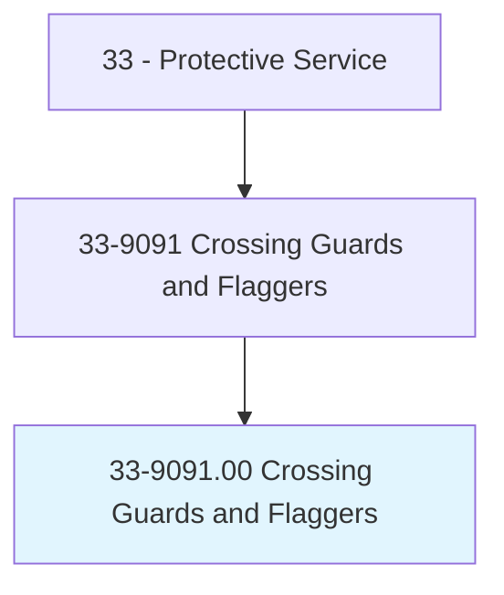
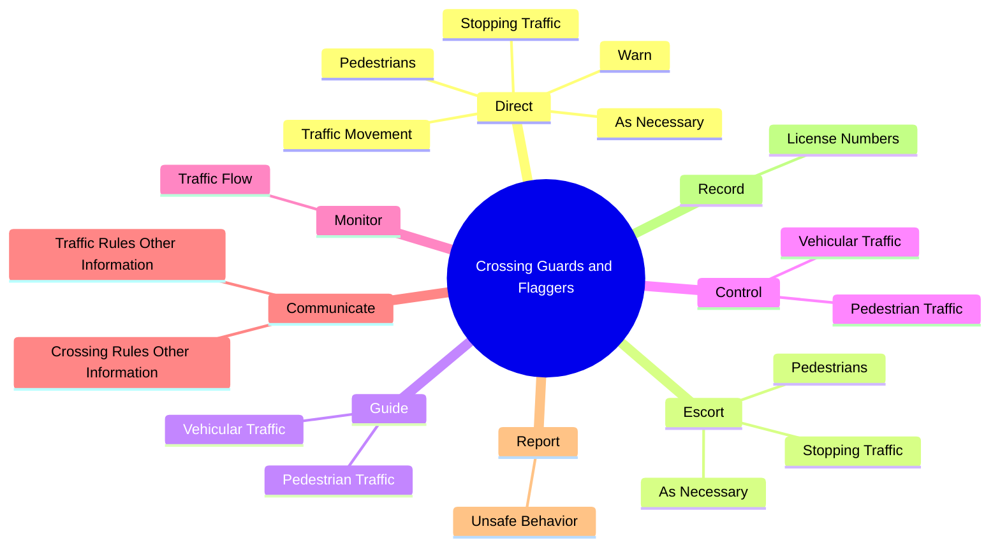
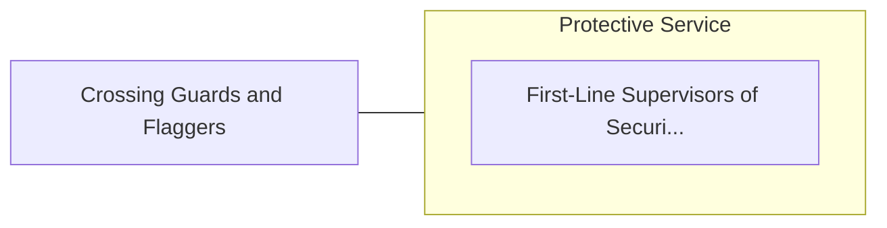

# Crossing Guards and Flaggers

> Guide or control vehicular or pedestrian traffic at such places as streets, schools, railroad crossings, or construction sites.

## Overview

Crossing Guards and Flaggers is classified under Protective Service (SOC 33). Guide or control vehicular or pedestrian traffic at such places as streets, schools, railroad crossings, or construction sites.

## Classification Hierarchy

## Key Statistics

| Metric | Value |
|--------|-------|
| SOC Code | 33-9091.00 |
| Category | [Protective Service](/occupations/PublicSafety/index) |
| Task Count | 40 |
| Source | O*NET |

## Core Tasks

### direct.Pedestrians

Crossing Guards and Flaggers direct pedestrians as part of their core responsibilities.

**Actions:**
- `direct.Pedestrians.across.Streets`
- `direct.StoppingTraffic`
- `direct.AsNecessary`
- `direct.TrafficMovement.of.Hazards`

### escort.Pedestrians

Crossing Guards and Flaggers escort pedestrians as part of their core responsibilities.

**Actions:**
- `escort.Pedestrians.across.Streets`
- `escort.StoppingTraffic`
- `escort.AsNecessary`

### guide.VehicularTraffic

Crossing Guards and Flaggers guide vehicular traffic as part of their core responsibilities.

**Actions:**
- `guide.VehicularTraffic.at.SuchPlacesAsStreetCrossingsConstructionSites`
- `guide.VehicularTraffic.at.RailroadCrossingsConstructionSites`
- `guide.PedestrianTraffic.at.SuchPlacesAsStreetCrossingsConstructionSites`
- `guide.PedestrianTraffic.at.RailroadCrossingsConstructionSites`

## Skills & Competencies

### Technical Skills
- **Law Enforcement** - Advanced
- **Emergency Response** - Advanced
- **Public Safety** - Advanced

### Soft Skills
- **Communication** - Essential
- **Problem Solving** - Essential
- **Critical Thinking** - Important
- **Teamwork** - Important
- **Adaptability** - Important

## Related Occupations

## Industries

This occupation is found across multiple industries. See [Industries](/industries) for sector-specific employment data.

## Career Progression

---

*Source: O*NET 33-9091.00 - ONETOccupation*
