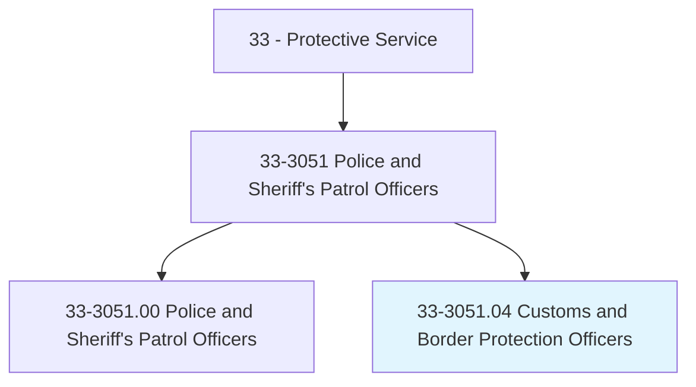
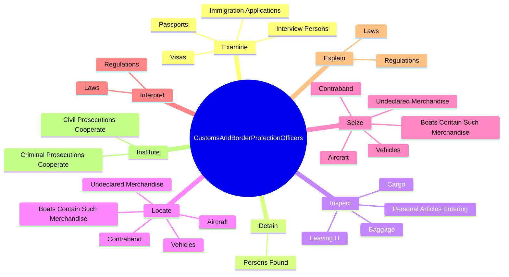
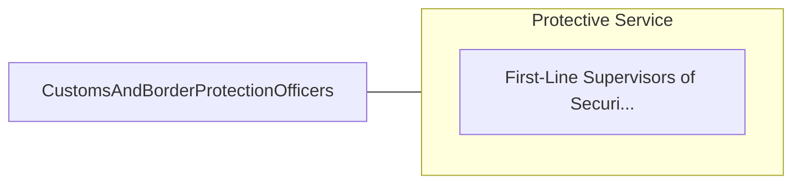

# Customs and Border Protection Officers

> Investigate and inspect persons, common carriers, goods, and merchandise, arriving in or departing from the United States or between states to detect violations of immigration and customs laws and regulations.

## Overview

Customs and Border Protection Officers is classified under Protective Service (SOC 33). Investigate and inspect persons, common carriers, goods, and merchandise, arriving in or departing from the United States or between states to detect violations of immigration and customs laws and regulations.

## Classification Hierarchy

## Key Statistics

| Metric | Value |
|--------|-------|
| SOC Code | 33-3051.04 |
| Category | [Protective Service](/occupations/PublicSafety/index) |
| Task Count | 71 |
| Source | O*NET |

## Core Tasks

### examine.ImmigrationApplications

Customs and Border Protection Officers examine immigration applications as part of their core responsibilities.

**Actions:**
- `examine.ImmigrationApplications.to.determine.EligibilityForAdmission`
- `examine.ImmigrationApplications.to.Residence`
- `examine.ImmigrationApplications.to.travel.InU`
- `examine.Visas.to.determine.EligibilityForAdmission`

### detain.PersonsFound

Customs and Border Protection Officers detain persons found as part of their core responsibilities.

**Actions:**
- `detain.PersonsFound.to.BeInViolationOfCustomsLawsArrangeForLegalAction`
- `detain.PersonsFound.to.ImmigrationLawsArrangeForLegalAction`
- `detain.PersonsFound.to.Deportation`

### inspect.Cargo

Customs and Border Protection Officers inspect cargo as part of their core responsibilities.

**Actions:**
- `inspect.Cargo.for.Compliance.with.RevenueLawsCustomsRegulations`
- `inspect.Cargo.for.U`
- `inspect.Baggage.for.Compliance.with.RevenueLawsCustomsRegulations`
- `inspect.Baggage.for.U`

## Skills & Competencies

### Technical Skills
- **Law Enforcement** - Advanced
- **Emergency Response** - Advanced
- **Public Safety** - Advanced

### Soft Skills
- **Communication** - Essential
- **Problem Solving** - Essential
- **Critical Thinking** - Important
- **Teamwork** - Important
- **Adaptability** - Important

## Related Occupations

## Industries

This occupation is found across multiple industries. See [Industries](/industries) for sector-specific employment data.

## Career Progression

---

*Source: O*NET 33-3051.04 - ONETOccupation*
