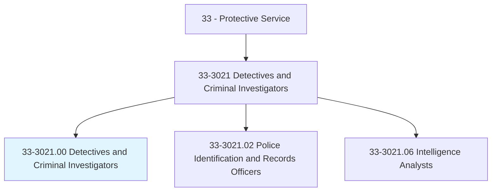
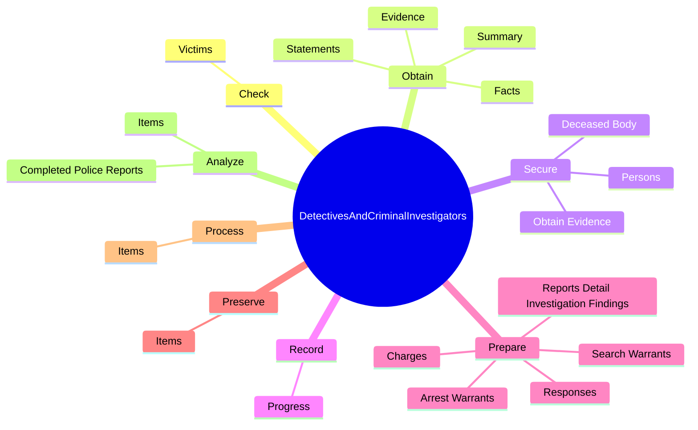
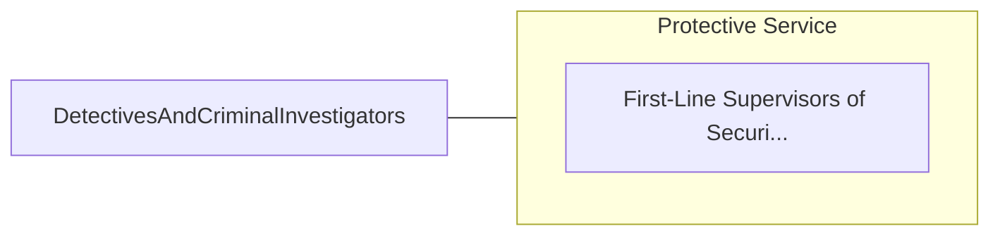

# Detectives and Criminal Investigators

> Conduct investigations related to suspected violations of federal, state, or local laws to prevent or solve crimes.

## Overview

Detectives and Criminal Investigators is classified under Protective Service (SOC 33). Conduct investigations related to suspected violations of federal, state, or local laws to prevent or solve crimes.

## Classification Hierarchy

## Key Statistics

| Metric | Value |
|--------|-------|
| SOC Code | 33-3021.00 |
| Category | [Protective Service](/occupations/PublicSafety/index) |
| Task Count | 119 |
| Source | O*NET |

## Core Tasks

### check.Victims

Detectives and Criminal Investigators check victims as part of their core responsibilities.

**Actions:**
- `check.Victims.for.Signs.of.Life`
- `check.Victims.for.Breathing`
- `check.Victims.for.Pulse`

### obtain.Facts

Detectives and Criminal Investigators obtain facts as part of their core responsibilities.

**Actions:**
- `obtain.Facts.from.Complainants`
- `obtain.Facts.from.Witnesses`
- `obtain.Facts.from.AccusedPersons`
- `obtain.Facts.from.RecordInterviews`

### secure.DeceasedBody

Detectives and Criminal Investigators secure deceased body as part of their core responsibilities.

**Actions:**
- `secure.DeceasedBody.from.It`
- `secure.DeceasedBody.from.PreventingBystanders.from.TamperingWithItPri`
- `secure.DeceasedBody.from.ToMedicalExaminersArrival`
- `secure.ObtainEvidence.from.It`

## Skills & Competencies

### Technical Skills
- **Law Enforcement** - Advanced
- **Emergency Response** - Advanced
- **Public Safety** - Advanced

### Soft Skills
- **Communication** - Essential
- **Problem Solving** - Essential
- **Critical Thinking** - Important
- **Teamwork** - Important
- **Adaptability** - Important

## Related Occupations

## Industries

This occupation is found across multiple industries. See [Industries](/industries) for sector-specific employment data.

## Career Progression

---

*Source: O*NET 33-3021.00 - ONETOccupation*
