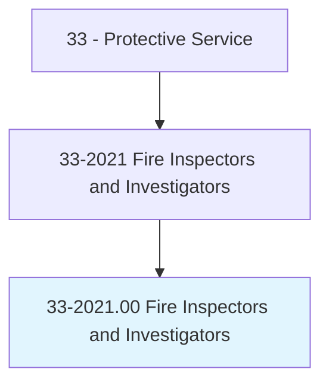
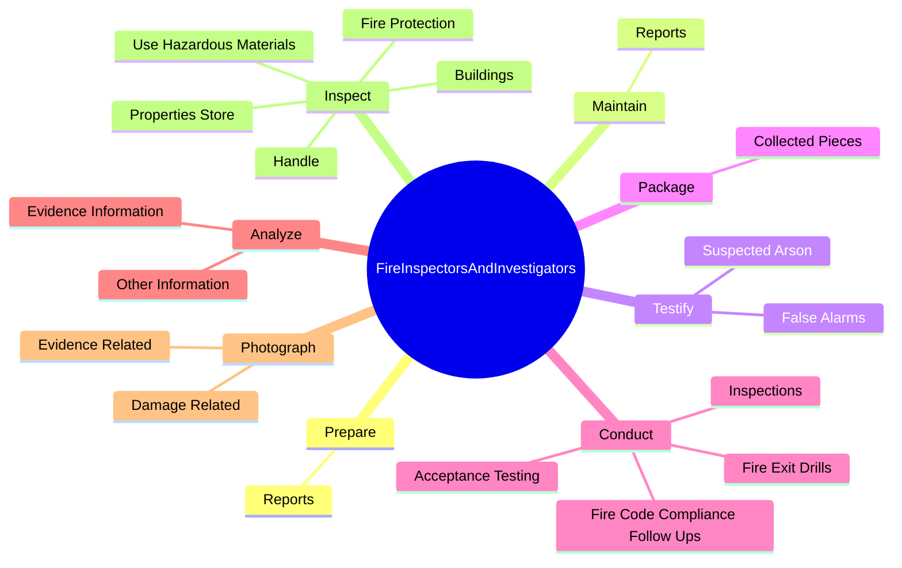
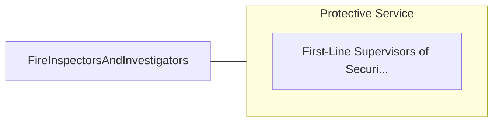

# Fire Inspectors and Investigators

> Inspect buildings to detect fire hazards and enforce local ordinances and state laws, or investigate and gather facts to determine cause of fires and explosions.

## Overview

Fire Inspectors and Investigators is classified under Protective Service (SOC 33). Inspect buildings to detect fire hazards and enforce local ordinances and state laws, or investigate and gather facts to determine cause of fires and explosions.

## Classification Hierarchy

## Key Statistics

| Metric | Value |
|--------|-------|
| SOC Code | 33-2021.00 |
| Category | [Protective Service](/occupations/PublicSafety) |
| Task Count | 133 |
| Source | O*NET |

## Core Tasks

### prepare.Reports

Fire Inspectors and Investigators prepare reports as part of their core responsibilities.

**Actions:**
- `prepare.Reports.of.InvestigationResults`
- `prepare.Reports.of.Records.of.ConvictedArsonists`
- `prepare.Reports.of.ArsonSuspects`

### maintain.Reports

Fire Inspectors and Investigators maintain reports as part of their core responsibilities.

**Actions:**
- `maintain.Reports.of.InvestigationResults`
- `maintain.Reports.of.Records.of.ConvictedArsonists`
- `maintain.Reports.of.ArsonSuspects`

### testify.SuspectedArson

Fire Inspectors and Investigators testify suspected arson as part of their core responsibilities.

**Actions:**
- `testify.SuspectedArson`
- `testify.FalseAlarms`

## Skills & Competencies

### Technical Skills
- **Law Enforcement** - Advanced
- **Emergency Response** - Advanced
- **Public Safety** - Advanced

### Soft Skills
- **Communication** - Essential
- **Problem Solving** - Essential
- **Critical Thinking** - Important
- **Teamwork** - Important
- **Adaptability** - Important

## Related Occupations

## Industries

This occupation is found across multiple industries. See [Industries](/industries) for sector-specific employment data.

## Career Progression

---

*Source: O*NET 33-2021.00 - ONETOccupation*
