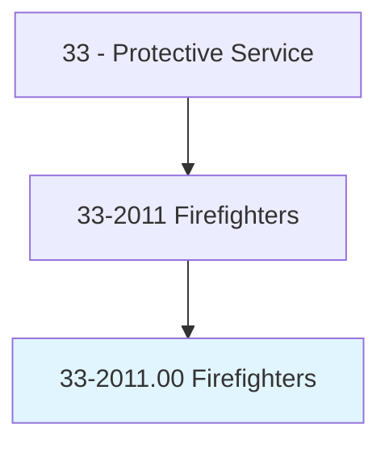
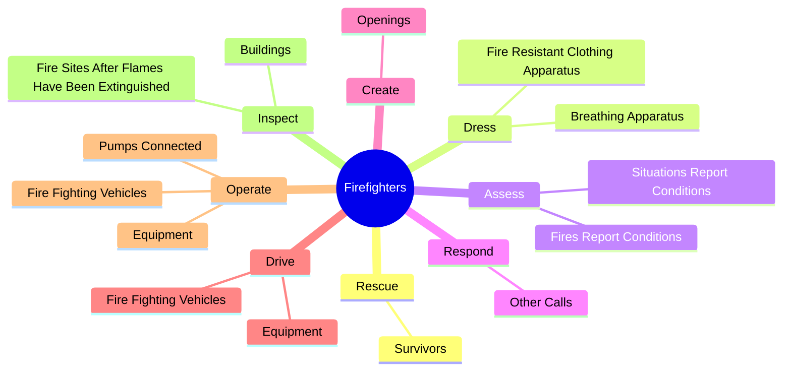
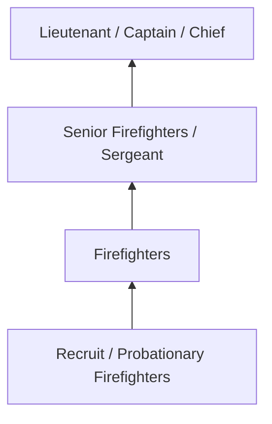
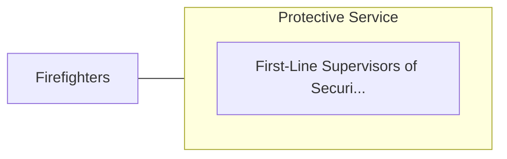

# Firefighters

> Control and extinguish fires or respond to emergency situations where life, property, or the environment is at risk. Duties may include fire prevention, emergency medical service, hazardous material response, search and rescue, and disaster assistance.

## Overview

Firefighters professionals control and extinguish fires or respond to emergency situations where life, property, or the environment is at risk. This occupation falls within the Protective Service category and requires a combination of specialized knowledge, technical skills, and practical experience.

These professionals work across diverse settings and organizational contexts, applying their expertise to meet the demands of their field. They must stay current with industry standards, emerging practices, and regulatory requirements that affect their work. The role demands both independent judgment and collaborative skills, as practitioners regularly interact with colleagues, stakeholders, and the public.

As the field continues to evolve, Firefighters professionals increasingly leverage technology and data-driven approaches to enhance their effectiveness. Career opportunities span the public and private sectors, with demand influenced by economic conditions, demographic shifts, and technological advancement.

## Classification Hierarchy



## Key Statistics

| Metric | Value |
|--------|-------|
| SOC Code | 33-2011.00 |
| Job Zone | N/A |
| Category | [Protective Service](/occupations/PublicSafety/index) |
| Core Tasks | 98+ |
| Salary Range | $35,000 - $90,000 |
| Median Salary | $52,000 |
| Growth Outlook | 5% (As fast as average) |
| Source | O*NET |

## Core Tasks



### maintain.Contact

Firefighters maintain contact as part of their core responsibilities.

**Actions:**
- `maintain.Contact.with.FireDispatchersAtTimes.to.notify.ThemOfNeedForAdditionalFirefighters` - Maintain contact with fire dispatchers at all times to notify them of the nee...
- `maintain.Contact.with.Supplies` - Maintain contact with fire dispatchers at all times to notify them of the nee...
- `maintain.Contact.with.detail.DifficultiesEncountered` - Maintain contact with fire dispatchers at all times to notify them of the nee...
- `maintain.Knowledge.of.CurrentFirefightingPractices.by.ParticipatingInDrillsAttendingSeminars` - Maintain knowledge of current firefighting practices by participating in dril...
- `maintain.Knowledge.of.ByAttendingSeminars` - Maintain knowledge of current firefighting practices by participating in dril...

### extinguish.Flames

Firefighters extinguish flames as part of their core responsibilities.

**Actions:**
- `extinguish.Flames.to.SuppressFires` - Extinguish flames and embers to suppress fires, using shovels or engine- or h...
- `extinguish.Flames.to.UsingShovels` - Extinguish flames and embers to suppress fires, using shovels or engine- or h...
- `extinguish.Flames.to.EngineWaterChemicalPumps` - Extinguish flames and embers to suppress fires, using shovels or engine- or h...
- `extinguish.Flames.to.hand.DrivenWaterChemicalPumps` - Extinguish flames and embers to suppress fires, using shovels or engine- or h...
- `extinguish.Embers.to.SuppressFires` - Extinguish flames and embers to suppress fires, using shovels or engine- or h...

### administer.FirstAidResuscitation

Firefighters administer first aid resuscitation as part of their core responsibilities.

**Actions:**
- `administer.FirstAidResuscitation.to.InjuredPersons` - Administer first aid and cardiopulmonary resuscitation to injured persons or ...
- `administer.FirstAidResuscitation.to.provide.EmergencyMedicalCare` - Administer first aid and cardiopulmonary resuscitation to injured persons or ...
- `administer.FirstAidResuscitation.to.Basic` - Administer first aid and cardiopulmonary resuscitation to injured persons or ...
- `administer.FirstAidResuscitation.to.advanced.LifeSupport` - Administer first aid and cardiopulmonary resuscitation to injured persons or ...
- `administer.CardiopulmonaryResuscitation.to.InjuredPersons` - Administer first aid and cardiopulmonary resuscitation to injured persons or ...

### create.Openings

Firefighters create openings as part of their core responsibilities.

**Actions:**
- `create.Openings.in.Buildings.for.Ventilation` - Create openings in buildings for ventilation or entrance, using axes, chisels...
- `create.Openings.in.Entrance` - Create openings in buildings for ventilation or entrance, using axes, chisels...
- `create.Openings.in.UsingAxes` - Create openings in buildings for ventilation or entrance, using axes, chisels...
- `create.Openings.in.Chisels` - Create openings in buildings for ventilation or entrance, using axes, chisels...
- `create.Openings.in.Crowbars` - Create openings in buildings for ventilation or entrance, using axes, chisels...


## Skills & Competencies

### Technical Skills
- **Law Enforcement / Emergency Procedures** - Expert
- **Defensive Tactics** - Advanced
- **Report Writing** - Advanced
- **Emergency Response** - Advanced
- **Investigation Techniques** - Proficient
- **First Aid / CPR** - Proficient

### Soft Skills
- **Situational Awareness** - Critical
- **Decision Making Under Pressure** - Critical
- **Communication** - Essential
- **Physical Fitness** - Essential
- **Integrity** - Essential

## Education & Certifications

| Requirement | Details |
|-------------|---------|
| Typical Education | High school diploma to associate degree; academy training required |
| Work Experience | 0-2 years; field training period |
| On-the-Job Training | Extensive - police/fire/corrections academy |
| Certifications | State POST certification, EMT certification, firearms qualification |

## Career Progression



## Industry Variations

### Municipal Law Enforcement
City and county public safety services. Firefighters professionals serve local communities through patrol, investigation, and prevention.

### Fire and Emergency Services
Emergency response and fire prevention. Focus on rapid response, incident command, and community safety education.

### Corrections
Custody and supervision of incarcerated individuals. Emphasis on security, rehabilitation, and institutional order.

### Private Security
Contract security services for commercial and residential clients. Focus on access control, surveillance, and risk assessment.

## Technology & Tools

- **Computer-aided dispatch (CAD) systems**
- **Body cameras and surveillance systems**
- **Records management systems**
- **Firearms and tactical equipment**
- **Emergency communication systems**

## Related Occupations



## Industries

- [Local Government](/industries/LocalGovernment) - High Employment
- [State Government](/industries/StateGovernment) - High Employment
- [Federal Government](/industries/FederalGovernment) - Moderate Employment
- [Private Security Services](/industries/SecurityServices) - Moderate Employment

## Departments

This occupation typically works in:
- [Patrol Division](/departments/Patrol)
- [Investigations](/departments/Investigations)
- [Emergency Services](/departments/EmergencyServices)

## GraphDL Semantic Structure

```
Firefighters perform:
- rescue.Survivors.from.BurningBuildings
- rescue.Survivors.from.AccidentSites
- rescue.Survivors.from.WaterHazards
- dress.FireResistantClothingApparatus
- dress.BreathingApparatus
- assess.FiresReportConditions.to.SuperiorsToReceiveInstructions
```

---

*Source: O*NET 33-2011.00 - ONETOccupation*
