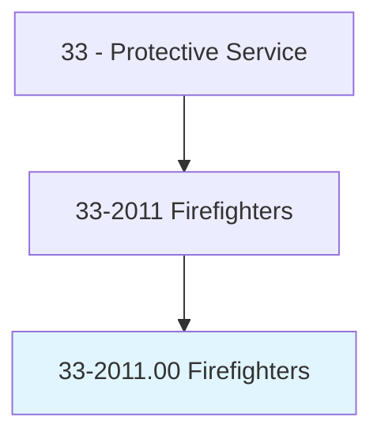
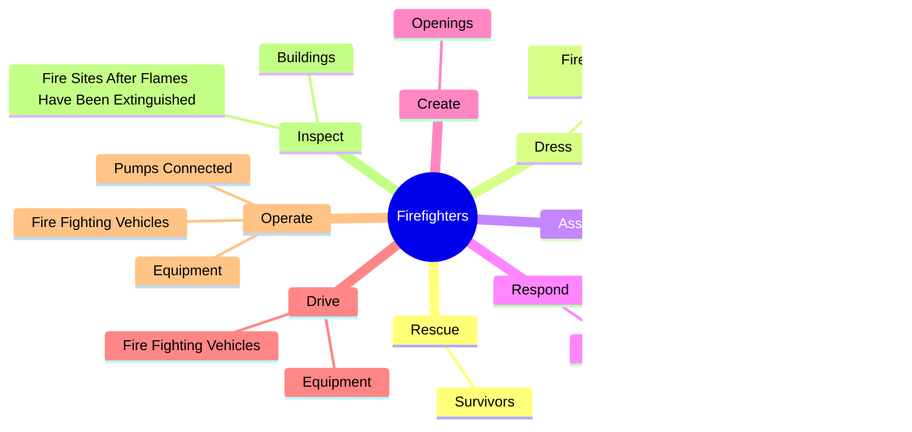
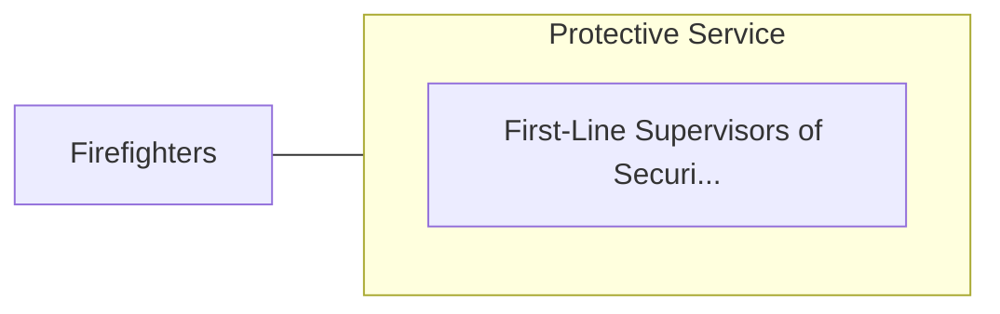

# Firefighters

> Control and extinguish fires or respond to emergency situations where life, property, or the environment is at risk. Duties may include fire prevention, emergency medical service, hazardous material response, search and rescue, and disaster assistance.

## Overview

Firefighters is an occupation within the Protective Service category. Control and extinguish fires or respond to emergency situations where life, property, or the environment is at risk. 

## Classification Hierarchy

## Key Statistics

| Metric | Value |
|--------|-------|
| SOC Code | 33-2011.00 |
| Category | [Protective Service](/occupations/PublicSafety/index) |
| Task Count | 98 |
| Source | O*NET |

## Core Tasks

### rescue.Survivors

Firefighters rescue survivors as part of their core responsibilities.

**Actions:**
- `rescue.Survivors.from.BurningBuildings`
- `rescue.Survivors.from.AccidentSites`
- `rescue.Survivors.from.WaterHazards`

### dress.FireResistantClothingApparatus

Firefighters dress fire resistant clothing apparatus as part of their core responsibilities.

**Actions:**
- `dress.FireResistantClothingApparatus`
- `dress.BreathingApparatus`

### assess.FiresReportConditions

Firefighters assess fires report conditions as part of their core responsibilities.

**Actions:**
- `assess.FiresReportConditions.to.SuperiorsToReceiveInstructions`
- `assess.FiresReportConditions.to.UsingTwoWayRadios`
- `assess.SituationsReportConditions.to.SuperiorsToReceiveInstructions`
- `assess.SituationsReportConditions.to.UsingTwoWayRadios`

## Skills & Competencies

### Technical Skills
- **Law Enforcement** - Advanced
- **Emergency Response** - Advanced
- **Public Safety** - Advanced

### Soft Skills
- **Communication** - Essential
- **Problem Solving** - Essential
- **Critical Thinking** - Important
- **Teamwork** - Important
- **Adaptability** - Important

## Related Occupations

## Industries

This occupation is found across multiple industries. See [Industries](/industries) for sector-specific employment data.

## Career Progression

---

*Source: O*NET 33-2011.00 - ONETOccupation*
