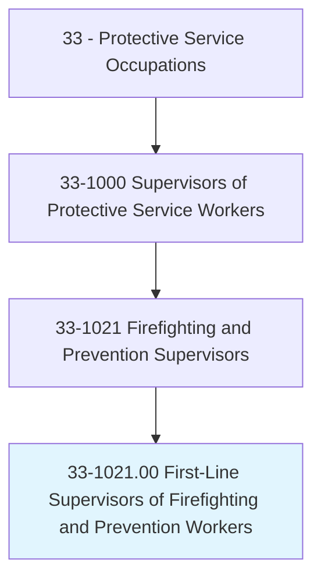
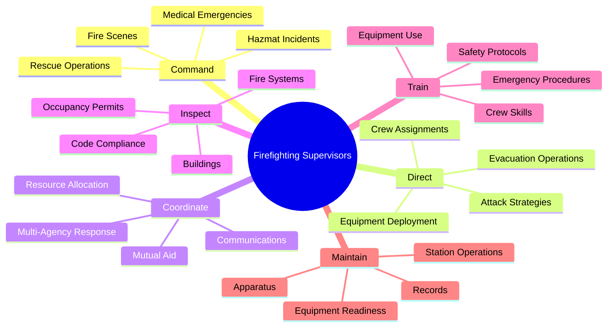
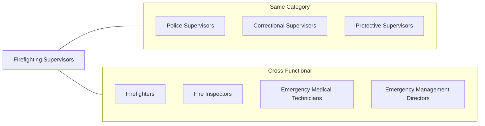
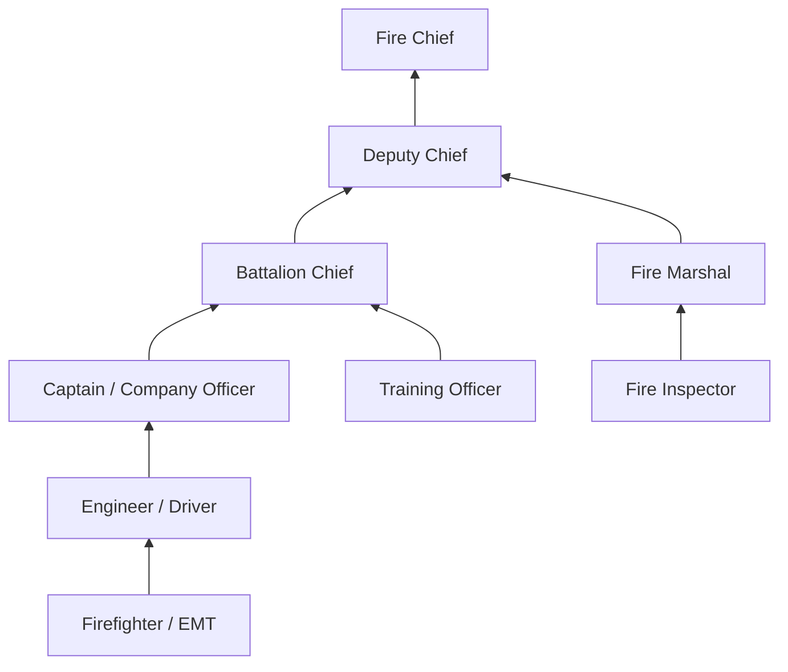
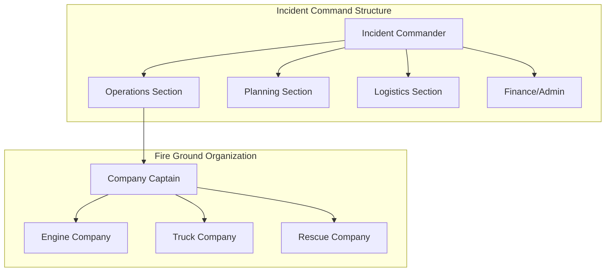

# First-Line Supervisors of Firefighting and Prevention Workers

> Directly supervise and coordinate activities of workers engaged in firefighting and fire prevention and control.

## Overview

First-Line Supervisors of Firefighting and Prevention Workers serve as fire captains, battalion chiefs, and fire marshals who lead firefighters and fire prevention personnel in protecting lives and property. They direct emergency response operations at fire scenes, coordinate rescue activities, oversee fire inspection programs, and ensure their crews are trained and equipped for any emergency. These supervisors make split-second decisions in dangerous environments while managing team safety and operational effectiveness. The role extends beyond fire suppression to include emergency medical response, hazardous materials incidents, and community fire prevention education.

## Classification Hierarchy

## Key Statistics

| Metric | Value |
|--------|-------|
| SOC Code | 33-1021.00 |
| Job Zone | 3 (Medium Preparation) |
| Category | [Protective Service](/occupations/PublicSafety) |
| Core Tasks | 14+ |
| Source | O*NET |

## Core Tasks

### command.FireScenes

Firefighting Supervisors assume incident command and direct suppression operations.

**Actions:**
- `command.FireScenes.to.control.Fires` - Direct attack strategies for fire containment and extinguishment
- `direct.Crews.to.perform.SearchAndRescue` - Coordinate search operations for trapped victims
- `assess.Structures.for.SafetyRisks` - Evaluate building conditions and collapse potential
- `coordinate.Ventilation.to.control.FireSpread` - Direct tactical ventilation operations

### direct.EmergencyResponse

Supervisors lead crews in responding to diverse emergency situations.

**Actions:**
- `direct.Crews.to.respond.to.MedicalEmergencies` - Coordinate EMS response and patient care
- `direct.Operations.at.VehicleAccidents` - Lead extrication and rescue at crash scenes
- `coordinate.Response.to.HazmatIncidents` - Manage hazardous materials containment
- `direct.WaterRescue.Operations` - Lead swift water and surface rescue operations

### coordinate.MultiAgencyResponse

Supervisors work with multiple agencies during large-scale incidents.

**Actions:**
- `coordinate.Resources.with.MutualAid` - Request and integrate resources from neighboring jurisdictions
- `communicate.WithPolice.at.Scenes` - Coordinate with law enforcement on traffic and security
- `coordinate.EMS.for.PatientCare` - Integrate ambulance services for victim treatment
- `liaise.WithUtilities.for.ServiceShutoff` - Coordinate gas, electric, and water shutoffs

### inspect.Buildings

Prevention supervisors ensure fire code compliance through inspection programs.

**Actions:**
- `inspect.Buildings.for.CodeCompliance` - Conduct fire safety inspections
- `review.FireSystems.for.Functionality` - Test sprinkler, alarm, and suppression systems
- `evaluate.OccupancyLoads.for.Safety` - Verify buildings meet occupancy requirements
- `issue.Violations.for.NonCompliance` - Document and enforce fire code violations

### train.CrewMembers

Supervisors develop and maintain crew competencies through ongoing training.

**Actions:**
- `train.Crews.on.FireTactics` - Conduct drills on attack and suppression strategies
- `train.Staff.on.EquipmentUse` - Ensure proficiency with tools and apparatus
- `train.Firefighters.on.RescueTechniques` - Develop technical rescue capabilities
- `evaluate.CrewPerformance.through.Drills` - Assess readiness through scenario exercises

### maintain.Apparatus

Supervisors ensure equipment and apparatus are ready for emergency response.

**Actions:**
- `maintain.Apparatus.for.Readiness` - Oversee vehicle maintenance and inspections
- `inventory.Equipment.for.Accountability` - Track tools, hoses, and safety gear
- `inspect.PPE.for.Safety` - Verify personal protective equipment condition
- `coordinate.Repairs.with.Mechanics` - Schedule apparatus maintenance and repairs

## Skills & Competencies

### Technical Skills
- **Fire Suppression Tactics** - Expert
- **Incident Command System (ICS)** - Expert
- **Building Construction** - Advanced
- **Hazardous Materials** - Advanced
- **Emergency Medical Services** - Advanced

### Soft Skills
- **Leadership Under Pressure** - Critical
- **Decision Making** - Critical
- **Team Coordination** - Critical
- **Communication** - Essential
- **Physical Fitness** - Essential

## Related Occupations

## Industries

- [Local Government (Municipal Fire Departments)](/industries/GovernmentLocal) - Highest Employment
- [State Government (State Fire Marshal)](/industries/GovernmentState) - Moderate Employment
- [Federal Government (Federal Firefighting)](/industries/GovernmentFederal) - Specialized Employment
- [Military Bases](/industries/Military) - Base Fire Departments
- [Industrial Facilities](/industries/Manufacturing) - Plant Fire Brigades
- [Airports](/industries/AirTransportation) - ARFF Services

## Industry Variations

### Municipal Fire Departments
- Supervise career firefighters in city and town fire departments
- Respond to structure fires, vehicle accidents, medical emergencies
- Coordinate with city administration on budget and policy
- Implement community risk reduction and public education programs

### County/Rural Fire Districts
- Manage combination career and volunteer firefighter crews
- Cover large geographic areas with limited resources
- Coordinate mutual aid agreements with neighboring districts
- Address wildland-urban interface fire risks

### Federal Wildland Firefighting
- Lead crews on wildland fire incidents across federal lands
- Supervise hotshot crews, engine crews, and helicopter operations
- Implement Incident Command System at complex fires
- Coordinate with multiple federal agencies (USFS, BLM, NPS)

### Industrial Fire Brigades
- Supervise plant emergency response teams at refineries, chemical plants
- Focus on specialized industrial hazards and fire risks
- Coordinate with plant management and safety departments
- Maintain compliance with OSHA and industry regulations

### Airport Rescue and Firefighting (ARFF)
- Command aircraft rescue firefighting operations
- Supervise specialized ARFF apparatus and equipment
- Maintain FAA certification requirements
- Coordinate with airport operations and airlines

## Career Progression

## Education & Training

| Requirement | Details |
|-------------|---------|
| Typical Education | High school diploma required; Associate's or Bachelor's degree preferred |
| Work Experience | 5-8 years as Firefighter/Engineer |
| On-the-Job Training | 1-2 years in company officer development |
| Required Certifications | Fire Officer I/II, EMT or Paramedic, Hazmat Ops, ICS 100-400 |
| Continuing Education | Fire service leadership programs, tactical training, continuing education |

## Work Environment

| Factor | Description |
|--------|-------------|
| Setting | Fire stations, emergency scenes, inspection sites, training facilities |
| Schedule | 24-hour shifts (Kelly Schedule), holidays, on-call status |
| Physical Demands | Heavy lifting, climbing, exposure to extreme heat, extended exertion |
| Stress Level | Very High - life safety decisions, traumatic incidents |
| Risk Factors | Burns, smoke inhalation, structural collapse, cancer exposure |

## Incident Command Structure

## Departments

This occupation typically works in:
- [Fire Suppression](/departments/FireSuppression)
- [Fire Prevention](/departments/FirePrevention)
- [Emergency Medical Services](/departments/EMS)
- [Training Division](/departments/FireTraining)
- [Special Operations](/departments/SpecialOperations)

## Related Processes

- [Emergency Dispatch](/processes/EmergencyDispatch)
- [Incident Command](/processes/IncidentCommand)
- [Fire Investigation](/processes/FireInvestigation)
- [Apparatus Maintenance](/processes/ApparatusMaintenance)
- [Building Inspection](/processes/BuildingInspection)

## Certifications & Standards

| Certification | Issuing Body |
|---------------|--------------|
| Fire Officer I/II | NFPA 1021 / State Fire Marshal |
| Incident Safety Officer | NFPA 1521 |
| Fire Inspector I/II | NFPA 1031 |
| Hazardous Materials Technician | NFPA 472 |
| National Incident Management System | FEMA |

---

*Source: O*NET 33-1021.00 - ONETOccupation*
