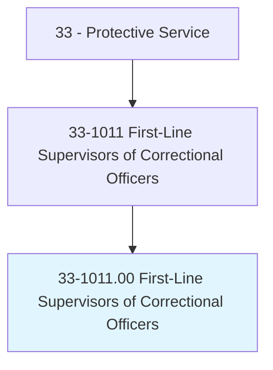
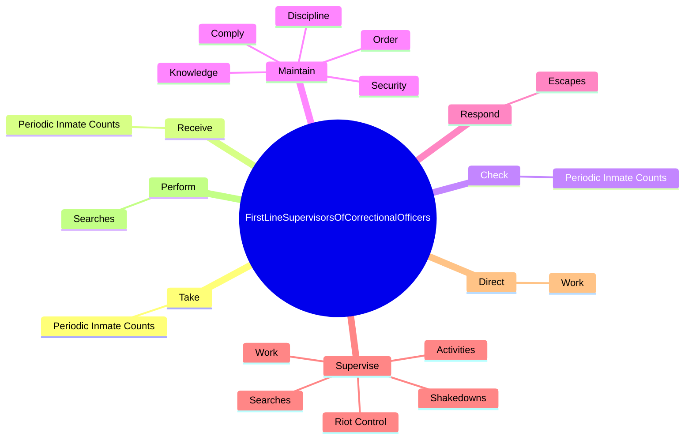
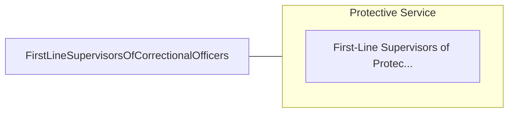

# First-Line Supervisors of Correctional Officers

> Directly supervise and coordinate activities of correctional officers and jailers.

## Overview

First-Line Supervisors of Correctional Officers is classified under Protective Service (SOC 33). Directly supervise and coordinate activities of correctional officers and jailers.

## Classification Hierarchy

## Key Statistics

| Metric | Value |
|--------|-------|
| SOC Code | 33-1011.00 |
| Category | [Protective Service](/occupations/PublicSafety) |
| Task Count | 107 |
| Source | O*NET |

## Core Tasks

### take.PeriodicInmateCounts

First-Line Supervisors of Correctional Officers take periodic inmate counts as part of their core responsibilities.

**Actions:**
- `take.PeriodicInmateCounts`

### receive.PeriodicInmateCounts

First-Line Supervisors of Correctional Officers receive periodic inmate counts as part of their core responsibilities.

**Actions:**
- `receive.PeriodicInmateCounts`

### check.PeriodicInmateCounts

First-Line Supervisors of Correctional Officers check periodic inmate counts as part of their core responsibilities.

**Actions:**
- `check.PeriodicInmateCounts`

## Skills & Competencies

### Technical Skills
- **Law Enforcement** - Advanced
- **Emergency Response** - Advanced
- **Public Safety** - Advanced

### Soft Skills
- **Communication** - Essential
- **Problem Solving** - Essential
- **Critical Thinking** - Important
- **Teamwork** - Important
- **Adaptability** - Important

## Related Occupations

## Industries

This occupation is found across multiple industries. See [Industries](/industries) for sector-specific employment data.

## Career Progression

---

*Source: O*NET 33-1011.00 - ONETOccupation*
