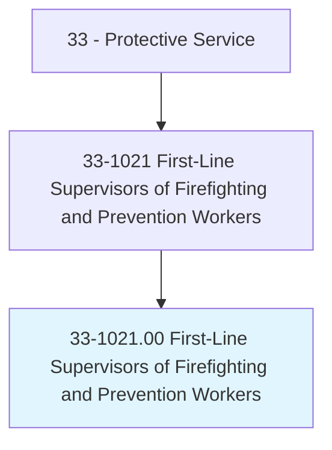
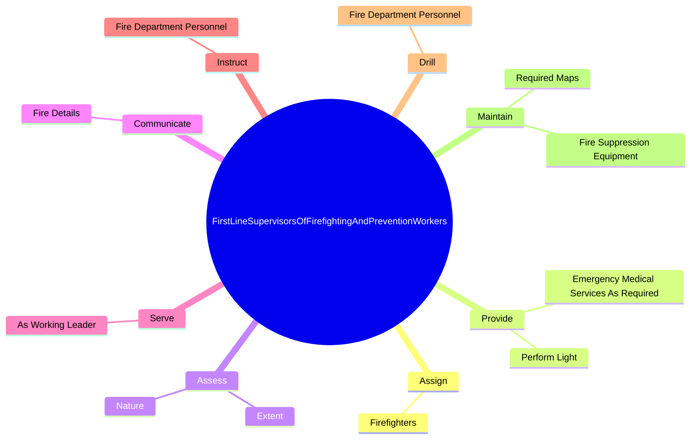
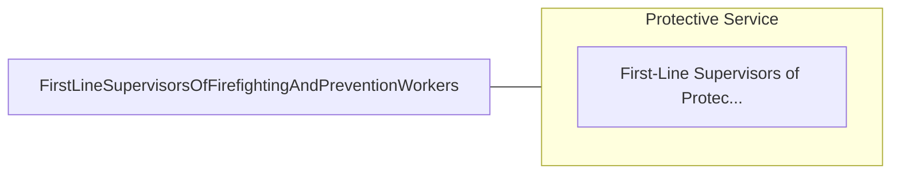

# First-Line Supervisors of Firefighting and Prevention Workers

> Directly supervise and coordinate activities of workers engaged in firefighting and fire prevention and control.

## Overview

First-Line Supervisors of Firefighting and Prevention Workers is classified under Protective Service (SOC 33). Directly supervise and coordinate activities of workers engaged in firefighting and fire prevention and control.

## Classification Hierarchy

## Key Statistics

| Metric | Value |
|--------|-------|
| SOC Code | 33-1021.00 |
| Category | [Protective Service](/occupations/PublicSafety) |
| Task Count | 112 |
| Source | O*NET |

## Core Tasks

### assign.Firefighters

First-Line Supervisors of Firefighting and Prevention Workers assign firefighters as part of their core responsibilities.

**Actions:**
- `assign.Firefighters.to.JobsAtStrategicLocationsToFacilitateRescueOfPersons`
- `assign.Firefighters.to.maximize.ApplicationOfExtinguishingAgents`

### provide.EmergencyMedicalServicesAsRequired

First-Line Supervisors of Firefighting and Prevention Workers provide emergency medical services as required as part of their core responsibilities.

**Actions:**
- `provide.EmergencyMedicalServicesAsRequired.to.HeavyRescueFunctionsAtEmergencies`
- `provide.PerformLight.to.HeavyRescueFunctionsAtEmergencies`

### assess.Nature

First-Line Supervisors of Firefighting and Prevention Workers assess nature as part of their core responsibilities.

**Actions:**
- `assess.Nature.of.Fire`
- `assess.Nature.of.Condition.of.Building`
- `assess.Nature.of.DangerToAdjacentBuildings`
- `assess.Nature.of.WaterSupplyStatus.to.determine.CrewRequirements`

## Skills & Competencies

### Technical Skills
- **Law Enforcement** - Advanced
- **Emergency Response** - Advanced
- **Public Safety** - Advanced

### Soft Skills
- **Communication** - Essential
- **Problem Solving** - Essential
- **Critical Thinking** - Important
- **Teamwork** - Important
- **Adaptability** - Important

## Related Occupations

## Industries

This occupation is found across multiple industries. See [Industries](/industries) for sector-specific employment data.

## Career Progression

---

*Source: O*NET 33-1021.00 - ONETOccupation*
