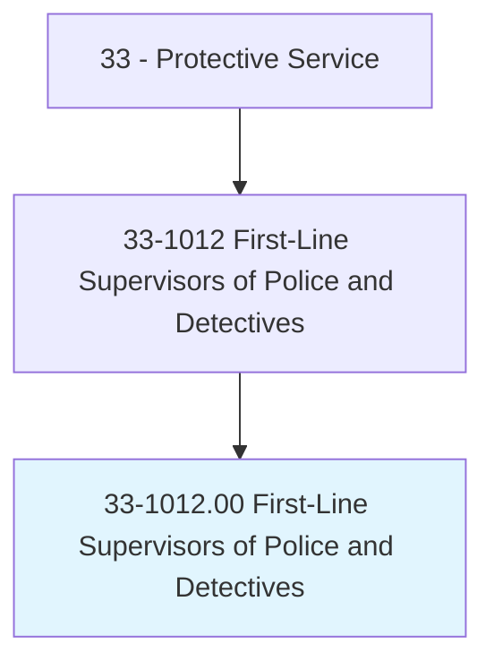
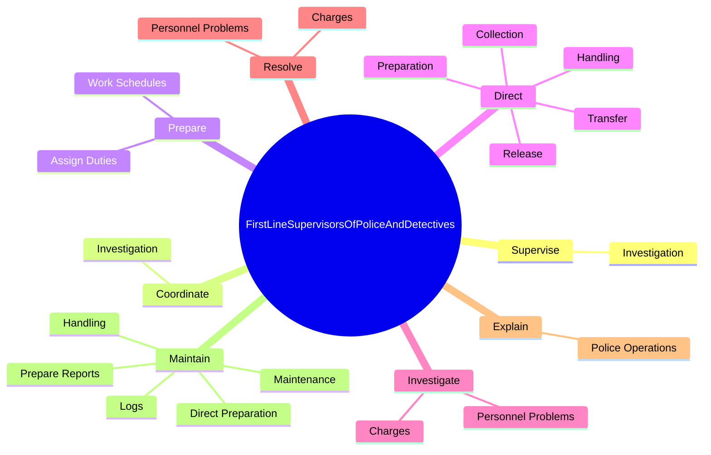

# First-Line Supervisors of Police and Detectives

> Directly supervise and coordinate activities of members of police force.

## Overview

First-Line Supervisors of Police and Detectives is classified under Protective Service (SOC 33). Directly supervise and coordinate activities of members of police force.

## Classification Hierarchy

## Key Statistics

| Metric | Value |
|--------|-------|
| SOC Code | 33-1012.00 |
| Category | [Protective Service](/occupations/PublicSafety/index) |
| Task Count | 71 |
| Source | O*NET |

## Core Tasks

### supervise.Investigation

First-Line Supervisors of Police and Detectives supervise investigation as part of their core responsibilities.

**Actions:**
- `supervise.Investigation.of.CriminalCases`
- `supervise.Investigation.of.OfferingGuidance`
- `supervise.Investigation.of.Expertise.to.Investigators`
- `supervise.Investigation.of.EnsuringProceduresAreConducted.in.AccordanceWithLaws`

### coordinate.Investigation

First-Line Supervisors of Police and Detectives coordinate investigation as part of their core responsibilities.

**Actions:**
- `coordinate.Investigation.of.CriminalCases`
- `coordinate.Investigation.of.OfferingGuidance`
- `coordinate.Investigation.of.Expertise.to.Investigators`
- `coordinate.Investigation.of.EnsuringProceduresAreConducted.in.AccordanceWithLaws`

### prepare.WorkSchedules

First-Line Supervisors of Police and Detectives prepare work schedules as part of their core responsibilities.

**Actions:**
- `prepare.WorkSchedules.to.Subordinates`
- `prepare.AssignDuties.to.Subordinates`

## Skills & Competencies

### Technical Skills
- **Law Enforcement** - Advanced
- **Emergency Response** - Advanced
- **Public Safety** - Advanced

### Soft Skills
- **Communication** - Essential
- **Problem Solving** - Essential
- **Critical Thinking** - Important
- **Teamwork** - Important
- **Adaptability** - Important

## Related Occupations

## Industries

This occupation is found across multiple industries. See [Industries](/industries) for sector-specific employment data.

## Career Progression

---

*Source: O*NET 33-1012.00 - ONETOccupation*
