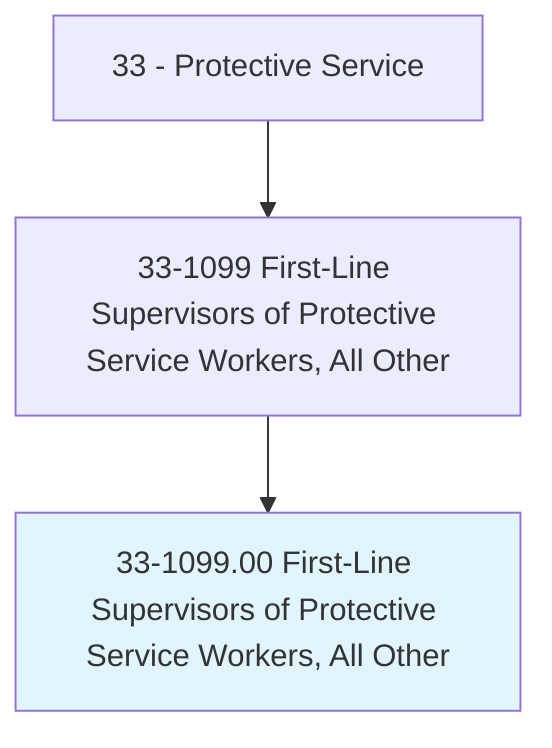

# First-Line Supervisors of Protective Service Workers, All Other

> All protective service supervisors not listed separately above.

## Overview

First-Line Supervisors of Protective Service Workers, All Other is classified under Protective Service (SOC 33). All protective service supervisors not listed separately above.

## Classification Hierarchy

## Key Statistics

| Metric | Value |
|--------|-------|
| SOC Code | 33-1099.00 |
| Category | [Protective Service](/occupations/PublicSafety/index) |
| Task Count | 0 |
| Source | O*NET |

## Core Tasks

Task data is being compiled for this occupation. See [O*NET 33-1099.00](https://www.onetonline.org/link/summary/33-1099.00) for detailed task information.

## Skills & Competencies

### Technical Skills
- **Law Enforcement** - Advanced
- **Emergency Response** - Advanced
- **Public Safety** - Advanced

### Soft Skills
- **Communication** - Essential
- **Problem Solving** - Essential
- **Critical Thinking** - Important
- **Teamwork** - Important
- **Adaptability** - Important

## Related Occupations

## Industries

This occupation is found across multiple industries. See [Industries](/industries) for sector-specific employment data.

## Career Progression

---

*Source: O*NET 33-1099.00 - ONETOccupation*
