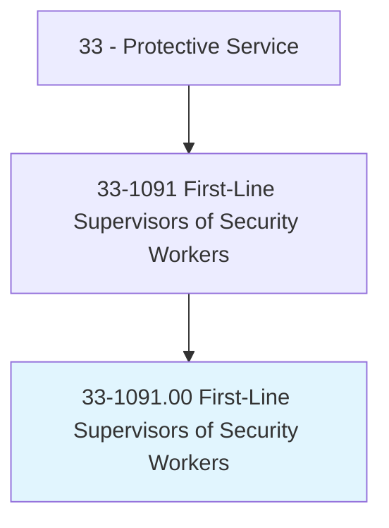
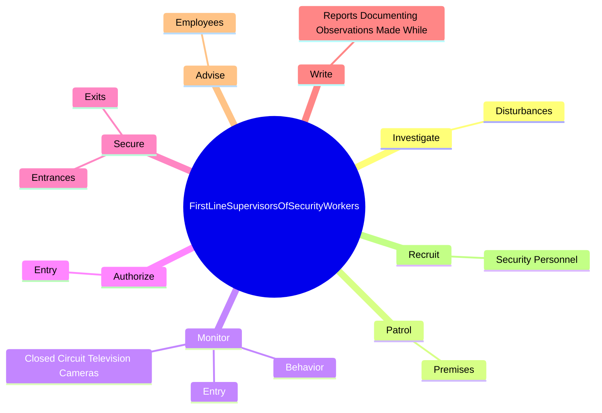
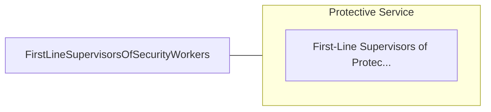

# First-Line Supervisors of Security Workers

> Directly supervise and coordinate activities of security workers and security guards.

## Overview

First-Line Supervisors of Security Workers is classified under Protective Service (SOC 33). Directly supervise and coordinate activities of security workers and security guards.

## Classification Hierarchy

## Key Statistics

| Metric | Value |
|--------|-------|
| SOC Code | 33-1091.00 |
| Category | [Protective Service](/occupations/PublicSafety) |
| Task Count | 82 |
| Source | O*NET |

## Core Tasks

### investigate.Disturbances

First-Line Supervisors of Security Workers investigate disturbances as part of their core responsibilities.

**Actions:**
- `investigate.Disturbances.on.Premises`
- `investigate.Disturbances.on.SecurityAlarms`
- `investigate.Disturbances.on.Altercations`
- `investigate.Disturbances.on.SuspiciousActivity`

### patrol.Premises

First-Line Supervisors of Security Workers patrol premises as part of their core responsibilities.

**Actions:**
- `patrol.Premises.to.prevent.Intrusion`
- `patrol.Premises.to.detect.Intrusion`
- `patrol.Premises.to.protect.Property`
- `patrol.Premises.to.preserve.Order`

### monitor.Entry

First-Line Supervisors of Security Workers monitor entry as part of their core responsibilities.

**Actions:**
- `monitor.Entry.of.Employees`
- `monitor.Entry.of.Visitors`
- `monitor.Entry.of.OtherPersons`
- `monitor.Behavior.of.SecurityEmployees.to.ensure.AdherenceToQualityStandards`

## Skills & Competencies

### Technical Skills
- **Law Enforcement** - Advanced
- **Emergency Response** - Advanced
- **Public Safety** - Advanced

### Soft Skills
- **Communication** - Essential
- **Problem Solving** - Essential
- **Critical Thinking** - Important
- **Teamwork** - Important
- **Adaptability** - Important

## Related Occupations

## Industries

This occupation is found across multiple industries. See [Industries](/industries) for sector-specific employment data.

## Career Progression

---

*Source: O*NET 33-1091.00 - ONETOccupation*
