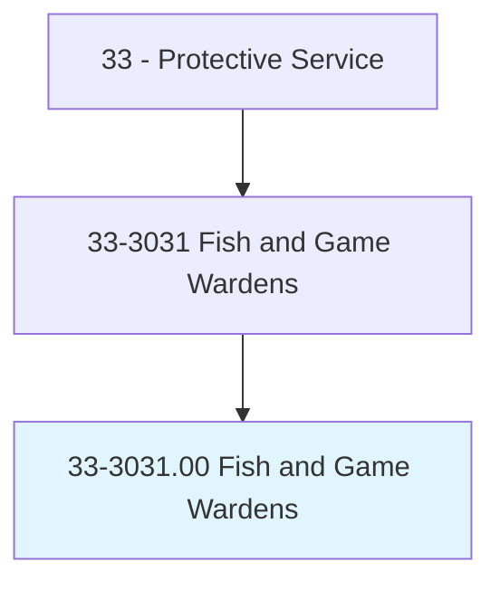
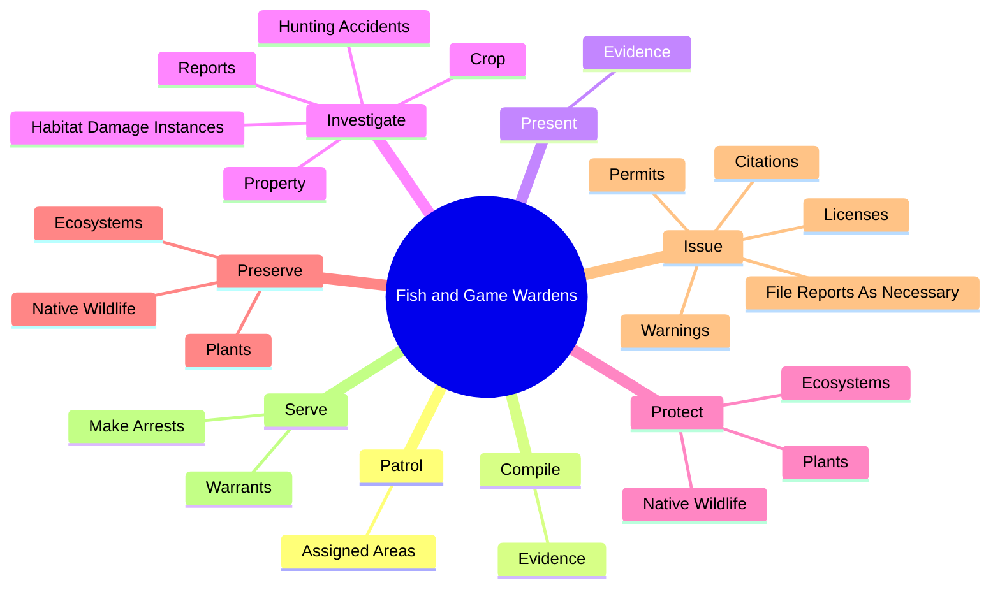
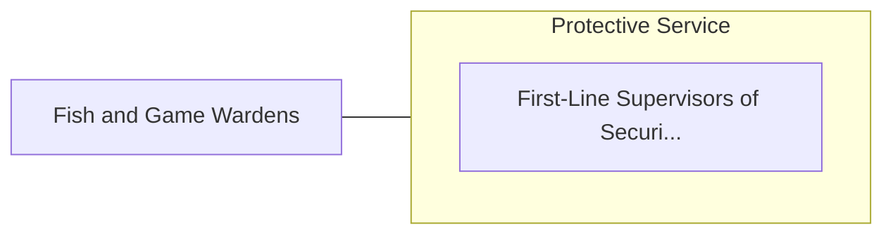

# Fish and Game Wardens

> Patrol assigned area to prevent fish and game law violations. Investigate reports of damage to crops or property by wildlife. Compile biological data.

## Overview

Fish and Game Wardens is an occupation within the Protective Service category. Patrol assigned area to prevent fish and game law violations. Investigate reports of damage to crops or property by wildlife.

## Classification Hierarchy

## Key Statistics

| Metric | Value |
|--------|-------|
| SOC Code | 33-3031.00 |
| Category | [Protective Service](/occupations/PublicSafety/index) |
| Task Count | 90 |
| Source | O*NET |

## Core Tasks

### patrol.AssignedAreas

Fish and Game Wardens patrol assigned areas as part of their core responsibilities.

**Actions:**
- `patrol.AssignedAreas.by.Car`
- `patrol.AssignedAreas.by.Boat`
- `patrol.AssignedAreas.by.Airplane`
- `patrol.AssignedAreas.by.Horse`

### compile.Evidence

Fish and Game Wardens compile evidence as part of their core responsibilities.

**Actions:**
- `compile.Evidence.for.CourtActions`

### present.Evidence

Fish and Game Wardens present evidence as part of their core responsibilities.

**Actions:**
- `present.Evidence.for.CourtActions`

## Skills & Competencies

### Technical Skills
- **Law Enforcement** - Advanced
- **Emergency Response** - Advanced
- **Public Safety** - Advanced

### Soft Skills
- **Communication** - Essential
- **Problem Solving** - Essential
- **Critical Thinking** - Important
- **Teamwork** - Important
- **Adaptability** - Important

## Related Occupations

## Industries

This occupation is found across multiple industries. See [Industries](/industries) for sector-specific employment data.

## Career Progression

---

*Source: O*NET 33-3031.00 - ONETOccupation*
