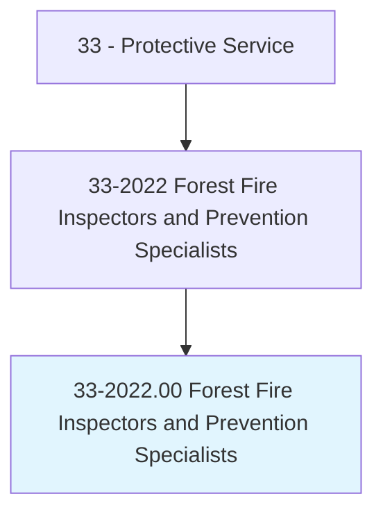
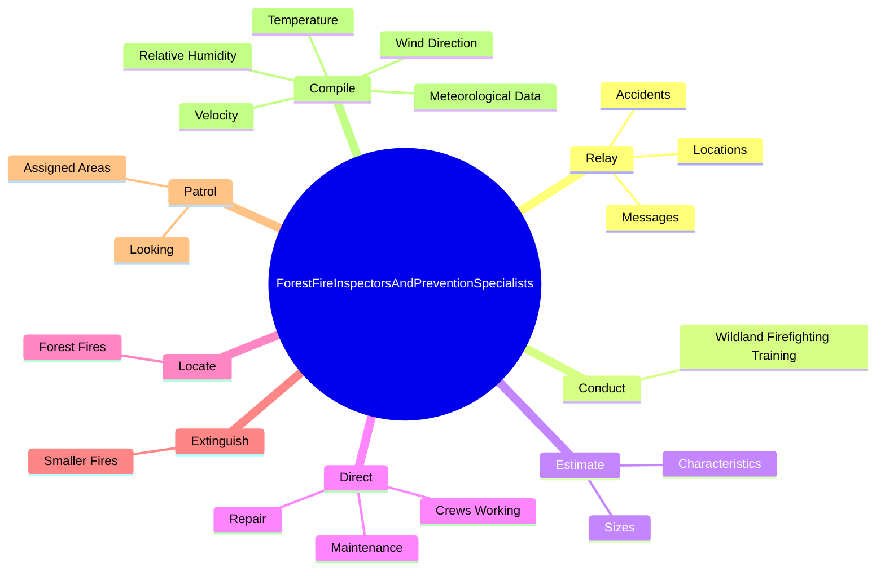
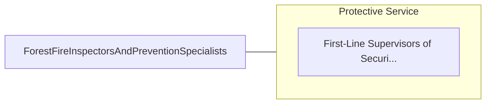

# Forest Fire Inspectors and Prevention Specialists

> Enforce fire regulations, inspect forest for fire hazards, and recommend forest fire prevention or control measures. May report forest fires and weather conditions.

## Overview

Forest Fire Inspectors and Prevention Specialists is an occupation within the Protective Service category. Enforce fire regulations, inspect forest for fire hazards, and recommend forest fire prevention or control measures. 

## Classification Hierarchy

## Key Statistics

| Metric | Value |
|--------|-------|
| SOC Code | 33-2022.00 |
| Category | [Protective Service](/occupations/PublicSafety) |
| Task Count | 90 |
| Source | O*NET |

## Core Tasks

### relay.Messages

Forest Fire Inspectors and Prevention Specialists relay messages as part of their core responsibilities.

**Actions:**
- `relay.Messages.about.Emergencies.of.Crew`
- `relay.Messages.about.Emergencies.of.Personnel`
- `relay.Messages.about.Emergencies.of.FireHazardConditions`
- `relay.Accidents.of.Crew`

### conduct.WildlandFirefightingTraining

Forest Fire Inspectors and Prevention Specialists conduct wildland firefighting training as part of their core responsibilities.

**Actions:**
- `conduct.WildlandFirefightingTraining`

### estimate.Sizes

Forest Fire Inspectors and Prevention Specialists estimate sizes as part of their core responsibilities.

**Actions:**
- `estimate.Sizes.of.Fires`
- `estimate.Sizes.of.ReportFindingsToBaseCampsByRadio`
- `estimate.Sizes.of.Telephone`
- `estimate.Characteristics.of.Fires`

## Skills & Competencies

### Technical Skills
- **Law Enforcement** - Advanced
- **Emergency Response** - Advanced
- **Public Safety** - Advanced

### Soft Skills
- **Communication** - Essential
- **Problem Solving** - Essential
- **Critical Thinking** - Important
- **Teamwork** - Important
- **Adaptability** - Important

## Related Occupations

## Industries

This occupation is found across multiple industries. See [Industries](/industries) for sector-specific employment data.

## Career Progression

---

*Source: O*NET 33-2022.00 - ONETOccupation*
