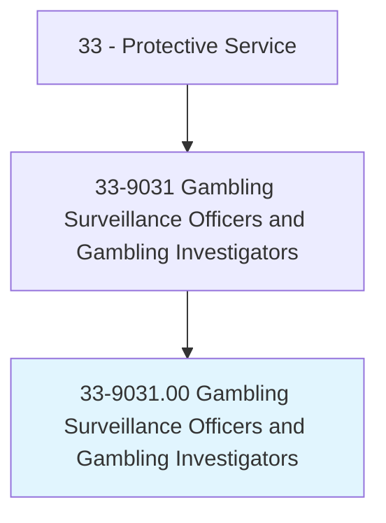
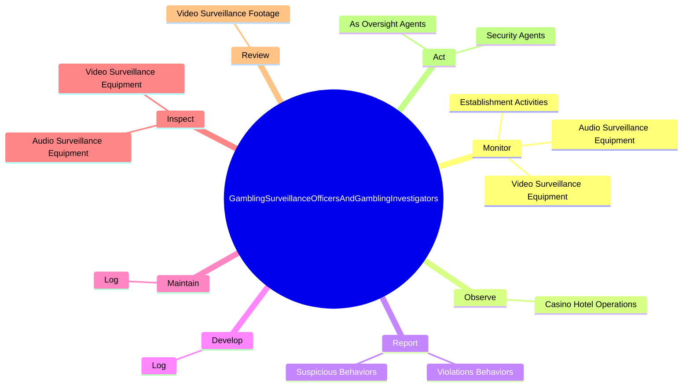
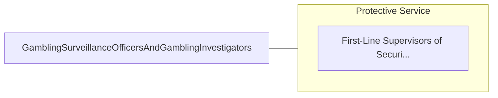

# Gambling Surveillance Officers and Gambling Investigators

> Observe gambling operation for irregular activities such as cheating or theft by either employees or patrons. Investigate potential threats to gambling assets such as money, chips, and gambling equipment. Act as oversight and security agent for management and customers.

## Overview

Gambling Surveillance Officers and Gambling Investigators is an occupation within the Protective Service category. Observe gambling operation for irregular activities such as cheating or theft by either employees or patrons. Investigate potential threats to gambling assets such as money, chips, and gambling equipment.

## Classification Hierarchy

## Key Statistics

| Metric | Value |
|--------|-------|
| SOC Code | 33-9031.00 |
| Category | [Protective Service](/occupations/PublicSafety) |
| Task Count | 28 |
| Source | O*NET |

## Core Tasks

### monitor.EstablishmentActivities

Gambling Surveillance Officers and Gambling Investigators monitor establishment activities as part of their core responsibilities.

**Actions:**
- `monitor.EstablishmentActivities.to.ensure.AdherenceToStateGamingRegulationsPoliciesProcedures`
- `monitor.EstablishmentActivities.to.CompanyPoliciesProcedures`
- `monitor.AudioSurveillanceEquipment.to.ensure.ItIsWorkingAppropriately`
- `monitor.VideoSurveillanceEquipment.to.ensure.ItIsWorkingAppropriately`

### observe.CasinoHotelOperations

Gambling Surveillance Officers and Gambling Investigators observe casino hotel operations as part of their core responsibilities.

**Actions:**
- `observe.CasinoHotelOperations.for.IrregularActivities`
- `observe.CasinoHotelOperations.for.Cheating`
- `observe.CasinoHotelOperations.for.Theft.by.Employees`
- `observe.CasinoHotelOperations.for.Patrons`

### report.ViolationsBehaviors

Gambling Surveillance Officers and Gambling Investigators report violations behaviors as part of their core responsibilities.

**Actions:**
- `report.ViolationsBehaviors.to.Supervisors`
- `report.ViolationsBehaviors.to.Verbally`
- `report.ViolationsBehaviors.to.InWriting`
- `report.SuspiciousBehaviors.to.Supervisors`

## Skills & Competencies

### Technical Skills
- **Law Enforcement** - Advanced
- **Emergency Response** - Advanced
- **Public Safety** - Advanced

### Soft Skills
- **Communication** - Essential
- **Problem Solving** - Essential
- **Critical Thinking** - Important
- **Teamwork** - Important
- **Adaptability** - Important

## Related Occupations

## Industries

This occupation is found across multiple industries. See [Industries](/industries) for sector-specific employment data.

## Career Progression

---

*Source: O*NET 33-9031.00 - ONETOccupation*
