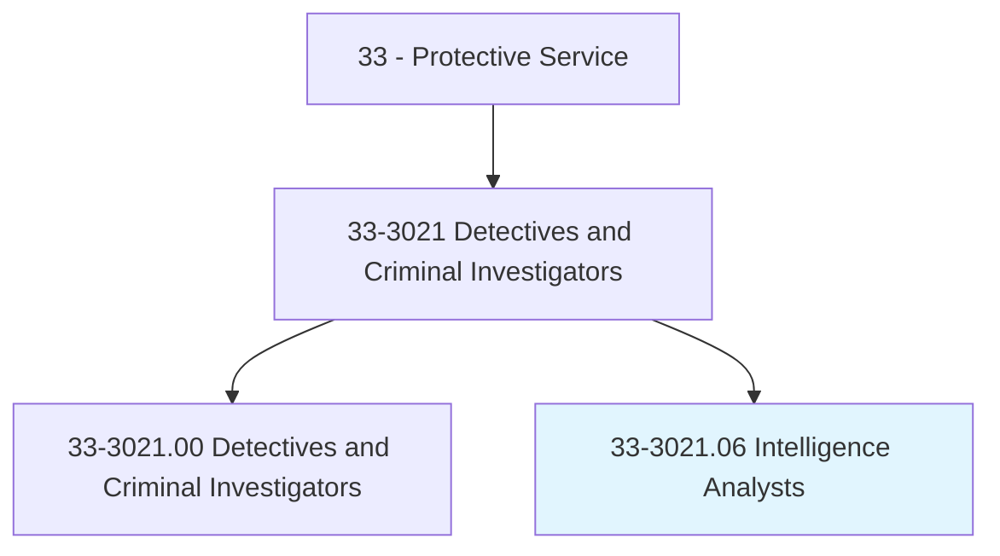
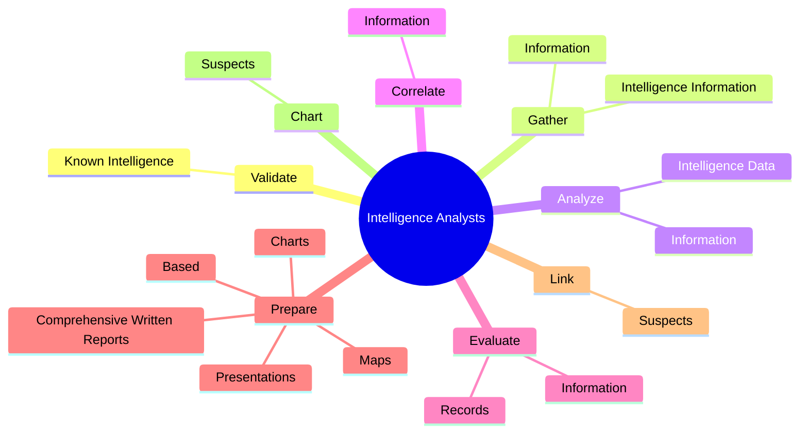
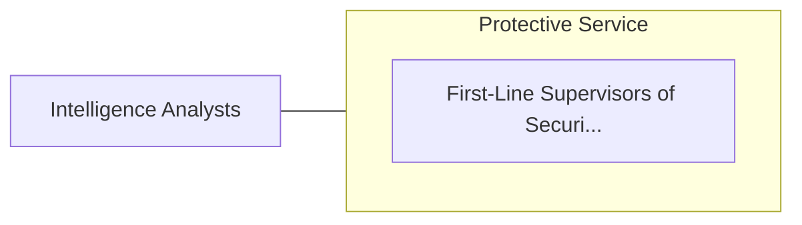

# Intelligence Analysts

> Gather, analyze, or evaluate information from a variety of sources, such as law enforcement databases, surveillance, intelligence networks or geographic information systems. Use intelligence data to anticipate and prevent organized crime activities, such as terrorism.

## Overview

Intelligence Analysts is a specialized variant within the Protective Service category. Gather, analyze, or evaluate information from a variety of sources, such as law enforcement databases, surveillance, intelligence networks or geographic information systems. 

## Classification Hierarchy

## Key Statistics

| Metric | Value |
|--------|-------|
| SOC Code | 33-3021.06 |
| Category | [Protective Service](/occupations/PublicSafety/index) |
| Task Count | 90 |
| Source | O*NET |

## Core Tasks

### validate.KnownIntelligence

Intelligence Analysts validate known intelligence as part of their core responsibilities.

**Actions:**
- `validate.KnownIntelligence.with.Data.from.OtherSources`

### gather.Information

Intelligence Analysts gather information as part of their core responsibilities.

**Actions:**
- `gather.Information.from.Variety.of.Resources`
- `gather.Information.from.LawEnforcementDatabases`
- `gather.IntelligenceInformation.by.FieldObservation`
- `gather.IntelligenceInformation.by.ConfidentialInformationSources`

### analyze.Information

Intelligence Analysts analyze information as part of their core responsibilities.

**Actions:**
- `analyze.Information.from.Variety.of.Resources`
- `analyze.Information.from.LawEnforcementDatabases`
- `analyze.IntelligenceData.to.identify.PatternsInCriminalActivity`
- `analyze.IntelligenceData.to.TrendsInCriminalActivity`

## Skills & Competencies

### Technical Skills
- **Law Enforcement** - Advanced
- **Emergency Response** - Advanced
- **Public Safety** - Advanced

### Soft Skills
- **Communication** - Essential
- **Problem Solving** - Essential
- **Critical Thinking** - Important
- **Teamwork** - Important
- **Adaptability** - Important

## Related Occupations

## Industries

This occupation is found across multiple industries. See [Industries](/industries) for sector-specific employment data.

## Career Progression

---

*Source: O*NET 33-3021.06 - ONETOccupation*
