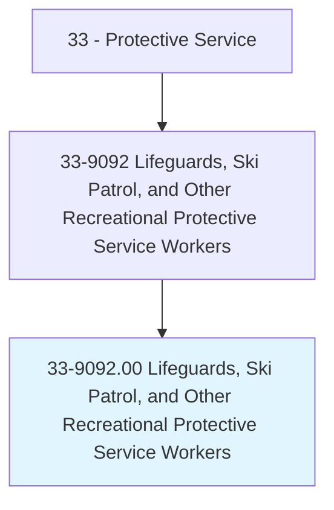
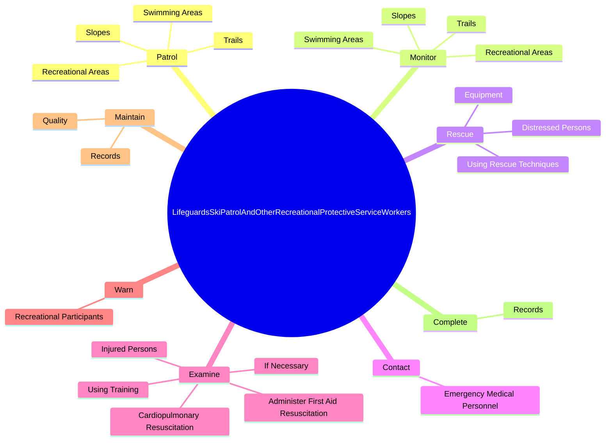
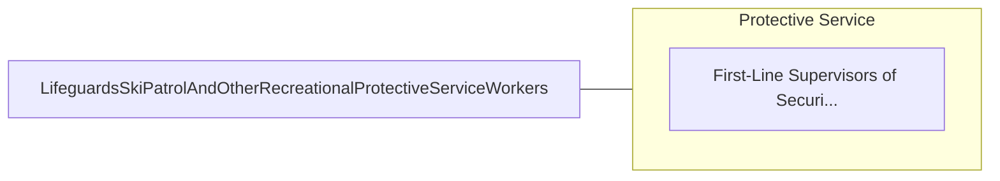

# Lifeguards, Ski Patrol, and Other Recreational Protective Service Workers

> Monitor recreational areas, such as pools, beaches, or ski slopes, to provide assistance and protection to participants.

## Overview

Lifeguards, Ski Patrol, and Other Recreational Protective Service Workers is classified under Protective Service (SOC 33). Monitor recreational areas, such as pools, beaches, or ski slopes, to provide assistance and protection to participants.

## Classification Hierarchy

## Key Statistics

| Metric | Value |
|--------|-------|
| SOC Code | 33-9092.00 |
| Category | [Protective Service](/occupations/PublicSafety/index) |
| Task Count | 73 |
| Source | O*NET |

## Core Tasks

### patrol.RecreationalAreas

Lifeguards, Ski Patrol, and Other Recreational Protective Service Workers patrol recreational areas as part of their core responsibilities.

**Actions:**
- `patrol.RecreationalAreas.on.Foot`
- `patrol.RecreationalAreas.on.InVehicles`
- `patrol.RecreationalAreas.on.FromTowers`
- `patrol.Trails.on.Foot`

### monitor.RecreationalAreas

Lifeguards, Ski Patrol, and Other Recreational Protective Service Workers monitor recreational areas as part of their core responsibilities.

**Actions:**
- `monitor.RecreationalAreas.on.Foot`
- `monitor.RecreationalAreas.on.InVehicles`
- `monitor.RecreationalAreas.on.FromTowers`
- `monitor.Trails.on.Foot`

### rescue.DistressedPersons

Lifeguards, Ski Patrol, and Other Recreational Protective Service Workers rescue distressed persons as part of their core responsibilities.

**Actions:**
- `rescue.DistressedPersons`
- `rescue.UsingRescueTechniques`
- `rescue.Equipment`

## Skills & Competencies

### Technical Skills
- **Law Enforcement** - Advanced
- **Emergency Response** - Advanced
- **Public Safety** - Advanced

### Soft Skills
- **Communication** - Essential
- **Problem Solving** - Essential
- **Critical Thinking** - Important
- **Teamwork** - Important
- **Adaptability** - Important

## Related Occupations

## Industries

This occupation is found across multiple industries. See [Industries](/industries) for sector-specific employment data.

## Career Progression

---

*Source: O*NET 33-9092.00 - ONETOccupation*
