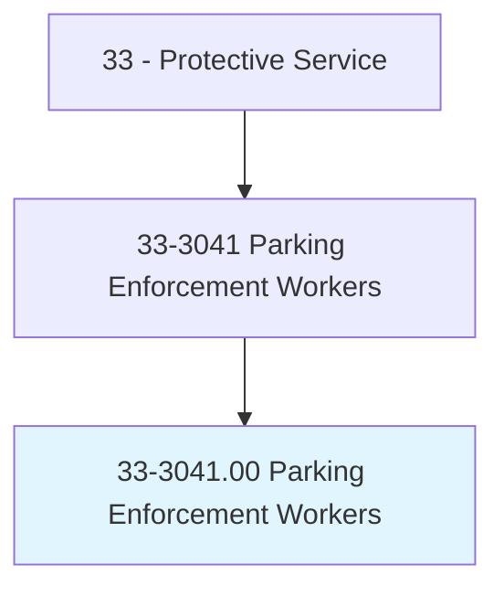
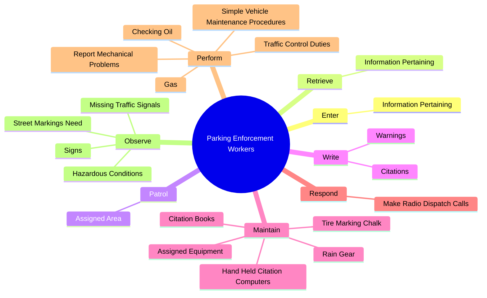
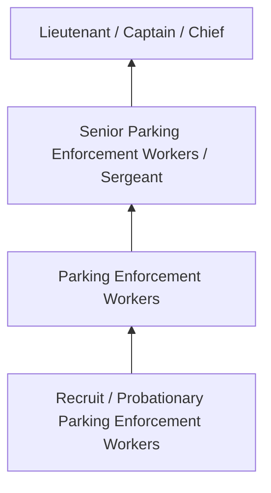
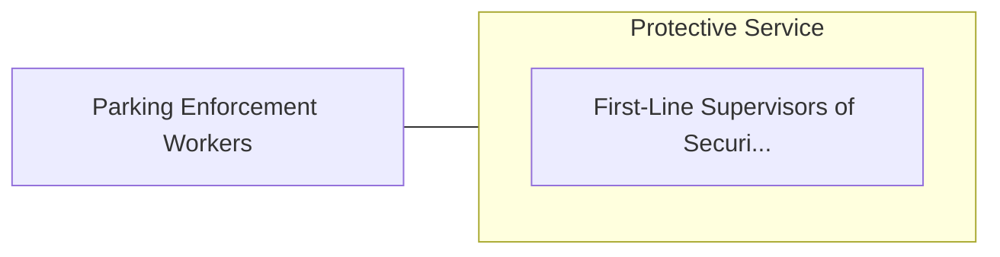

# Parking Enforcement Workers

> Patrol assigned area, such as public parking lot or city streets to issue tickets to overtime parking violators and illegally parked vehicles.

## Overview

Parking Enforcement Workers professionals patrol assigned area, such as public parking lot or city streets to issue tickets to overtime parking violators and illegally parked vehicles.. This occupation falls within the Protective Service category and requires a combination of specialized knowledge, technical skills, and practical experience.

These professionals work across diverse settings and organizational contexts, applying their expertise to meet the demands of their field. They must stay current with industry standards, emerging practices, and regulatory requirements that affect their work. The role demands both independent judgment and collaborative skills, as practitioners regularly interact with colleagues, stakeholders, and the public.

As the field continues to evolve, Parking Enforcement Workers professionals increasingly leverage technology and data-driven approaches to enhance their effectiveness. Career opportunities span the public and private sectors, with demand influenced by economic conditions, demographic shifts, and technological advancement.

## Classification Hierarchy



## Key Statistics

| Metric | Value |
|--------|-------|
| SOC Code | 33-3041.00 |
| Job Zone | N/A |
| Category | [Protective Service](/occupations/PublicSafety/index) |
| Core Tasks | 85+ |
| Salary Range | $35,000 - $90,000 |
| Median Salary | $52,000 |
| Growth Outlook | 5% (As fast as average) |
| Source | O*NET |

## Core Tasks



### maintain.AssignedEquipment

Parking Enforcement Workers maintain assigned equipment as part of their core responsibilities.

**Actions:**
- `maintain.AssignedEquipment` - Maintain assigned equipment and supplies, such as hand-held citation computer...
- `maintain.HandHeldCitationComputers` - Maintain assigned equipment and supplies, such as hand-held citation computer...
- `maintain.CitationBooks` - Maintain assigned equipment and supplies, such as hand-held citation computer...
- `maintain.RainGear` - Maintain assigned equipment and supplies, such as hand-held citation computer...
- `maintain.TireMarkingChalk` - Maintain assigned equipment and supplies, such as hand-held citation computer...

### perform.SimpleVehicleMaintenanceProcedures

Parking Enforcement Workers perform simple vehicle maintenance procedures as part of their core responsibilities.

**Actions:**
- `perform.SimpleVehicleMaintenanceProcedures.to.Supervisors` - Perform simple vehicle maintenance procedures, such as checking oil and gas, ...
- `perform.CheckingOil.to.Supervisors` - Perform simple vehicle maintenance procedures, such as checking oil and gas, ...
- `perform.Gas.to.Supervisors` - Perform simple vehicle maintenance procedures, such as checking oil and gas, ...
- `perform.ReportMechanicalProblems.to.Supervisors` - Perform simple vehicle maintenance procedures, such as checking oil and gas, ...
- `perform.TrafficControlDuties.on.ParkingMetersToLimitUse` - Perform traffic control duties such as setting up barricades and temporary si...

### provide.Information

Parking Enforcement Workers provide information as part of their core responsibilities.

**Actions:**
- `provide.Information.to.PublicRegardingParkingRegulations` - Provide information to the public regarding parking regulations and facilitie...
- `provide.Information.to.Facilities` - Provide information to the public regarding parking regulations and facilitie...
- `provide.Information.to.LocationOfStreets` - Provide information to the public regarding parking regulations and facilitie...
- `provide.Information.to.Buildings` - Provide information to the public regarding parking regulations and facilitie...
- `provide.Information.to.PointsOfInterest` - Provide information to the public regarding parking regulations and facilitie...

### enter.InformationPertaining

Parking Enforcement Workers enter information pertaining as part of their core responsibilities.

**Actions:**
- `enter.InformationPertaining.to.VehicleRegistration` - Enter and retrieve information pertaining to vehicle registration, identifica...
- `enter.InformationPertaining.to.Identification` - Enter and retrieve information pertaining to vehicle registration, identifica...
- `enter.InformationPertaining.to.Status` - Enter and retrieve information pertaining to vehicle registration, identifica...
- `enter.InformationPertaining.to.UsingHandHeldComputers` - Enter and retrieve information pertaining to vehicle registration, identifica...


## Skills & Competencies

### Technical Skills
- **Law Enforcement / Emergency Procedures** - Expert
- **Defensive Tactics** - Advanced
- **Report Writing** - Advanced
- **Emergency Response** - Advanced
- **Investigation Techniques** - Proficient
- **First Aid / CPR** - Proficient

### Soft Skills
- **Situational Awareness** - Critical
- **Decision Making Under Pressure** - Critical
- **Communication** - Essential
- **Physical Fitness** - Essential
- **Integrity** - Essential

## Education & Certifications

| Requirement | Details |
|-------------|---------|
| Typical Education | High school diploma to associate degree; academy training required |
| Work Experience | 0-2 years; field training period |
| On-the-Job Training | Extensive - police/fire/corrections academy |
| Certifications | State POST certification, EMT certification, firearms qualification |

## Career Progression



## Industry Variations

### Municipal Law Enforcement
City and county public safety services. Parking Enforcement Workers professionals serve local communities through patrol, investigation, and prevention.

### Fire and Emergency Services
Emergency response and fire prevention. Focus on rapid response, incident command, and community safety education.

### Corrections
Custody and supervision of incarcerated individuals. Emphasis on security, rehabilitation, and institutional order.

### Private Security
Contract security services for commercial and residential clients. Focus on access control, surveillance, and risk assessment.

## Technology & Tools

- **Computer-aided dispatch (CAD) systems**
- **Body cameras and surveillance systems**
- **Records management systems**
- **Firearms and tactical equipment**
- **Emergency communication systems**

## Related Occupations



## Industries

- [Local Government](/industries/LocalGovernment) - High Employment
- [State Government](/industries/StateGovernment) - High Employment
- [Federal Government](/industries/FederalGovernment) - Moderate Employment
- [Private Security Services](/industries/SecurityServices) - Moderate Employment

## Departments

This occupation typically works in:
- [Patrol Division](/departments/Patrol)
- [Investigations](/departments/Investigations)
- [Emergency Services](/departments/EmergencyServices)

## GraphDL Semantic Structure

```
Parking Enforcement Workers perform:
- enter.InformationPertaining.to.VehicleRegistration
- enter.InformationPertaining.to.Identification
- enter.InformationPertaining.to.Status
- enter.InformationPertaining.to.UsingHandHeldComputers
- retrieve.InformationPertaining.to.VehicleRegistration
- retrieve.InformationPertaining.to.Identification
```

---

*Source: O*NET 33-3041.00 - ONETOccupation*
