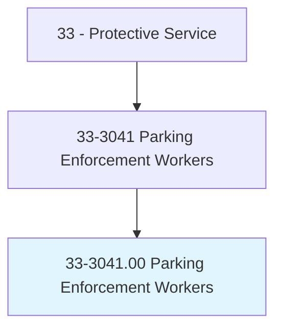
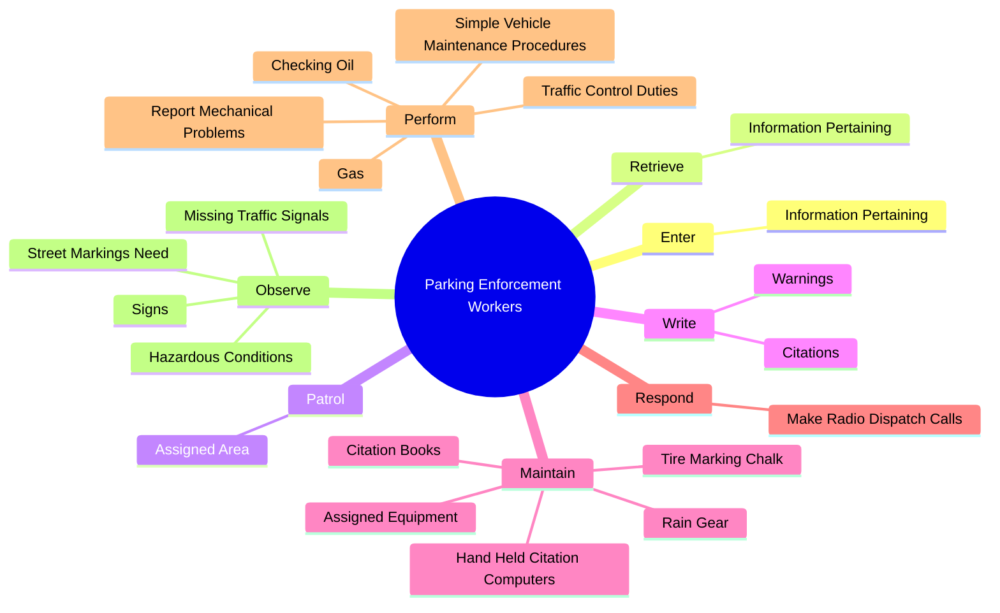
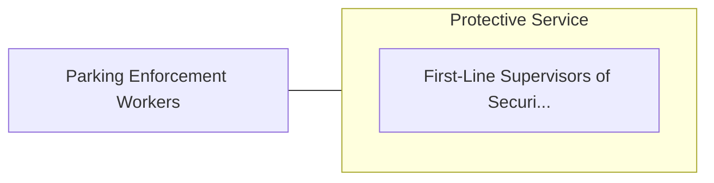

# Parking Enforcement Workers

> Patrol assigned area, such as public parking lot or city streets to issue tickets to overtime parking violators and illegally parked vehicles.

## Overview

Parking Enforcement Workers is classified under Protective Service (SOC 33). Patrol assigned area, such as public parking lot or city streets to issue tickets to overtime parking violators and illegally parked vehicles.

## Classification Hierarchy

## Key Statistics

| Metric | Value |
|--------|-------|
| SOC Code | 33-3041.00 |
| Category | [Protective Service](/occupations/PublicSafety/index) |
| Task Count | 85 |
| Source | O*NET |

## Core Tasks

### enter.InformationPertaining

Parking Enforcement Workers enter information pertaining as part of their core responsibilities.

**Actions:**
- `enter.InformationPertaining.to.VehicleRegistration`
- `enter.InformationPertaining.to.Identification`
- `enter.InformationPertaining.to.Status`
- `enter.InformationPertaining.to.UsingHandHeldComputers`

### retrieve.InformationPertaining

Parking Enforcement Workers retrieve information pertaining as part of their core responsibilities.

**Actions:**
- `retrieve.InformationPertaining.to.VehicleRegistration`
- `retrieve.InformationPertaining.to.Identification`
- `retrieve.InformationPertaining.to.Status`
- `retrieve.InformationPertaining.to.UsingHandHeldComputers`

### patrol.AssignedArea

Parking Enforcement Workers patrol assigned area as part of their core responsibilities.

**Actions:**
- `patrol.AssignedArea.by.VehicleFoot.to.ensure.PublicComplianceWithExistingParkingOrdinance`
- `patrol.AssignedArea.by.OnFoot.to.ensure.PublicComplianceWithExistingParkingOrdinance`

## Skills & Competencies

### Technical Skills
- **Law Enforcement** - Advanced
- **Emergency Response** - Advanced
- **Public Safety** - Advanced

### Soft Skills
- **Communication** - Essential
- **Problem Solving** - Essential
- **Critical Thinking** - Important
- **Teamwork** - Important
- **Adaptability** - Important

## Related Occupations

## Industries

This occupation is found across multiple industries. See [Industries](/industries) for sector-specific employment data.

## Career Progression

---

*Source: O*NET 33-3041.00 - ONETOccupation*
