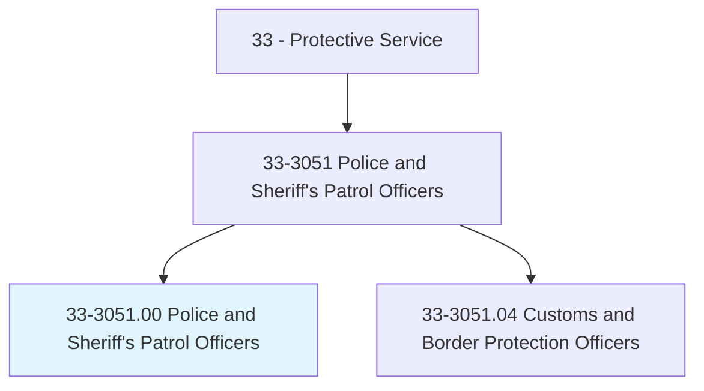
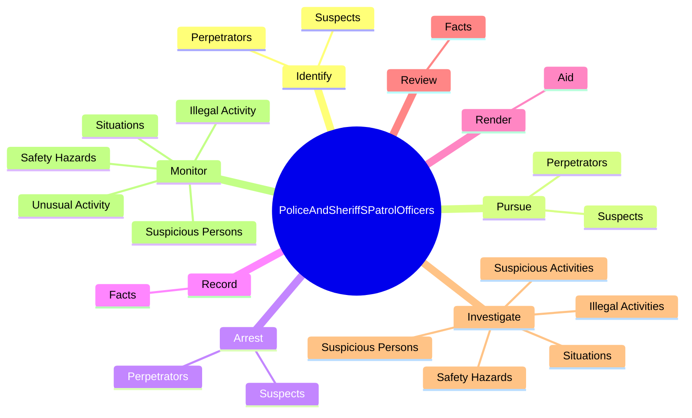
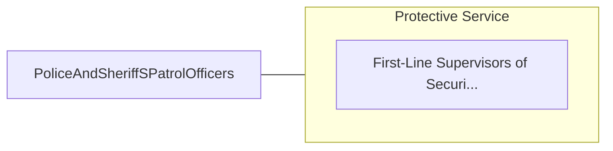

# Police and Sheriff's Patrol Officers

> Maintain order and protect life and property by enforcing local, tribal, state, or federal laws and ordinances. Perform a combination of the following duties: patrol a specific area; direct traffic; issue traffic summonses; investigate accidents; apprehend and arrest suspects, or serve legal processes of courts. Includes police officers working at educational institutions.

## Overview

Police and Sheriff's Patrol Officers is an occupation within the Protective Service category. Maintain order and protect life and property by enforcing local, tribal, state, or federal laws and ordinances. Perform a combination of the following duties: patrol a specific area; direct traffic; issue traffic summonses; investigate accidents; apprehend and arrest suspects, or serve legal processes of courts.

## Classification Hierarchy

## Key Statistics

| Metric | Value |
|--------|-------|
| SOC Code | 33-3051.00 |
| Category | [Protective Service](/occupations/PublicSafety) |
| Task Count | 149 |
| Source | O*NET |

## Core Tasks

### identify.Suspects

Police and Sheriff's Patrol Officers identify suspects as part of their core responsibilities.

**Actions:**
- `identify.Suspects.of.CriminalActs`
- `identify.Perpetrators.of.CriminalActs`

### pursue.Suspects

Police and Sheriff's Patrol Officers pursue suspects as part of their core responsibilities.

**Actions:**
- `pursue.Suspects.of.CriminalActs`
- `pursue.Perpetrators.of.CriminalActs`

### arrest.Suspects

Police and Sheriff's Patrol Officers arrest suspects as part of their core responsibilities.

**Actions:**
- `arrest.Suspects.of.CriminalActs`
- `arrest.Perpetrators.of.CriminalActs`

## Skills & Competencies

### Technical Skills
- **Law Enforcement** - Advanced
- **Emergency Response** - Advanced
- **Public Safety** - Advanced

### Soft Skills
- **Communication** - Essential
- **Problem Solving** - Essential
- **Critical Thinking** - Important
- **Teamwork** - Important
- **Adaptability** - Important

## Related Occupations

## Industries

This occupation is found across multiple industries. See [Industries](/industries) for sector-specific employment data.

## Career Progression

---

*Source: O*NET 33-3051.00 - ONETOccupation*
