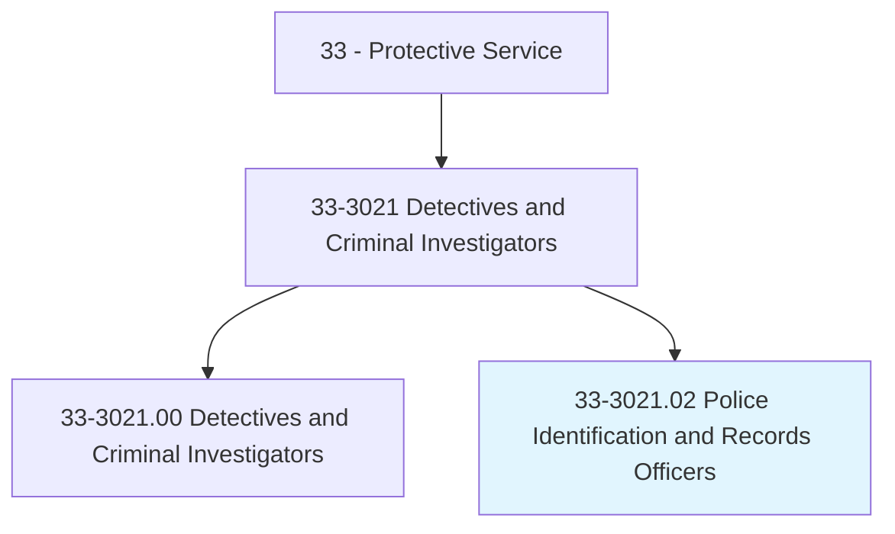
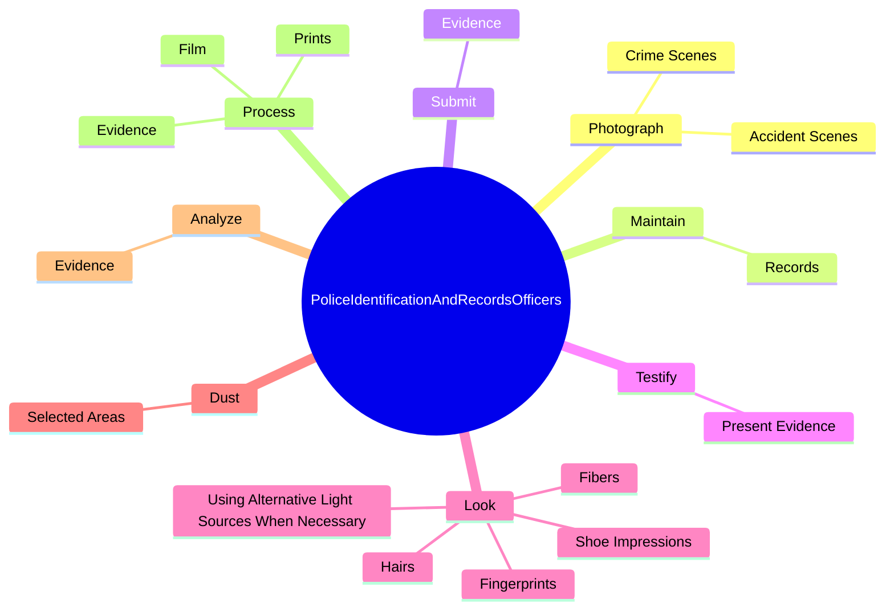

# Police Identification and Records Officers

> Collect evidence at crime scene, classify and identify fingerprints, and photograph evidence for use in criminal and civil cases.

## Overview

Police Identification and Records Officers is classified under Protective Service (SOC 33). Collect evidence at crime scene, classify and identify fingerprints, and photograph evidence for use in criminal and civil cases.

## Classification Hierarchy

## Key Statistics

| Metric | Value |
|--------|-------|
| SOC Code | 33-3021.02 |
| Category | [Protective Service](/occupations/PublicSafety) |
| Task Count | 71 |
| Source | O*NET |

## Core Tasks

### photograph.CrimeScenes

Police Identification and Records Officers photograph crime scenes as part of their core responsibilities.

**Actions:**
- `photograph.CrimeScenes.for.EvidenceRecords`
- `photograph.AccidentScenes.for.EvidenceRecords`

### maintain.Records

Police Identification and Records Officers maintain records as part of their core responsibilities.

**Actions:**
- `maintain.Records.of.Evidence`
- `maintain.Records.of.WriteReports`
- `maintain.Records.of.ReviewReports`

### submit.Evidence

Police Identification and Records Officers submit evidence as part of their core responsibilities.

**Actions:**
- `submit.Evidence.to.Supervisors`
- `submit.Evidence.to.CrimeLabs`
- `submit.Evidence.to.CourtOfficialsForLegalProceedings`

## Skills & Competencies

### Technical Skills
- **Law Enforcement** - Advanced
- **Emergency Response** - Advanced
- **Public Safety** - Advanced

### Soft Skills
- **Communication** - Essential
- **Problem Solving** - Essential
- **Critical Thinking** - Important
- **Teamwork** - Important
- **Adaptability** - Important

## Related Occupations

## Industries

This occupation is found across multiple industries. See [Industries](/industries) for sector-specific employment data.

## Career Progression

---

*Source: O*NET 33-3021.02 - ONETOccupation*
