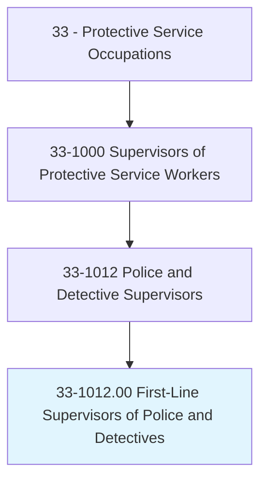
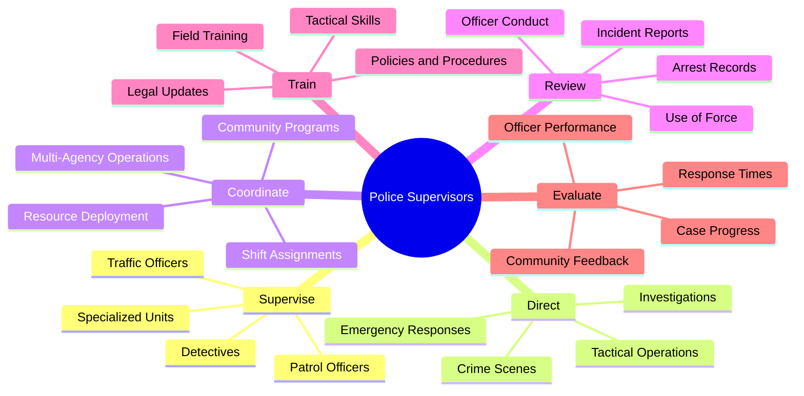
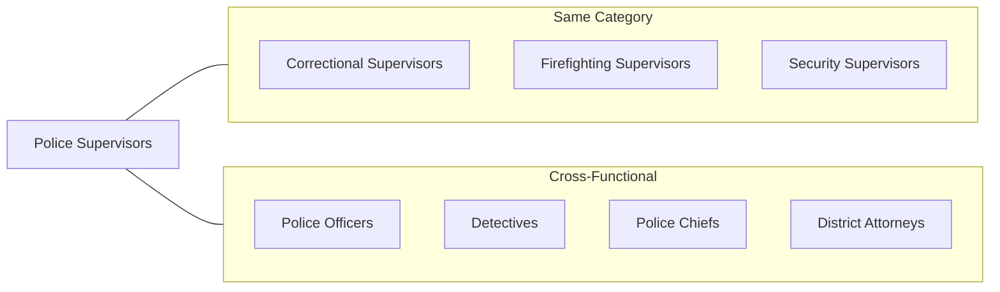
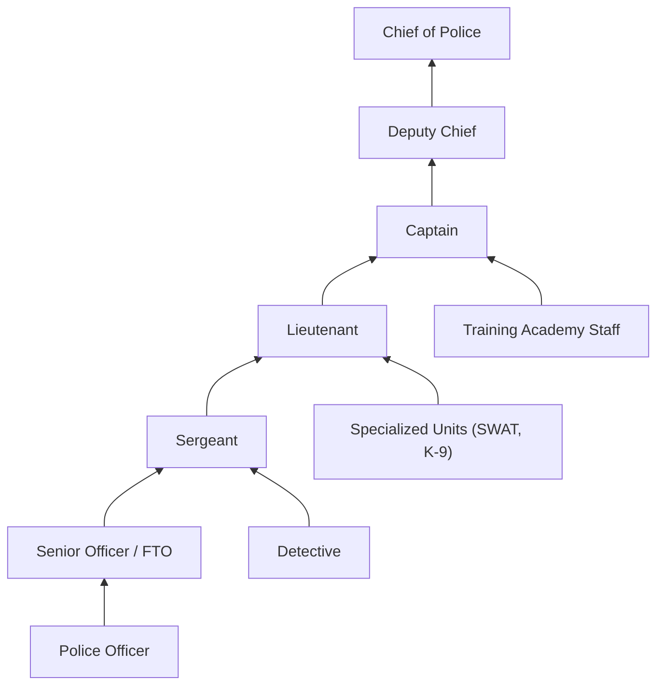
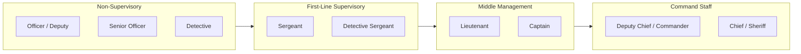

# First-Line Supervisors of Police and Detectives

> Directly supervise and coordinate activities of members of police force.

## Overview

First-Line Supervisors of Police and Detectives serve as sergeants, lieutenants, and watch commanders who directly oversee patrol officers, detectives, and specialized unit personnel. They are responsible for ensuring law enforcement operations run effectively, officers respond appropriately to calls, investigations progress properly, and department policies are followed. These supervisors bridge the gap between field personnel and command staff, translating policy into practice while managing the daily challenges of policing diverse communities. The role requires balancing officer safety, public service, legal compliance, and community relations in high-pressure situations.

## Classification Hierarchy

## Key Statistics

| Metric | Value |
|--------|-------|
| SOC Code | 33-1012.00 |
| Job Zone | 4 (Considerable Preparation) |
| Category | [Protective Service](/occupations/PublicSafety) |
| Core Tasks | 15+ |
| Source | O*NET |

## Core Tasks

### supervise.PoliceOfficers

Police Supervisors oversee the daily activities of officers on patrol and specialized assignments.

**Actions:**
- `supervise.PatrolOfficers.to.ensure.PublicSafety` - Direct patrol activities for effective coverage
- `supervise.Officers.to.enforce.Laws` - Ensure proper enforcement of criminal and traffic laws
- `supervise.Staff.to.respond.to.Calls` - Coordinate officer dispatch and response
- `monitor.RadioTraffic.to.maintain.Awareness` - Track officer activities and locations

### direct.CrimeScenes

Supervisors take command of crime scenes and critical incidents.

**Actions:**
- `direct.CrimeScenes.to.preserve.Evidence` - Establish perimeters and secure evidence
- `coordinate.Investigators.at.Scenes` - Assign detective and forensic resources
- `direct.Officers.to.interview.Witnesses` - Organize witness canvassing efforts
- `coordinate.Resources.for.MajorCrimes` - Manage personnel for significant investigations

### coordinate.EmergencyResponses

Supervisors lead officers during critical situations requiring coordinated action.

**Actions:**
- `coordinate.Responses.to.ActiveShooters` - Direct tactical response to violent incidents
- `coordinate.Resources.during.Pursuits` - Manage vehicle and foot pursuits safely
- `direct.Officers.during.HostageSituations` - Coordinate initial response and containment
- `coordinate.Evacuations.during.Disasters` - Lead public safety operations in emergencies

### review.OfficerConduct

Supervisors ensure accountability and compliance with policies and laws.

**Actions:**
- `review.UseOfForce.Reports.for.Compliance` - Evaluate force incidents against policy
- `review.ArrestReports.for.Accuracy` - Verify proper documentation and legal standards
- `investigate.Complaints.against.Officers` - Conduct or oversee misconduct investigations
- `document.Performance.for.Evaluations` - Maintain records for personnel reviews

### train.FieldOfficers

Supervisors develop officer skills through training and mentorship.

**Actions:**
- `train.NewOfficers.through.FieldProgram` - Supervise probationary officer development
- `train.Staff.on.PolicyChanges` - Communicate and implement new procedures
- `train.Officers.on.LegalUpdates` - Ensure awareness of court decisions and law changes
- `mentor.Officers.for.CareerDevelopment` - Guide officer professional growth

### evaluate.InvestigationProgress

Supervisors monitor case development and investigative quality.

**Actions:**
- `evaluate.CaseProgress.to.ensure.Completion` - Track investigation timelines and outcomes
- `review.Evidence.for.Prosecution` - Assess case readiness for district attorney review
- `coordinate.WithProsecutors.on.Cases` - Liaise with legal staff on charging decisions
- `prioritize.Cases.based.on.Severity` - Allocate resources to high-priority investigations

## Skills & Competencies

### Technical Skills
- **Criminal Law and Procedure** - Expert
- **Investigative Techniques** - Advanced
- **Report Writing** - Advanced
- **Tactical Operations** - Advanced
- **Evidence Management** - Proficient

### Soft Skills
- **Leadership** - Critical
- **Decision Making Under Pressure** - Critical
- **Communication** - Critical
- **Conflict Resolution** - Essential
- **Community Relations** - Essential

## Related Occupations

## Industries

- [Local Government (Municipal Police)](/industries/GovernmentLocal) - Highest Employment
- [State Government (State Police/Highway Patrol)](/industries/GovernmentState) - High Employment
- [Federal Government (Federal Law Enforcement)](/industries/GovernmentFederal) - Moderate Employment
- [County Government (Sheriff's Offices)](/industries/GovernmentCounty) - High Employment
- [Transit Authorities](/industries/TransitAuthorities) - Specialized Employment

## Industry Variations

### Municipal Police Departments
- Supervise patrol divisions covering defined city jurisdictions
- Coordinate with specialized units: SWAT, narcotics, gang, domestic violence
- Interface with city administration on policy and community concerns
- Manage community policing initiatives and neighborhood relations

### State Police/Highway Patrol
- Oversee troopers patrolling highways and state facilities
- Coordinate multi-county investigations and task forces
- Supervise specialized units: commercial vehicle enforcement, dignitary protection
- Implement statewide law enforcement standards and training

### County Sheriff's Offices
- Manage deputies across unincorporated areas and contract cities
- Oversee courthouse security and civil process serving
- Coordinate with courts on warrant service and prisoner transport
- Balance jail operations with patrol and detective responsibilities

### Federal Law Enforcement
- Supervise agents in specialized federal agencies (FBI, DEA, ATF, HSI)
- Coordinate multi-jurisdictional investigations
- Implement federal training standards and career progression
- Manage complex, long-term investigations with national scope

### Campus Police
- Supervise officers on university and college campuses
- Coordinate with academic administration on safety policies
- Balance enforcement with educational environment considerations
- Manage large event security and access control

## Career Progression

## Education & Training

| Requirement | Details |
|-------------|---------|
| Typical Education | High school diploma required; Bachelor's degree increasingly preferred |
| Work Experience | 5-7 years as Police Officer or Detective |
| On-the-Job Training | 6-12 months supervisory development program |
| Required Certifications | POST Certification, Supervisory Course, Firearms Qualification |
| Continuing Education | Management training, legal updates, leadership development |

## Work Environment

| Factor | Description |
|--------|-------------|
| Setting | Police stations, patrol vehicles, community settings, crime scenes |
| Schedule | Shift work including nights, weekends, holidays (24/7 operations) |
| Physical Demands | Active patrol, potential physical confrontation, extended standing |
| Stress Level | Very High - life and death decisions, community scrutiny |
| Risk Factors | Violence, vehicle accidents, exposure to trauma |

## Rank Structure

## Departments

This occupation typically works in:
- [Patrol Division](/departments/PatrolDivision)
- [Detective Bureau](/departments/DetectiveBureau)
- [Traffic Division](/departments/TrafficDivision)
- [Special Operations](/departments/SpecialOperations)
- [Training Academy](/departments/TrainingAcademy)

## Related Processes

- [Incident Response](/processes/IncidentResponse)
- [Investigation Management](/processes/InvestigationManagement)
- [Officer Evaluation](/processes/OfficerEvaluation)
- [Use of Force Review](/processes/UseOfForceReview)
- [Community Engagement](/processes/CommunityEngagement)

---

*Source: O*NET 33-1012.00 - ONETOccupation*
