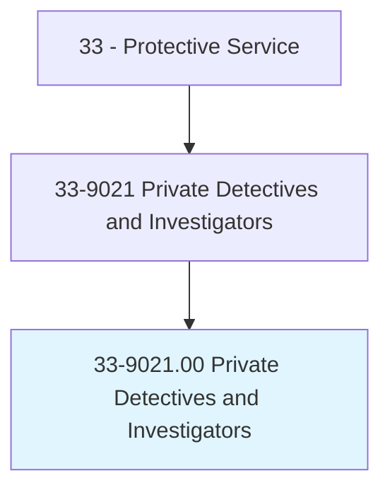
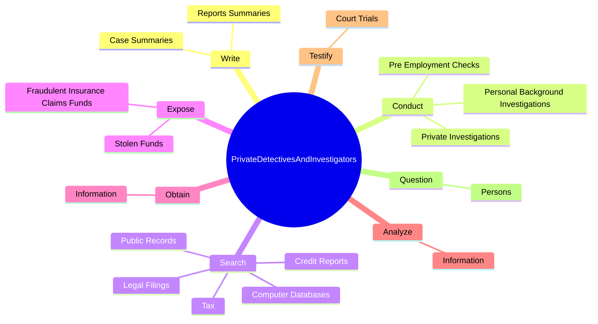
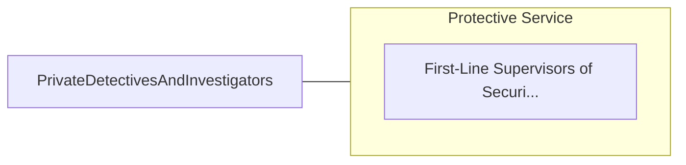

# Private Detectives and Investigators

> Gather, analyze, compile, and report information regarding individuals or organizations to clients, or detect occurrences of unlawful acts or infractions of rules in private establishment.

## Overview

Private Detectives and Investigators is classified under Protective Service (SOC 33). Gather, analyze, compile, and report information regarding individuals or organizations to clients, or detect occurrences of unlawful acts or infractions of rules in private establishment.

## Classification Hierarchy

## Key Statistics

| Metric | Value |
|--------|-------|
| SOC Code | 33-9021.00 |
| Category | [Protective Service](/occupations/PublicSafety/index) |
| Task Count | 76 |
| Source | O*NET |

## Core Tasks

### write.ReportsSummaries

Private Detectives and Investigators write reports summaries as part of their core responsibilities.

**Actions:**
- `write.ReportsSummaries.to.document.Investigations`
- `write.CaseSummaries.to.document.Investigations`

### conduct.PrivateInvestigations

Private Detectives and Investigators conduct private investigations as part of their core responsibilities.

**Actions:**
- `conduct.PrivateInvestigations.on.PaidBasis`
- `conduct.PersonalBackgroundInvestigations.to.obtain.InformationAboutIndividualsCharacter`
- `conduct.PersonalBackgroundInvestigations.to.FinancialStatus`
- `conduct.PersonalBackgroundInvestigations.to.PersonalHistory`

### search.ComputerDatabases

Private Detectives and Investigators search computer databases as part of their core responsibilities.

**Actions:**
- `search.ComputerDatabases.to.locate.PersonsCompileInformationForInvestigations`
- `search.ComputerDatabases.to.ToCompileInformationForInvestigations`
- `search.CreditReports.to.locate.PersonsCompileInformationForInvestigations`
- `search.CreditReports.to.ToCompileInformationForInvestigations`

## Skills & Competencies

### Technical Skills
- **Law Enforcement** - Advanced
- **Emergency Response** - Advanced
- **Public Safety** - Advanced

### Soft Skills
- **Communication** - Essential
- **Problem Solving** - Essential
- **Critical Thinking** - Important
- **Teamwork** - Important
- **Adaptability** - Important

## Related Occupations

## Industries

This occupation is found across multiple industries. See [Industries](/industries) for sector-specific employment data.

## Career Progression

---

*Source: O*NET 33-9021.00 - ONETOccupation*
