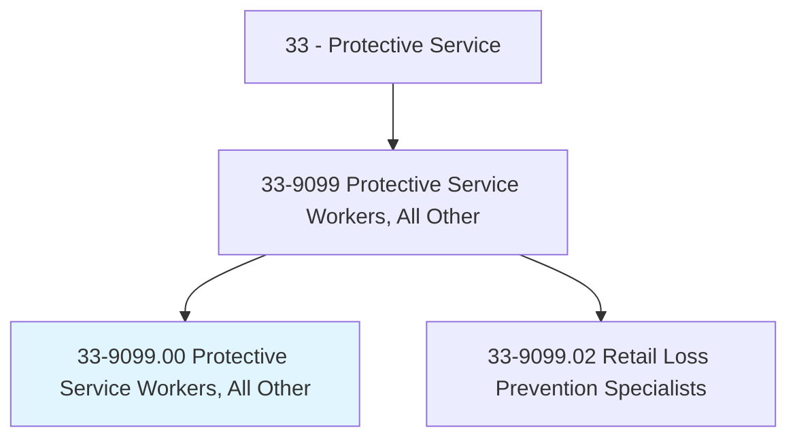
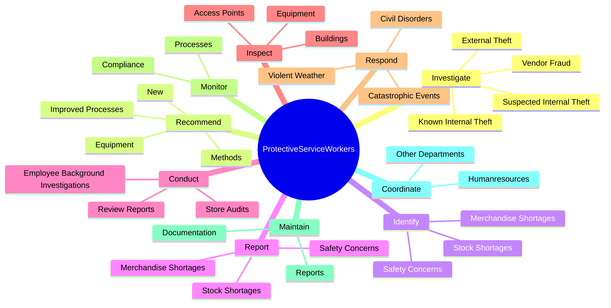
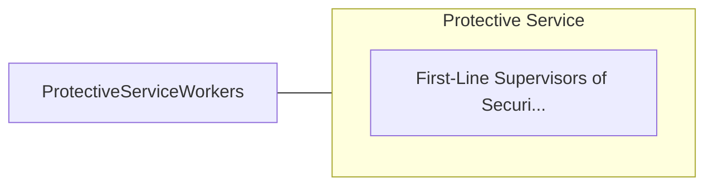

# Protective Service Workers, All Other

> All protective service workers not listed separately.

## Overview

Protective Service Workers, All Other is classified under Protective Service (SOC 33). All protective service workers not listed separately.

## Classification Hierarchy

## Key Statistics

| Metric | Value |
|--------|-------|
| SOC Code | 33-9099.00 |
| Category | [Protective Service](/occupations/PublicSafety) |
| Task Count | 60 |
| Source | O*NET |

## Core Tasks

### investigate.KnownInternalTheft

Protective Service Workers, All Other investigate known internal theft as part of their core responsibilities.

**Actions:**
- `investigate.KnownInternalTheft`
- `investigate.SuspectedInternalTheft`
- `investigate.ExternalTheft`
- `investigate.VendorFraud`

### recommend.Methods

Protective Service Workers, All Other recommend methods as part of their core responsibilities.

**Actions:**
- `recommend.Methods.to.PotentialFinancialFraudLosses`
- `recommend.New.to.RiskExposure`
- `recommend.ImprovedProcesses.to.RiskExposure`
- `recommend.Equipment.to.RiskExposure`

### identify.MerchandiseShortages

Protective Service Workers, All Other identify merchandise shortages as part of their core responsibilities.

**Actions:**
- `identify.MerchandiseShortages`
- `identify.StockShortages`
- `identify.SafetyConcerns.to.SafeShopping`
- `identify.SafetyConcerns.to.WorkingEnvironment`

## Skills & Competencies

### Technical Skills
- **Law Enforcement** - Advanced
- **Emergency Response** - Advanced
- **Public Safety** - Advanced

### Soft Skills
- **Communication** - Essential
- **Problem Solving** - Essential
- **Critical Thinking** - Important
- **Teamwork** - Important
- **Adaptability** - Important

## Related Occupations

## Industries

This occupation is found across multiple industries. See [Industries](/industries) for sector-specific employment data.

## Career Progression

---

*Source: O*NET 33-9099.00 - ONETOccupation*
