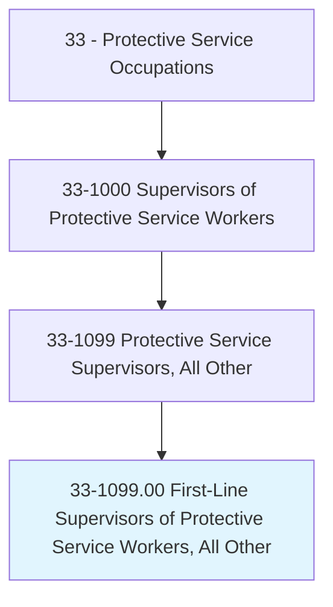
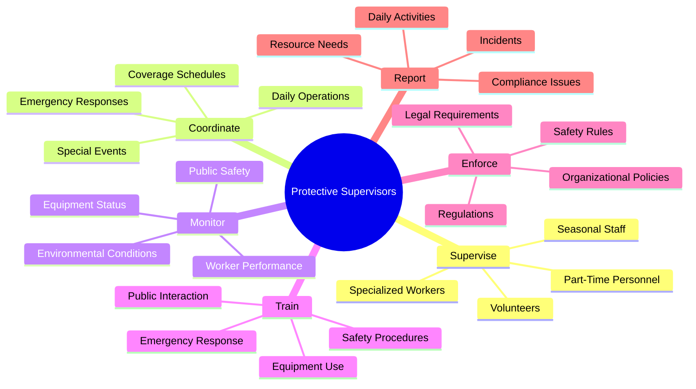
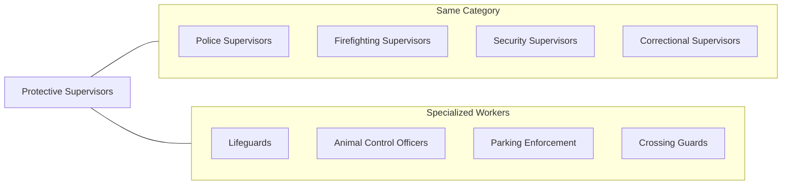
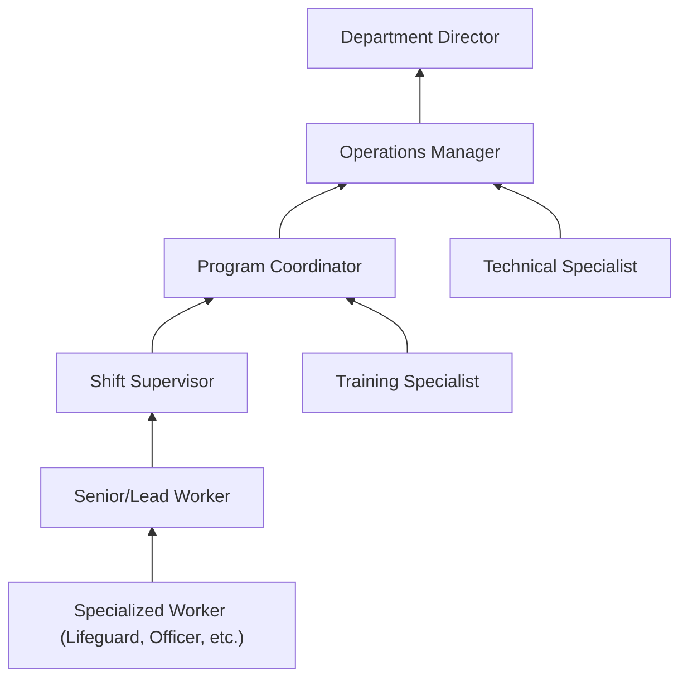
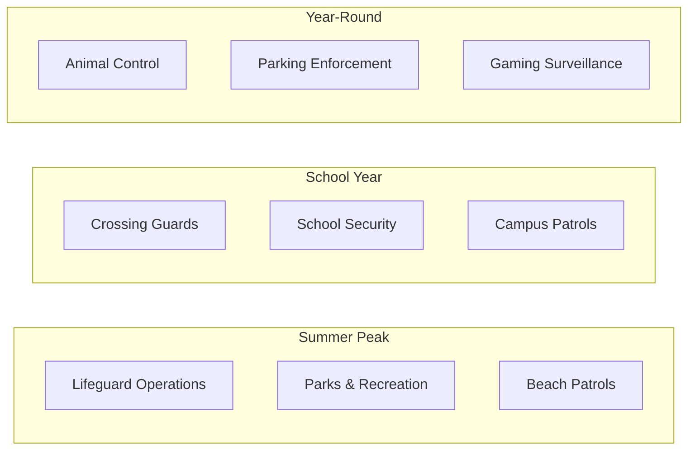

# First-Line Supervisors of Protective Service Workers, All Other

> All protective service supervisors not listed separately above.

## Overview

First-Line Supervisors of Protective Service Workers, All Other encompasses supervisory roles in specialized protective services that do not fall under standard law enforcement, firefighting, corrections, or security classifications. This category includes supervisors of lifeguards, crossing guards, animal control officers, parking enforcement officers, gaming surveillance personnel, and other niche protective service workers. These supervisors adapt general protective service principles to their specific domains, whether ensuring beach and pool safety, managing school crossing operations, overseeing animal welfare enforcement, or directing casino surveillance activities. The role requires versatility in applying leadership and safety management across varied protective contexts.

## Classification Hierarchy

## Key Statistics

| Metric | Value |
|--------|-------|
| SOC Code | 33-1099.00 |
| Job Zone | 2-3 (Limited to Medium Preparation) |
| Category | [Protective Service](/occupations/PublicSafety) |
| Core Tasks | 10+ |
| Source | O*NET |

## Core Tasks

### supervise.SpecializedWorkers

Protective Supervisors oversee workers in specialized protective roles.

**Actions:**
- `supervise.Lifeguards.to.ensure.WaterSafety` - Manage aquatic safety personnel
- `supervise.CrossingGuards.to.protect.Pedestrians` - Oversee school crossing operations
- `supervise.AnimalControlOfficers.to.enforce.Laws` - Direct animal welfare enforcement
- `supervise.ParkingOfficers.to.enforce.Regulations` - Manage parking enforcement staff

### coordinate.ProtectiveOperations

Supervisors manage the logistics of specialized protective services.

**Actions:**
- `coordinate.Coverage.for.AssignedAreas` - Ensure adequate staffing for zones
- `coordinate.Responses.to.Emergencies` - Direct actions during incidents
- `coordinate.Equipment.for.Operations` - Manage specialized tools and gear
- `schedule.Staff.based.on.Demand` - Adjust coverage for peak periods and events

### monitor.SafetyConditions

Supervisors ensure safe environments within their areas of responsibility.

**Actions:**
- `monitor.EnvironmentalConditions.for.Hazards` - Assess weather, water, and site conditions
- `monitor.PublicBehavior.for.Compliance` - Observe adherence to rules and regulations
- `inspect.Equipment.for.Safety` - Verify tools and gear are operational
- `evaluate.Procedures.for.Effectiveness` - Assess whether protocols achieve safety goals

### train.ProtectiveStaff

Supervisors develop worker competencies in specialized protective functions.

**Actions:**
- `train.Staff.on.EmergencyProcedures` - Prepare workers for crisis response
- `train.Workers.on.EquipmentUse` - Ensure proficiency with specialized tools
- `train.Personnel.on.PublicRelations` - Develop customer service and communication skills
- `certify.Staff.on.RequiredSkills` - Verify qualifications for specific roles

### enforce.SafetyRegulations

Supervisors ensure compliance with applicable rules and laws.

**Actions:**
- `enforce.Regulations.to.protect.Public` - Apply rules consistently and fairly
- `issue.Warnings.for.Violations` - Address non-compliance appropriately
- `document.Enforcement.for.Records` - Maintain documentation of actions taken
- `coordinate.WithAuthorities.on.Violations` - Escalate serious matters to appropriate agencies

### report.OperationalStatus

Supervisors document activities and communicate with management.

**Actions:**
- `report.DailyActivities.to.Management` - Provide operational summaries
- `report.Incidents.to.Stakeholders` - Communicate significant events
- `compile.Statistics.for.Analysis` - Track operational metrics
- `recommend.Improvements.based.on.Experience` - Suggest enhancements to operations

## Specialized Roles Within This Category

### Lifeguard Supervisors
Oversee aquatic safety staff at pools, beaches, and water parks.
- Manage rescue team readiness and response
- Monitor water and weather conditions
- Ensure compliance with health codes
- Coordinate swim lessons and safety programs

### Crossing Guard Supervisors
Manage school crossing guards and pedestrian safety programs.
- Assign posts and monitor performance
- Coordinate with schools and police
- Manage seasonal staffing needs
- Ensure equipment visibility and safety

### Animal Control Supervisors
Direct officers who enforce animal welfare laws.
- Oversee animal capture and transport
- Manage shelter operations and capacity
- Coordinate with veterinary services
- Handle dangerous animal situations

### Parking Enforcement Supervisors
Manage parking officers and meter enforcement.
- Assign patrol routes and zones
- Handle citation appeals and complaints
- Coordinate with towing services
- Manage parking technology systems

### Gaming Surveillance Supervisors
Oversee casino surveillance operations.
- Monitor gaming floor activities
- Coordinate investigations of cheating
- Manage surveillance technology
- Interface with gaming regulators

### Park Ranger Supervisors
Lead rangers in recreational and natural areas.
- Manage visitor services and safety
- Oversee natural resource protection
- Coordinate emergency responses
- Handle wildlife management issues

## Skills & Competencies

### Technical Skills
- **Domain-Specific Safety Knowledge** - Advanced
- **Emergency Response** - Proficient
- **Report Writing** - Proficient
- **Equipment Operation** - Proficient
- **Regulatory Knowledge** - Proficient

### Soft Skills
- **Leadership** - Critical
- **Communication** - Essential
- **Problem Solving** - Essential
- **Adaptability** - Essential
- **Public Relations** - Important

## Related Occupations

## Industries

- [Local Government (Parks, Public Works)](/industries/GovernmentLocal) - Highest Employment
- [Amusement Parks and Recreation](/industries/AmusementRecreation) - High Employment
- [Gaming Industries](/industries/GamingCasinos) - Moderate Employment
- [Educational Services](/industries/Education) - Moderate Employment
- [State Government (Parks, Wildlife)](/industries/GovernmentState) - Moderate Employment
- [Private Recreation Facilities](/industries/Recreation) - Growing Sector

## Industry Variations

### Municipal Parks and Recreation
- Supervise lifeguards, recreation attendants, and facility staff
- Manage seasonal peaks in staffing and operations
- Coordinate community programs and special events
- Ensure compliance with health and safety regulations

### State and National Parks
- Oversee ranger activities across large natural areas
- Manage visitor safety and resource protection
- Coordinate search and rescue operations
- Handle wildlife encounters and natural disasters

### Gaming and Casino Operations
- Direct surveillance room activities and personnel
- Coordinate with gaming commission regulations
- Manage sophisticated monitoring technology
- Investigate suspected cheating or theft

### School Districts
- Supervise crossing guards at multiple locations
- Coordinate with school administration and police
- Manage part-time and seasonal staff
- Respond to traffic and pedestrian safety concerns

### Animal Services Agencies
- Direct field officers and shelter operations
- Manage dangerous animal situations
- Coordinate with veterinary and rescue organizations
- Ensure humane treatment and legal compliance

## Career Progression

## Education & Training

| Requirement | Details |
|-------------|---------|
| Typical Education | High school diploma required; Associate's degree preferred for some specialties |
| Work Experience | 2-5 years in specialized protective role |
| On-the-Job Training | 3-12 months supervisory development |
| Domain Certifications | Varies by specialty (Lifeguard Instructor, Animal Control, etc.) |
| Continuing Education | Domain-specific updates, leadership training |

## Work Environment

| Factor | Description |
|--------|-------------|
| Setting | Varies widely: pools/beaches, streets, parks, shelters, casinos, schools |
| Schedule | Varies by specialty; may include weekends, holidays, seasonal peaks |
| Physical Demands | Active work; may include outdoor exposure, physical exertion |
| Stress Level | Moderate - public interaction, emergency response requirements |
| Risk Factors | Environmental exposure, animal bites, public confrontations |

## Specialty Certifications

| Specialty | Common Certifications |
|-----------|----------------------|
| Aquatics | Lifeguard Instructor, Water Safety Instructor, Pool Operator |
| Animal Control | Animal Control Officer Certification, Euthanasia Technician |
| Gaming Surveillance | Gaming Commission License, Surveillance Certification |
| Parks/Recreation | First Aid/CPR, Wilderness First Responder, Park Ranger Training |
| Parking Enforcement | Citation Training, PCI DSS (payment security) |

## Departments

This occupation typically works in:
- [Parks and Recreation](/departments/ParksRecreation)
- [Animal Services](/departments/AnimalServices)
- [Parking Services](/departments/ParkingServices)
- [Gaming Operations](/departments/GamingOperations)
- [School Transportation](/departments/SchoolTransportation)

## Related Processes

- [Incident Response](/processes/IncidentResponse)
- [Staff Scheduling](/processes/StaffScheduling)
- [Equipment Maintenance](/processes/EquipmentMaintenance)
- [Compliance Monitoring](/processes/ComplianceMonitoring)
- [Public Engagement](/processes/PublicEngagement)

## Seasonal Considerations

---

*Source: O*NET 33-1099.00 - OccupationCategory*
