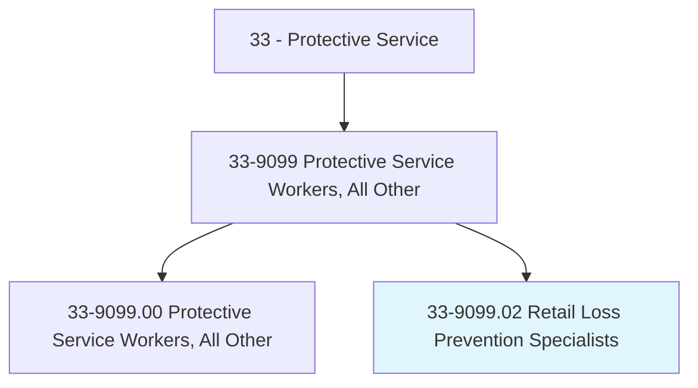
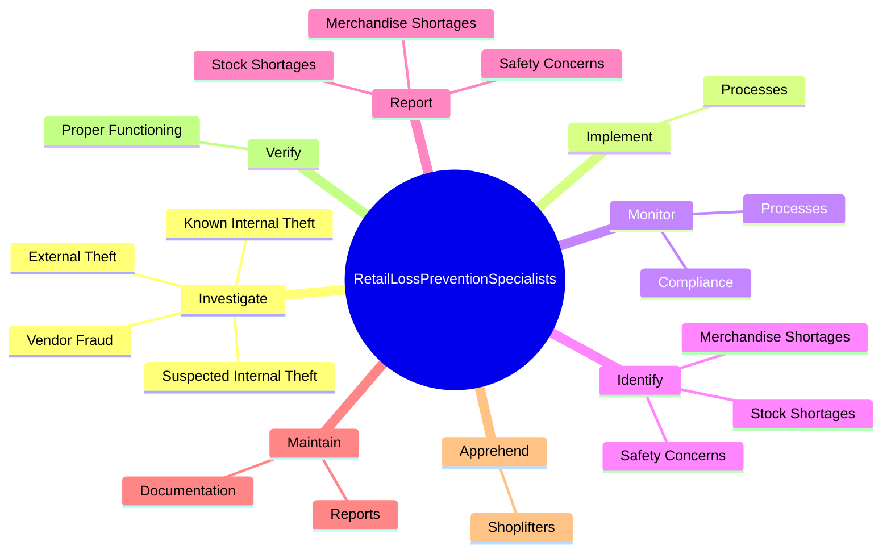
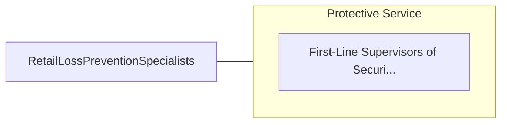

# Retail Loss Prevention Specialists

> Implement procedures and systems to prevent merchandise loss. Conduct audits and investigations of employee activity. May assist in developing policies, procedures, and systems for safeguarding assets.

## Overview

Retail Loss Prevention Specialists is a specialized variant within the Protective Service category. Implement procedures and systems to prevent merchandise loss. Conduct audits and investigations of employee activity.

## Classification Hierarchy

## Key Statistics

| Metric | Value |
|--------|-------|
| SOC Code | 33-9099.02 |
| Category | [Protective Service](/occupations/PublicSafety) |
| Task Count | 60 |
| Source | O*NET |

## Core Tasks

### investigate.KnownInternalTheft

Retail Loss Prevention Specialists investigate known internal theft as part of their core responsibilities.

**Actions:**
- `investigate.KnownInternalTheft`
- `investigate.SuspectedInternalTheft`
- `investigate.ExternalTheft`
- `investigate.VendorFraud`

### implement.Processes

Retail Loss Prevention Specialists implement processes as part of their core responsibilities.

**Actions:**
- `implement.Processes.to.reduce.PropertyLosses`
- `implement.Processes.to.FinancialLosses`

### monitor.Processes

Retail Loss Prevention Specialists monitor processes as part of their core responsibilities.

**Actions:**
- `monitor.Processes.to.reduce.PropertyLosses`
- `monitor.Processes.to.FinancialLosses`
- `monitor.Compliance.with.StandardOperatingProcedures.for.LossPrevention`
- `monitor.Compliance.with.PhysicalSecurity`

## Skills & Competencies

### Technical Skills
- **Law Enforcement** - Advanced
- **Emergency Response** - Advanced
- **Public Safety** - Advanced

### Soft Skills
- **Communication** - Essential
- **Problem Solving** - Essential
- **Critical Thinking** - Important
- **Teamwork** - Important
- **Adaptability** - Important

## Related Occupations

## Industries

This occupation is found across multiple industries. See [Industries](/industries) for sector-specific employment data.

## Career Progression

---

*Source: O*NET 33-9099.02 - ONETOccupation*
