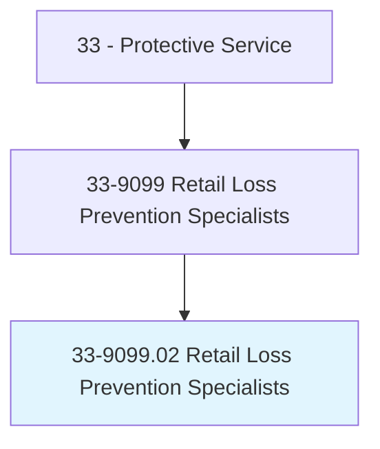
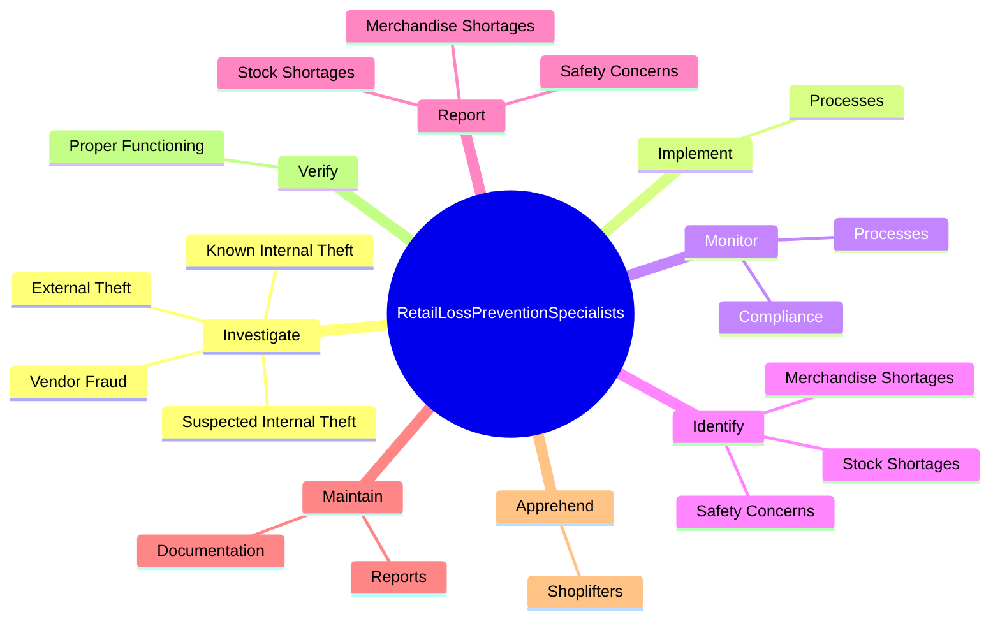
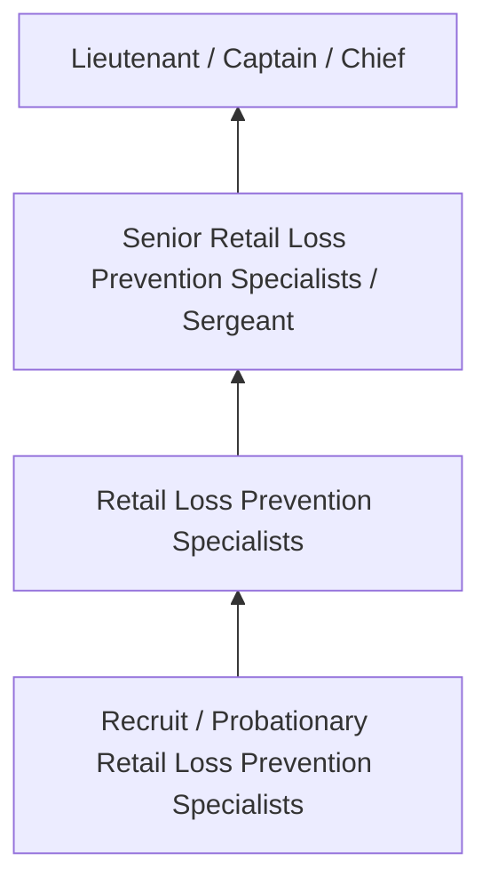
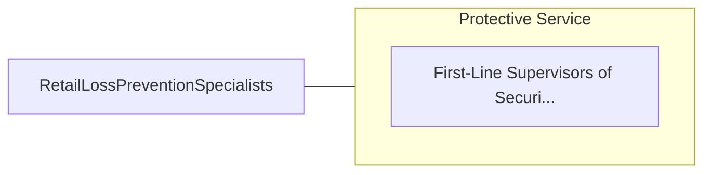

# Retail Loss Prevention Specialists

> Implement procedures and systems to prevent merchandise loss. Conduct audits and investigations of employee activity. May assist in developing policies, procedures, and systems for safeguarding assets.

## Overview

Retail Loss Prevention Specialists professionals implement procedures and systems to prevent merchandise loss. This occupation falls within the Protective Service category and requires a combination of specialized knowledge, technical skills, and practical experience.

These professionals work across diverse settings and organizational contexts, applying their expertise to meet the demands of their field. They must stay current with industry standards, emerging practices, and regulatory requirements that affect their work. The role demands both independent judgment and collaborative skills, as practitioners regularly interact with colleagues, stakeholders, and the public.

As the field continues to evolve, Retail Loss Prevention Specialists professionals increasingly leverage technology and data-driven approaches to enhance their effectiveness. Career opportunities span the public and private sectors, with demand influenced by economic conditions, demographic shifts, and technological advancement.

## Classification Hierarchy



## Key Statistics

| Metric | Value |
|--------|-------|
| SOC Code | 33-9099.02 |
| Job Zone | N/A |
| Category | [Protective Service](/occupations/PublicSafety/index) |
| Core Tasks | 60+ |
| Salary Range | $35,000 - $90,000 |
| Median Salary | $52,000 |
| Growth Outlook | 5% (As fast as average) |
| Source | O*NET |

## Core Tasks



### conduct.StoreAudits

Retail Loss Prevention Specialists conduct store audits as part of their core responsibilities.

**Actions:**
- `conduct.StoreAudits.to.identify.ProblemAreasDeficiencies` - Conduct store audits to identify problem areas or procedural deficiencies.
- `conduct.StoreAudits.to.ProceduralDeficiencies` - Conduct store audits to identify problem areas or procedural deficiencies.
- `conduct.EmployeeBackgroundInvestigations.with.OperationalResourcesManagers` - Conduct employee background investigations and review reports with operationa...
- `conduct.EmployeeBackgroundInvestigations.with.HumanresourcesManagers` - Conduct employee background investigations and review reports with operationa...
- `conduct.ReviewReports.with.OperationalResourcesManagers` - Conduct employee background investigations and review reports with operationa...

### coordinate.Humanresources

Retail Loss Prevention Specialists coordinate humanresources as part of their core responsibilities.

**Actions:**
- `coordinate.Humanresources.to.assist.InCompanyPrograms` - Coordinate with risk management, human resources, or other departments to ass...
- `coordinate.Humanresources.to.Investigations` - Coordinate with risk management, human resources, or other departments to ass...
- `coordinate.Humanresources.to.Training` - Coordinate with risk management, human resources, or other departments to ass...
- `coordinate.OtherDepartments.to.assist.InCompanyPrograms` - Coordinate with risk management, human resources, or other departments to ass...
- `coordinate.OtherDepartments.to.Investigations` - Coordinate with risk management, human resources, or other departments to ass...

### monitor.Processes

Retail Loss Prevention Specialists monitor processes as part of their core responsibilities.

**Actions:**
- `monitor.Processes.to.reduce.PropertyLosses` - Implement or monitor processes to reduce property or financial losses.
- `monitor.Processes.to.FinancialLosses` - Implement or monitor processes to reduce property or financial losses.
- `monitor.Compliance.with.StandardOperatingProcedures.for.LossPrevention` - Monitor compliance with standard operating procedures for loss prevention, ph...
- `monitor.Compliance.with.PhysicalSecurity` - Monitor compliance with standard operating procedures for loss prevention, ph...
- `monitor.Compliance.with.Riskmanagement` - Monitor compliance with standard operating procedures for loss prevention, ph...

### verify.ProperFunctioning

Retail Loss Prevention Specialists verify proper functioning as part of their core responsibilities.

**Actions:**
- `verify.ProperFunctioning.of.PhysicalSecuritySystems` - Verify proper functioning of physical security systems, such as closed-circui...
- `verify.ProperFunctioning.of.ClosedCircuitTelevisions` - Verify proper functioning of physical security systems, such as closed-circui...
- `verify.ProperFunctioning.of.Alarms` - Verify proper functioning of physical security systems, such as closed-circui...
- `verify.ProperFunctioning.of.SensorTagSystems` - Verify proper functioning of physical security systems, such as closed-circui...
- `verify.ProperFunctioning.of.Locks` - Verify proper functioning of physical security systems, such as closed-circui...


## Skills & Competencies

### Technical Skills
- **Law Enforcement / Emergency Procedures** - Expert
- **Defensive Tactics** - Advanced
- **Report Writing** - Advanced
- **Emergency Response** - Advanced
- **Investigation Techniques** - Proficient
- **First Aid / CPR** - Proficient

### Soft Skills
- **Situational Awareness** - Critical
- **Decision Making Under Pressure** - Critical
- **Communication** - Essential
- **Physical Fitness** - Essential
- **Integrity** - Essential

## Education & Certifications

| Requirement | Details |
|-------------|---------|
| Typical Education | High school diploma to associate degree; academy training required |
| Work Experience | 0-2 years; field training period |
| On-the-Job Training | Extensive - police/fire/corrections academy |
| Certifications | State POST certification, EMT certification, firearms qualification |

## Career Progression



## Industry Variations

### Municipal Law Enforcement
City and county public safety services. Retail Loss Prevention Specialists professionals serve local communities through patrol, investigation, and prevention.

### Fire and Emergency Services
Emergency response and fire prevention. Focus on rapid response, incident command, and community safety education.

### Corrections
Custody and supervision of incarcerated individuals. Emphasis on security, rehabilitation, and institutional order.

### Private Security
Contract security services for commercial and residential clients. Focus on access control, surveillance, and risk assessment.

## Technology & Tools

- **Computer-aided dispatch (CAD) systems**
- **Body cameras and surveillance systems**
- **Records management systems**
- **Firearms and tactical equipment**
- **Emergency communication systems**

## Related Occupations



## Industries

- [Local Government](/industries/LocalGovernment) - High Employment
- [State Government](/industries/StateGovernment) - High Employment
- [Federal Government](/industries/FederalGovernment) - Moderate Employment
- [Private Security Services](/industries/SecurityServices) - Moderate Employment

## Departments

This occupation typically works in:
- [Patrol Division](/departments/Patrol)
- [Investigations](/departments/Investigations)
- [Emergency Services](/departments/EmergencyServices)

## GraphDL Semantic Structure

```
Retail Loss Prevention Specialists perform:
- investigate.KnownInternalTheft
- investigate.SuspectedInternalTheft
- investigate.ExternalTheft
- investigate.VendorFraud
- implement.Processes.to.reduce.PropertyLosses
- implement.Processes.to.FinancialLosses
```

---

*Source: O*NET 33-9099.02 - ONETOccupation*
