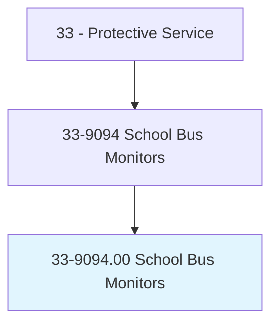
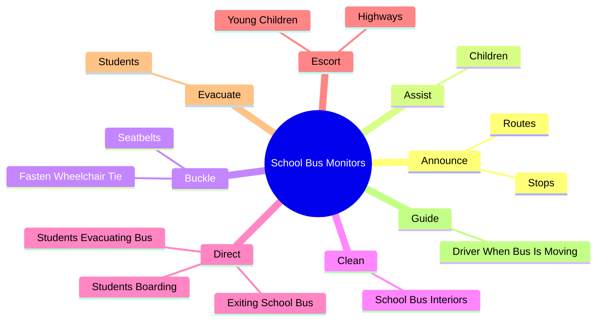
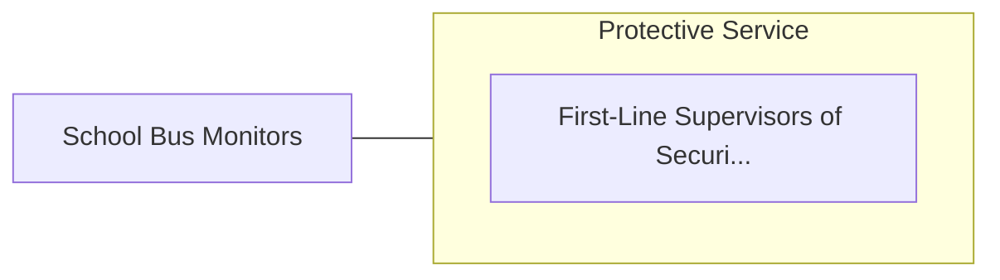

# School Bus Monitors

> Maintain order among students on a school bus. Duties include helping students safely board and exit and communicating behavioral problems. May perform pretrip and posttrip inspections and prepare for and assist in emergency evacuations.

## Overview

School Bus Monitors is an occupation within the Protective Service category. Maintain order among students on a school bus. Duties include helping students safely board and exit and communicating behavioral problems.

## Classification Hierarchy

## Key Statistics

| Metric | Value |
|--------|-------|
| SOC Code | 33-9094.00 |
| Category | [Protective Service](/occupations/PublicSafety/index) |
| Task Count | 67 |
| Source | O*NET |

## Core Tasks

### announce.Routes

School Bus Monitors announce routes as part of their core responsibilities.

**Actions:**
- `announce.Routes`
- `announce.Stops`

### assist.Children

School Bus Monitors assist children as part of their core responsibilities.

**Actions:**
- `assist.Children.with.Disabilities.with.Psychological`
- `assist.Children.with.Children.with.Psychological`
- `assist.Children.with.Emotional`
- `assist.Children.with.BehavioralIssues.with.Boarding`

### buckle.Seatbelts

School Bus Monitors buckle seatbelts as part of their core responsibilities.

**Actions:**
- `buckle.Seatbelts.to.secure.PassengersForTransportation`
- `buckle.FastenWheelchairTie.down.Straps.to.secure.PassengersForTransportation`

## Skills & Competencies

### Technical Skills
- **Law Enforcement** - Advanced
- **Emergency Response** - Advanced
- **Public Safety** - Advanced

### Soft Skills
- **Communication** - Essential
- **Problem Solving** - Essential
- **Critical Thinking** - Important
- **Teamwork** - Important
- **Adaptability** - Important

## Related Occupations

## Industries

This occupation is found across multiple industries. See [Industries](/industries) for sector-specific employment data.

## Career Progression

---

*Source: O*NET 33-9094.00 - ONETOccupation*
