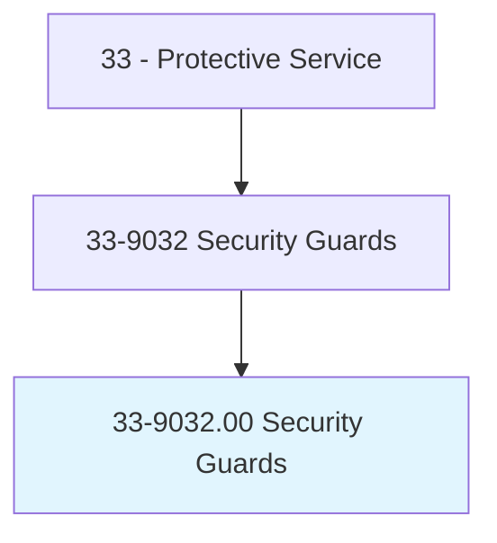
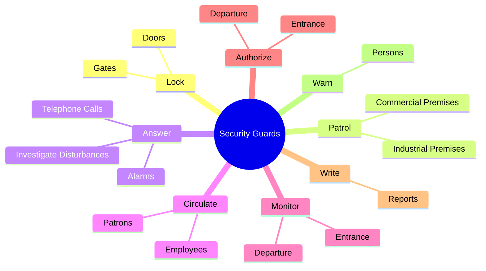
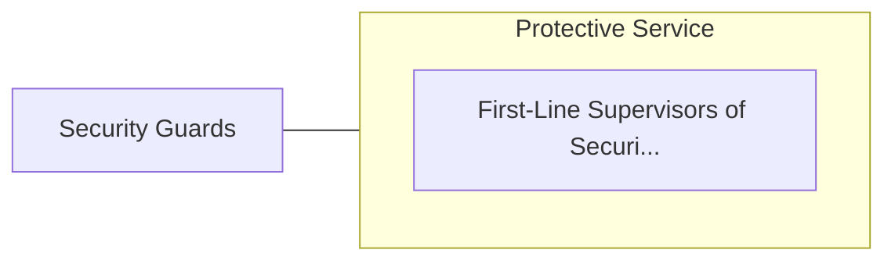

# Security Guards

> Guard, patrol, or monitor premises to prevent theft, violence, or infractions of rules. May operate x-ray and metal detector equipment.

## Overview

Security Guards is an occupation within the Protective Service category. Guard, patrol, or monitor premises to prevent theft, violence, or infractions of rules. 

## Classification Hierarchy

## Key Statistics

| Metric | Value |
|--------|-------|
| SOC Code | 33-9032.00 |
| Category | [Protective Service](/occupations/PublicSafety/index) |
| Task Count | 76 |
| Source | O*NET |

## Core Tasks

### lock.Doors

Security Guards lock doors as part of their core responsibilities.

**Actions:**
- `lock.Doors.of.Entrances`
- `lock.Doors.of.Exits.to.secure.Buildings`
- `lock.Gates.of.Entrances`
- `lock.Gates.of.Exits.to.secure.Buildings`

### patrol.IndustrialPremises

Security Guards patrol industrial premises as part of their core responsibilities.

**Actions:**
- `patrol.IndustrialPremises.to.prevent.SignsOfIntrusionEnsureSecurityOfDoors`
- `patrol.IndustrialPremises.to.detect.SignsOfIntrusionEnsureSecurityOfDoors`
- `patrol.IndustrialPremises.to.Windows`
- `patrol.IndustrialPremises.to.Gates`

### answer.Alarms

Security Guards answer alarms as part of their core responsibilities.

**Actions:**
- `answer.Alarms`
- `answer.InvestigateDisturbances`
- `answer.TelephoneCalls.to.take.Messages`
- `answer.TelephoneCalls.to.answer.Questions`

## Skills & Competencies

### Technical Skills
- **Law Enforcement** - Advanced
- **Emergency Response** - Advanced
- **Public Safety** - Advanced

### Soft Skills
- **Communication** - Essential
- **Problem Solving** - Essential
- **Critical Thinking** - Important
- **Teamwork** - Important
- **Adaptability** - Important

## Related Occupations

## Industries

This occupation is found across multiple industries. See [Industries](/industries) for sector-specific employment data.

## Career Progression

---

*Source: O*NET 33-9032.00 - ONETOccupation*
