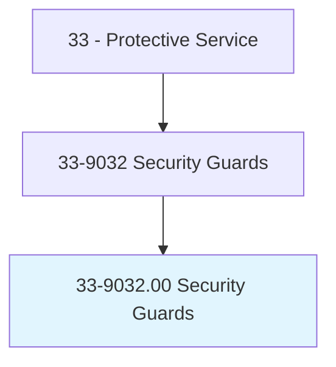
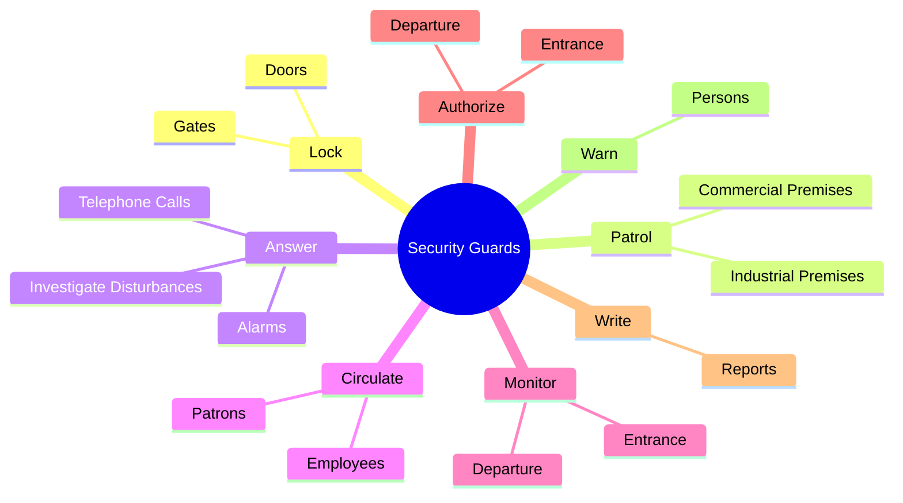
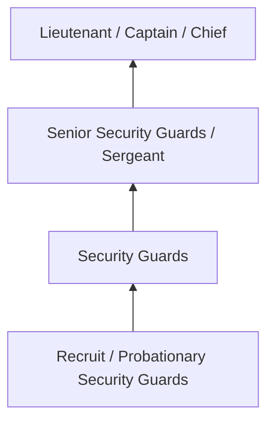
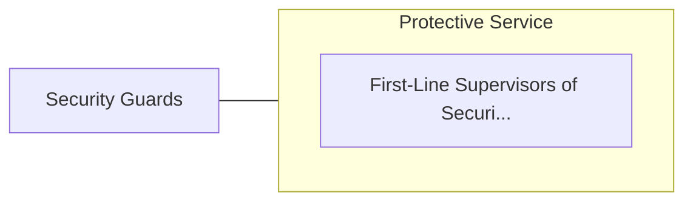

# Security Guards

> Guard, patrol, or monitor premises to prevent theft, violence, or infractions of rules. May operate x-ray and metal detector equipment.

## Overview

Security Guards professionals guard, patrol, or monitor premises to prevent theft, violence, or infractions of rules. This occupation falls within the Protective Service category and requires a combination of specialized knowledge, technical skills, and practical experience.

These professionals work across diverse settings and organizational contexts, applying their expertise to meet the demands of their field. They must stay current with industry standards, emerging practices, and regulatory requirements that affect their work. The role demands both independent judgment and collaborative skills, as practitioners regularly interact with colleagues, stakeholders, and the public.

As the field continues to evolve, Security Guards professionals increasingly leverage technology and data-driven approaches to enhance their effectiveness. Career opportunities span the public and private sectors, with demand influenced by economic conditions, demographic shifts, and technological advancement.

## Classification Hierarchy



## Key Statistics

| Metric | Value |
|--------|-------|
| SOC Code | 33-9032.00 |
| Job Zone | N/A |
| Category | [Protective Service](/occupations/PublicSafety/index) |
| Core Tasks | 76+ |
| Salary Range | $35,000 - $90,000 |
| Median Salary | $52,000 |
| Growth Outlook | 5% (As fast as average) |
| Source | O*NET |

## Core Tasks



### monitor.Entrance

Security Guards monitor entrance as part of their core responsibilities.

**Actions:**
- `monitor.Entrance.of.Employees` - Monitor and authorize entrance and departure of employees, visitors, and othe...
- `monitor.Entrance.of.Visitors` - Monitor and authorize entrance and departure of employees, visitors, and othe...
- `monitor.Entrance.of.OtherPersons.to.guard.AgainstTheft` - Monitor and authorize entrance and departure of employees, visitors, and othe...
- `monitor.Entrance.of.MaintainSecurity.of.Premises` - Monitor and authorize entrance and departure of employees, visitors, and othe...
- `monitor.Departure.of.Employees` - Monitor and authorize entrance and departure of employees, visitors, and othe...

### adjust.SecuritySystems

Security Guards adjust security systems as part of their core responsibilities.

**Actions:**
- `adjust.SecuritySystems.to.ensure.OperationalUseDetectEvidenceOfTampering` - Inspect and adjust security systems, equipment, or machinery to ensure operat...
- `adjust.SecuritySystems.to.ToDetectEvidenceOfTampering` - Inspect and adjust security systems, equipment, or machinery to ensure operat...
- `adjust.Equipment.to.ensure.OperationalUseDetectEvidenceOfTampering` - Inspect and adjust security systems, equipment, or machinery to ensure operat...
- `adjust.Equipment.to.ToDetectEvidenceOfTampering` - Inspect and adjust security systems, equipment, or machinery to ensure operat...
- `adjust.Machinery.to.ensure.OperationalUseDetectEvidenceOfTampering` - Inspect and adjust security systems, equipment, or machinery to ensure operat...

### patrol.IndustrialPremises

Security Guards patrol industrial premises as part of their core responsibilities.

**Actions:**
- `patrol.IndustrialPremises.to.prevent.SignsOfIntrusionEnsureSecurityOfDoors` - Patrol industrial or commercial premises to prevent and detect signs of intru...
- `patrol.IndustrialPremises.to.detect.SignsOfIntrusionEnsureSecurityOfDoors` - Patrol industrial or commercial premises to prevent and detect signs of intru...
- `patrol.IndustrialPremises.to.Windows` - Patrol industrial or commercial premises to prevent and detect signs of intru...
- `patrol.IndustrialPremises.to.Gates` - Patrol industrial or commercial premises to prevent and detect signs of intru...
- `patrol.CommercialPremises.to.prevent.SignsOfIntrusionEnsureSecurityOfDoors` - Patrol industrial or commercial premises to prevent and detect signs of intru...

### authorize.Entrance

Security Guards authorize entrance as part of their core responsibilities.

**Actions:**
- `authorize.Entrance.of.Employees` - Monitor and authorize entrance and departure of employees, visitors, and othe...
- `authorize.Entrance.of.Visitors` - Monitor and authorize entrance and departure of employees, visitors, and othe...
- `authorize.Entrance.of.OtherPersons.to.guard.AgainstTheft` - Monitor and authorize entrance and departure of employees, visitors, and othe...
- `authorize.Entrance.of.MaintainSecurity.of.Premises` - Monitor and authorize entrance and departure of employees, visitors, and othe...
- `authorize.Departure.of.Employees` - Monitor and authorize entrance and departure of employees, visitors, and othe...


## Skills & Competencies

### Technical Skills
- **Law Enforcement / Emergency Procedures** - Expert
- **Defensive Tactics** - Advanced
- **Report Writing** - Advanced
- **Emergency Response** - Advanced
- **Investigation Techniques** - Proficient
- **First Aid / CPR** - Proficient

### Soft Skills
- **Situational Awareness** - Critical
- **Decision Making Under Pressure** - Critical
- **Communication** - Essential
- **Physical Fitness** - Essential
- **Integrity** - Essential

## Education & Certifications

| Requirement | Details |
|-------------|---------|
| Typical Education | High school diploma to associate degree; academy training required |
| Work Experience | 0-2 years; field training period |
| On-the-Job Training | Extensive - police/fire/corrections academy |
| Certifications | State POST certification, EMT certification, firearms qualification |

## Career Progression



## Industry Variations

### Municipal Law Enforcement
City and county public safety services. Security Guards professionals serve local communities through patrol, investigation, and prevention.

### Fire and Emergency Services
Emergency response and fire prevention. Focus on rapid response, incident command, and community safety education.

### Corrections
Custody and supervision of incarcerated individuals. Emphasis on security, rehabilitation, and institutional order.

### Private Security
Contract security services for commercial and residential clients. Focus on access control, surveillance, and risk assessment.

## Technology & Tools

- **Computer-aided dispatch (CAD) systems**
- **Body cameras and surveillance systems**
- **Records management systems**
- **Firearms and tactical equipment**
- **Emergency communication systems**

## Related Occupations



## Industries

- Local Government - High Employment
- State Government - High Employment
- Federal Government - Moderate Employment
- [Private Security Services](/industries/SecurityServices) - Moderate Employment

## Departments

This occupation typically works in:
- Patrol Division
- Investigations
- Emergency Services

## GraphDL Semantic Structure

```graphdl
Security Guards perform:
- lock.Doors.of.Entrances
- lock.Doors.of.Exits.to.secure.Buildings
- lock.Gates.of.Entrances
- lock.Gates.of.Exits.to.secure.Buildings
- patrol.IndustrialPremises.to.prevent.SignsOfIntrusionEnsureSecurityOfDoors
- patrol.IndustrialPremises.to.detect.SignsOfIntrusionEnsureSecurityOfDoors
```

---

*Source: O*NET 33-9032.00 - ONETOccupation*
