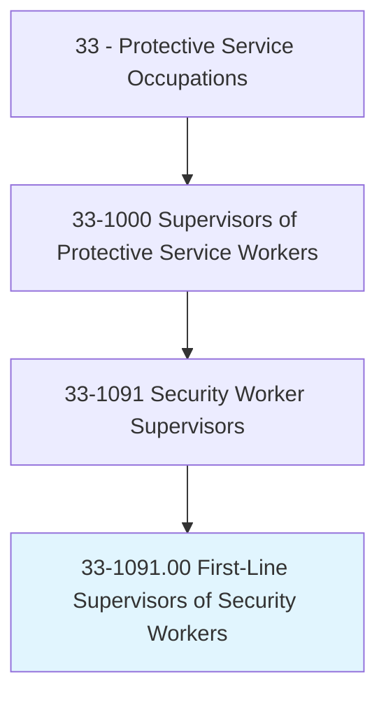
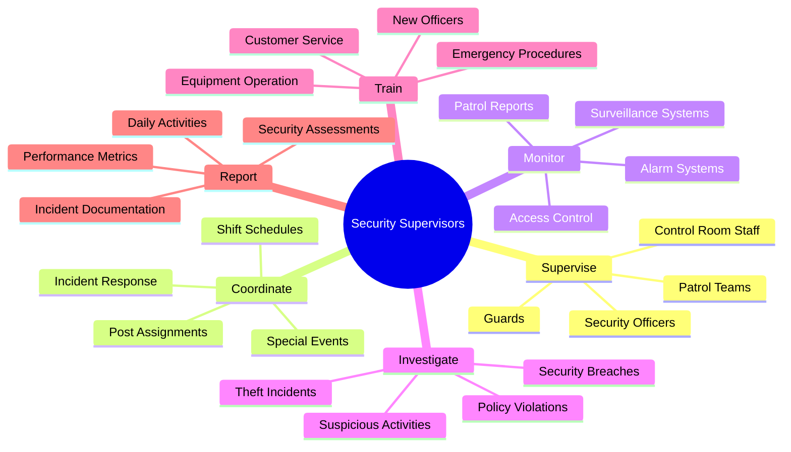
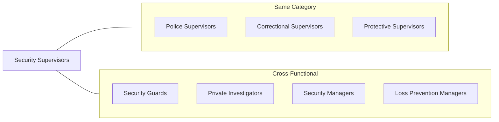
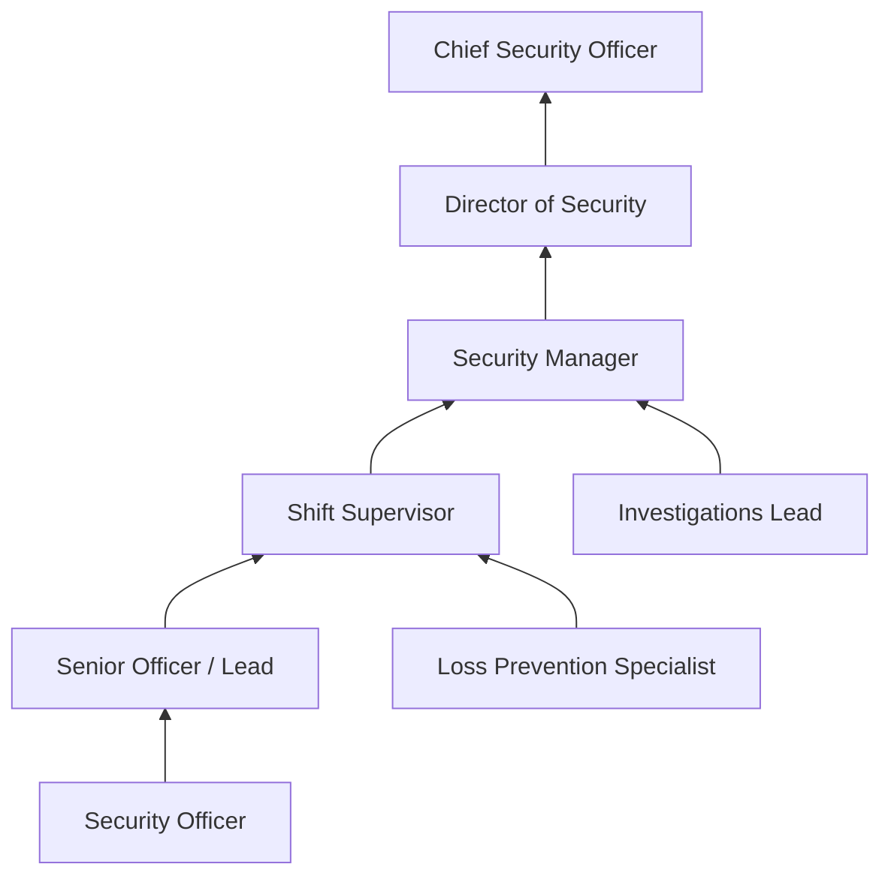
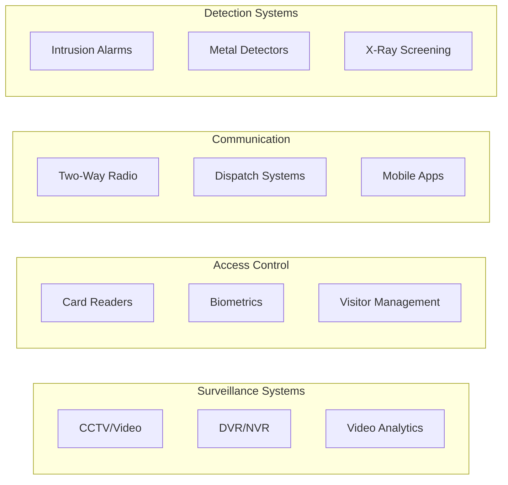

# First-Line Supervisors of Security Workers

> Directly supervise and coordinate activities of security workers and security guards.

## Overview

First-Line Supervisors of Security Workers manage security officers and guards who protect people, property, and assets across diverse settings. They oversee security operations for commercial buildings, retail stores, healthcare facilities, educational institutions, and industrial sites. These supervisors develop security protocols, assign patrol areas, monitor surveillance systems, respond to incidents, and ensure compliance with organizational policies and legal requirements. The role bridges physical security and risk management, requiring both tactical awareness and administrative capabilities to maintain safe environments while balancing customer service and loss prevention objectives.

## Classification Hierarchy

## Key Statistics

| Metric | Value |
|--------|-------|
| SOC Code | 33-1091.00 |
| Job Zone | 2-3 (Limited to Medium Preparation) |
| Category | [Protective Service](/occupations/PublicSafety/index) |
| Core Tasks | 12+ |
| Source | O*NET |

## Core Tasks

### supervise.SecurityOfficers

Security Supervisors oversee the daily activities of security personnel across assigned areas.

**Actions:**
- `supervise.SecurityOfficers.to.protect.Assets` - Direct guard activities for property protection
- `supervise.Guards.to.patrol.Facilities` - Ensure regular and thorough patrol coverage
- `supervise.Staff.to.enforce.Policies` - Monitor compliance with security procedures
- `coordinate.Officers.during.ShiftChanges` - Manage seamless transition between shifts

### coordinate.SecurityOperations

Supervisors manage the logistics of security coverage and resource deployment.

**Actions:**
- `coordinate.Schedules.to.ensure.Coverage` - Create and manage shift assignments
- `coordinate.Responses.to.Alarms` - Direct officer response to alarm activations
- `coordinate.Security.for.SpecialEvents` - Plan and execute event security operations
- `allocate.Resources.based.on.RiskAssessment` - Deploy personnel according to threat levels

### monitor.SurveillanceSystems

Supervisors ensure effective use of technology for security monitoring.

**Actions:**
- `monitor.CCTVSystems.to.detect.Incidents` - Oversee video surveillance operations
- `monitor.AccessControl.to.prevent.Intrusions` - Review access logs and badge systems
- `review.AlarmSystems.for.Functionality` - Ensure detection systems are operational
- `analyze.Footage.for.Investigations` - Review video evidence for security incidents

### investigate.SecurityIncidents

Supervisors lead investigations into breaches and violations.

**Actions:**
- `investigate.SecurityBreaches.to.identify.Causes` - Determine how incidents occurred
- `investigate.Theft.to.recover.Assets` - Lead loss prevention investigations
- `document.Incidents.for.LegalProceedings` - Create comprehensive incident reports
- `coordinate.WithPolice.on.CriminalMatters` - Interface with law enforcement as needed

### train.SecurityStaff

Supervisors develop and maintain officer competencies.

**Actions:**
- `train.NewOfficers.on.Procedures` - Conduct onboarding and orientation
- `train.Staff.on.EmergencyResponse` - Prepare personnel for crisis situations
- `train.Guards.on.CustomerService` - Balance security with hospitality
- `certify.Officers.on.Equipment` - Ensure proficiency with security technology

### report.SecurityStatus

Supervisors document and communicate security conditions.

**Actions:**
- `report.DailyActivities.to.Management` - Provide operational summaries
- `report.Incidents.to.Stakeholders` - Communicate significant events
- `compile.Metrics.for.Analysis` - Track performance indicators
- `recommend.Improvements.based.on.Findings` - Suggest security enhancements

## Skills & Competencies

### Technical Skills
- **Security Operations** - Advanced
- **Surveillance Technology** - Advanced
- **Access Control Systems** - Proficient
- **Report Writing** - Proficient
- **Emergency Response** - Proficient

### Soft Skills
- **Leadership** - Critical
- **Decision Making** - Essential
- **Communication** - Essential
- **Conflict Resolution** - Essential
- **Customer Service** - Important

## Related Occupations

## Industries

- [Investigation and Security Services](/industries/Administrative/SupportServices/SecurityServices/index) - Highest Employment
- [Retail Trade](/industries/Retail/index) - High Employment
- [Healthcare and Social Assistance](/industries/Healthcare/index) - High Employment
- [Manufacturing](/industries/Manufacturing/index) - Moderate Employment
- [Educational Services](/industries/Education) - Moderate Employment
- [Government](/industries/Government) - Moderate Employment

## Industry Variations

### Contract Security Services
- Supervise officers deployed to multiple client sites
- Manage varying client requirements and contracts
- Coordinate scheduling across dispersed locations
- Ensure compliance with client-specific policies and procedures

### Corporate Security
- Oversee in-house security for single organizations
- Integrate security with corporate culture and values
- Coordinate with HR, legal, and facilities departments
- Manage executive protection and sensitive asset security

### Retail Loss Prevention
- Focus on theft prevention and apprehension
- Coordinate with store management on shrinkage reduction
- Supervise plainclothes and uniformed personnel
- Implement technology solutions for loss prevention

### Healthcare Security
- Manage security in hospitals and medical facilities
- Handle sensitive situations involving patients and families
- Coordinate with clinical staff on safety concerns
- Implement de-escalation and behavioral health protocols

### Educational Institutions
- Supervise campus security officers
- Coordinate with administration on student safety
- Manage access control for buildings and events
- Implement emergency preparedness and response plans

### Critical Infrastructure
- Protect utilities, transportation, and essential facilities
- Implement heightened security measures and screenings
- Coordinate with federal agencies on compliance requirements
- Manage access for employees, contractors, and visitors

## Career Progression

## Education & Training

| Requirement | Details |
|-------------|---------|
| Typical Education | High school diploma required; Associate's or Bachelor's degree preferred |
| Work Experience | 2-5 years as Security Officer |
| On-the-Job Training | 3-6 months supervisory development |
| Common Certifications | CPP, PSP, CPO, First Aid/CPR, State Guard License |
| Continuing Education | Security management courses, technology training |

## Work Environment

| Factor | Description |
|--------|-------------|
| Setting | Control rooms, patrol routes, office environments, client sites |
| Schedule | Shift work including nights, weekends, holidays (24/7 coverage) |
| Physical Demands | Standing, walking, occasional physical intervention |
| Stress Level | Moderate to High - incident response, personnel management |
| Risk Factors | Confrontations, workplace violence exposure |

## Technology & Tools

## Certifications & Licensing

| Certification | Issuing Body |
|---------------|--------------|
| Certified Protection Professional (CPP) | ASIS International |
| Physical Security Professional (PSP) | ASIS International |
| Certified Protection Officer (CPO) | IFPO |
| State Security Guard License | State Regulatory Agency |
| First Aid/CPR/AED | American Red Cross / AHA |

## Departments

This occupation typically works in:
- [Security Operations](/departments/SecurityOperations)
- [Loss Prevention](/departments/LossPrevention)
- [Facilities Management](/departments/Facilities)
- [Risk Management](/departments/RiskManagement)
- [Corporate Security](/departments/CorporateSecurity)

## Related Processes

- [Access Control Management](/processes/AccessControl)
- [Incident Response](/processes/IncidentResponse)
- [Patrol Operations](/processes/PatrolOperations)
- [Visitor Management](/processes/VisitorManagement)
- [Emergency Evacuation](/processes/EmergencyEvacuation)

---

*Source: O*NET 33-1091.00 - ONETOccupation*
