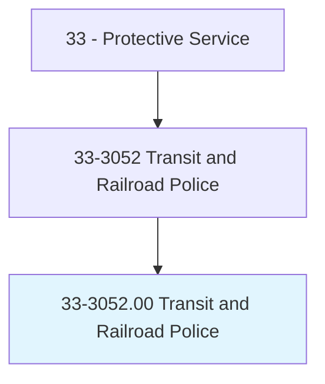
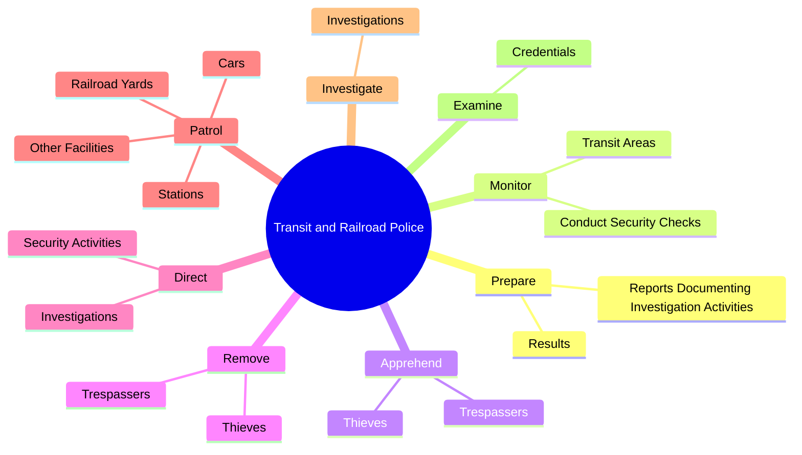
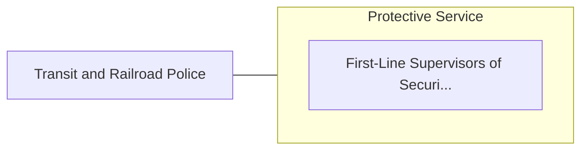

# Transit and Railroad Police

> Protect and police railroad and transit property, employees, or passengers.

## Overview

Transit and Railroad Police is classified under Protective Service (SOC 33). Protect and police railroad and transit property, employees, or passengers.

## Classification Hierarchy

## Key Statistics

| Metric | Value |
|--------|-------|
| SOC Code | 33-3052.00 |
| Category | [Protective Service](/occupations/PublicSafety/index) |
| Task Count | 63 |
| Source | O*NET |

## Core Tasks

### prepare.ReportsDocumentingInvestigationActivities

Transit and Railroad Police prepare reports documenting investigation activities as part of their core responsibilities.

**Actions:**
- `prepare.ReportsDocumentingInvestigationActivities`
- `prepare.Results`

### monitor.TransitAreas

Transit and Railroad Police monitor transit areas as part of their core responsibilities.

**Actions:**
- `monitor.TransitAreas.to.protect.RailroadProperties`
- `monitor.TransitAreas.to.Patrons`
- `monitor.TransitAreas.to.Employees`
- `monitor.ConductSecurityChecks.to.protect.RailroadProperties`

### apprehend.Trespassers

Transit and Railroad Police apprehend trespassers as part of their core responsibilities.

**Actions:**
- `apprehend.Trespassers.from.RailroadProperty`
- `apprehend.Trespassers.from.Coordinate.with.LawEnforcementAgenciesInApprehensions`
- `apprehend.Trespassers.from.Removals`
- `apprehend.Thieves.from.RailroadProperty`

## Skills & Competencies

### Technical Skills
- **Law Enforcement** - Advanced
- **Emergency Response** - Advanced
- **Public Safety** - Advanced

### Soft Skills
- **Communication** - Essential
- **Problem Solving** - Essential
- **Critical Thinking** - Important
- **Teamwork** - Important
- **Adaptability** - Important

## Related Occupations

## Industries

This occupation is found across multiple industries. See [Industries](/industries) for sector-specific employment data.

## Career Progression

---

*Source: O*NET 33-3052.00 - ONETOccupation*
