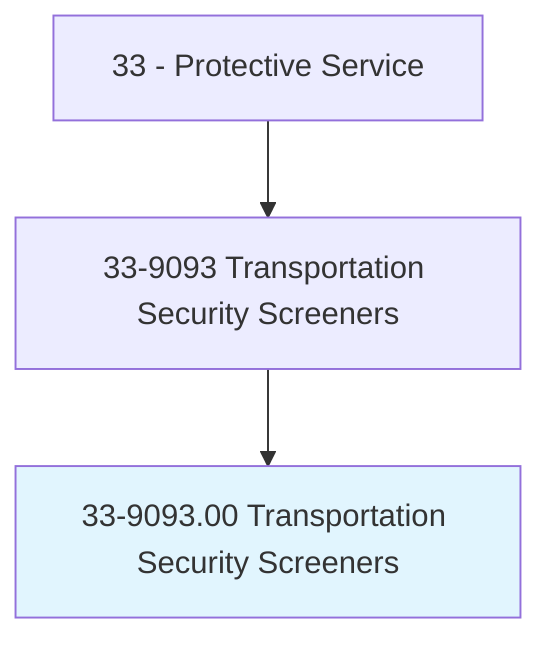
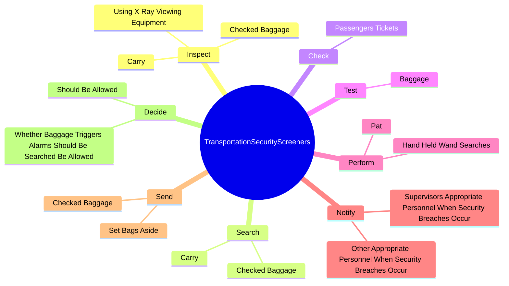
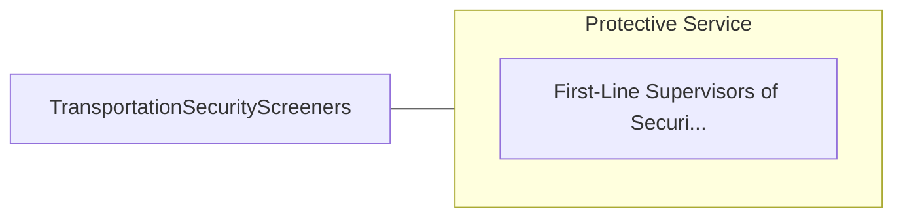

# Transportation Security Screeners

> Conduct screening of passengers, baggage, or cargo to ensure compliance with Transportation Security Administration (TSA) regulations. May operate basic security equipment such as x-ray machines and hand wands at screening checkpoints.

## Overview

Transportation Security Screeners is an occupation within the Protective Service category. Conduct screening of passengers, baggage, or cargo to ensure compliance with Transportation Security Administration (TSA) regulations. 

## Classification Hierarchy

## Key Statistics

| Metric | Value |
|--------|-------|
| SOC Code | 33-9093.00 |
| Category | [Protective Service](/occupations/PublicSafety/index) |
| Task Count | 64 |
| Source | O*NET |

## Core Tasks

### inspect.Carry

Transportation Security Screeners inspect carry as part of their core responsibilities.

**Actions:**
- `inspect.Carry.on.Items.to.determine.WhetherItemsContainObjectsWarrantFurtherInvestigation`
- `inspect.UsingXRayViewingEquipment.to.determine.WhetherItemsContainObjectsWarrantFurtherInvestigation`
- `inspect.CheckedBaggage.for.Signs.of.Tampering`

### search.Carry

Transportation Security Screeners search carry as part of their core responsibilities.

**Actions:**
- `search.Carry.on.ByHandWhenItIsSuspectedToContainProhibitedItems`
- `search.Carry.on.ByWeapons`
- `search.CheckedBaggage.by.HandWhenItIsSuspectedToContainProhibitedItems`
- `search.CheckedBaggage.by.Weapons`

### check.PassengersTickets

Transportation Security Screeners check passengers tickets as part of their core responsibilities.

**Actions:**
- `check.PassengersTickets.to.ensure.TheyAreValid`
- `check.PassengersTickets.to.ToDetermineWhetherPassengersHaveDesignationsRequireSpecialHandling`
- `check.PassengersTickets.to.ProvidingPhotoIdentification`

## Skills & Competencies

### Technical Skills
- **Law Enforcement** - Advanced
- **Emergency Response** - Advanced
- **Public Safety** - Advanced

### Soft Skills
- **Communication** - Essential
- **Problem Solving** - Essential
- **Critical Thinking** - Important
- **Teamwork** - Important
- **Adaptability** - Important

## Related Occupations

## Industries

This occupation is found across multiple industries. See [Industries](/industries) for sector-specific employment data.

## Career Progression

---

*Source: O*NET 33-9093.00 - ONETOccupation*
