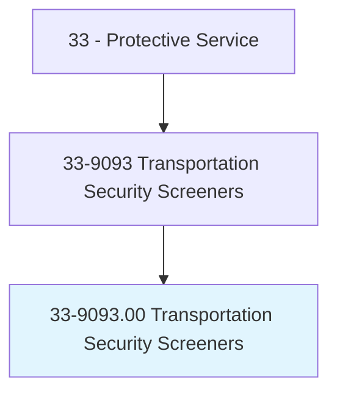
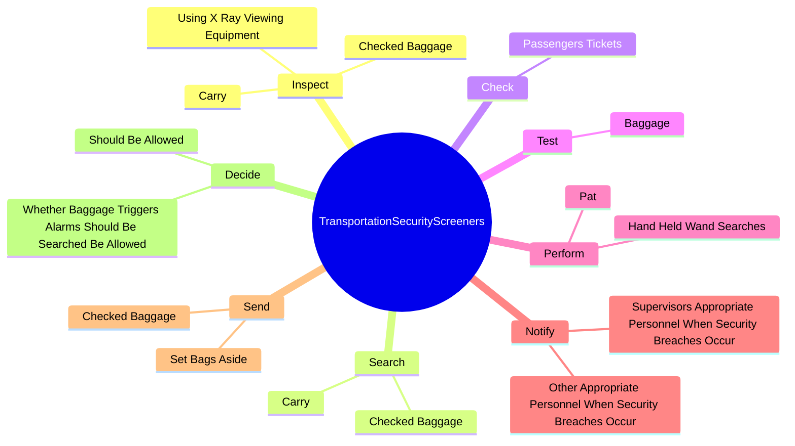
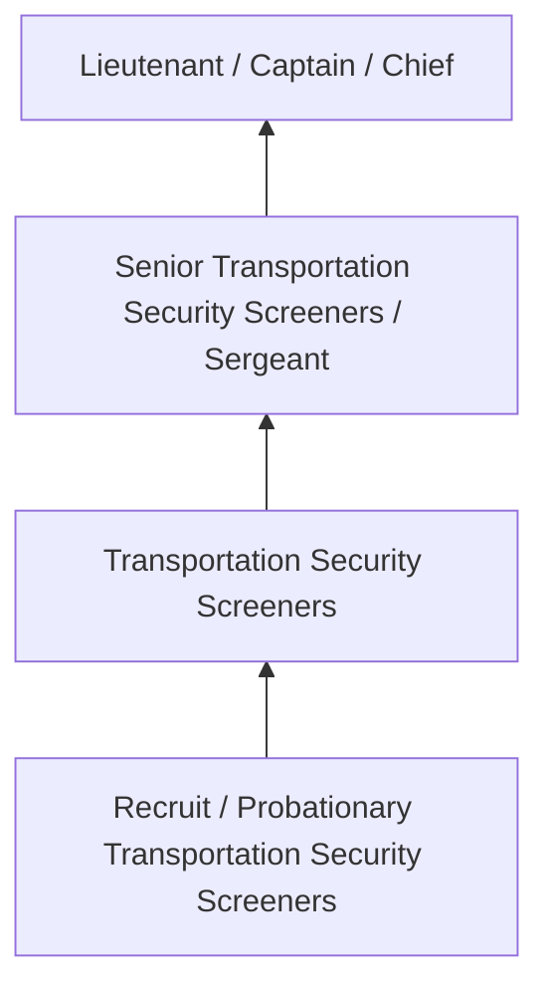
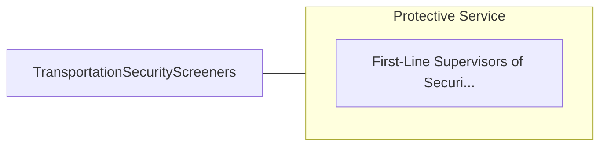

# Transportation Security Screeners

> Conduct screening of passengers, baggage, or cargo to ensure compliance with Transportation Security Administration (TSA) regulations. May operate basic security equipment such as x-ray machines and hand wands at screening checkpoints.

## Overview

Transportation Security Screeners professionals conduct screening of passengers, baggage, or cargo to ensure compliance with Transportation Security Administration (TSA) regulations. This occupation falls within the Protective Service category and requires a combination of specialized knowledge, technical skills, and practical experience.

These professionals work across diverse settings and organizational contexts, applying their expertise to meet the demands of their field. They must stay current with industry standards, emerging practices, and regulatory requirements that affect their work. The role demands both independent judgment and collaborative skills, as practitioners regularly interact with colleagues, stakeholders, and the public.

As the field continues to evolve, Transportation Security Screeners professionals increasingly leverage technology and data-driven approaches to enhance their effectiveness. Career opportunities span the public and private sectors, with demand influenced by economic conditions, demographic shifts, and technological advancement.

## Classification Hierarchy



## Key Statistics

| Metric | Value |
|--------|-------|
| SOC Code | 33-9093.00 |
| Job Zone | N/A |
| Category | [Protective Service](/occupations/PublicSafety/index) |
| Core Tasks | 64+ |
| Salary Range | $35,000 - $90,000 |
| Median Salary | $52,000 |
| Growth Outlook | 5% (As fast as average) |
| Source | O*NET |

## Core Tasks



### perform.Pat

Transportation Security Screeners perform pat as part of their core responsibilities.

**Actions:**
- `perform.Pat.down.WandSearches.of.PassengersWhoHaveTriggeredMachineAlarms` - Perform pat-down or hand-held wand searches of passengers who have triggered ...
- `perform.Pat.down.WandSearchesOfWhoAreUnable.to.pass.ThroughMetalDetectors` - Perform pat-down or hand-held wand searches of passengers who have triggered ...
- `perform.Pat.down.WandSearches.of.WhoHaveBeenRandomlyIdentifiedForSuchSearches` - Perform pat-down or hand-held wand searches of passengers who have triggered ...
- `perform.HandHeldWandSearches.of.PassengersWhoHaveTriggeredMachineAlarms` - Perform pat-down or hand-held wand searches of passengers who have triggered ...
- `perform.HandHeldWandSearches.of.WhoAreUnable.to.pass.ThroughMetalDetectors` - Perform pat-down or hand-held wand searches of passengers who have triggered ...

### contact.PoliceDirectly

Transportation Security Screeners contact police directly as part of their core responsibilities.

**Actions:**
- `contact.PoliceDirectly.in.Cases.of.UrgentSecurityIssues` - Contact police directly in cases of urgent security issues, using phones or t...
- `contact.PoliceDirectly.in.UsingPhones` - Contact police directly in cases of urgent security issues, using phones or t...
- `contact.PoliceDirectly.in.TwoWayRadios` - Contact police directly in cases of urgent security issues, using phones or t...
- `contact.Leads.to.discuss.ObjectsOfConcernAreNotOnProhibitedObjectLists` - Contact leads or supervisors to discuss objects of concern that are not on pr...
- `contact.Supervisors.to.discuss.ObjectsOfConcernAreNotOnProhibitedObjectLists` - Contact leads or supervisors to discuss objects of concern that are not on pr...

### view.Images

Transportation Security Screeners view images as part of their core responsibilities.

**Actions:**
- `view.Images.of.CheckedBags` - View images of checked bags and cargo, using remote screening equipment, and ...
- `view.Images.of.Cargo` - View images of checked bags and cargo, using remote screening equipment, and ...
- `view.Images.of.UsingRemoteScreeningEquipment` - View images of checked bags and cargo, using remote screening equipment, and ...
- `view.Images.of.AlertBaggageScreenersToPossibleProblems` - View images of checked bags and cargo, using remote screening equipment, and ...
- `view.Images.of.HandlersToPossibleProblems` - View images of checked bags and cargo, using remote screening equipment, and ...

### search.Carry

Transportation Security Screeners search carry as part of their core responsibilities.

**Actions:**
- `search.Carry.on.ByHandWhenItIsSuspectedToContainProhibitedItems` - Search carry-on or checked baggage by hand when it is suspected to contain pr...
- `search.Carry.on.ByWeapons` - Search carry-on or checked baggage by hand when it is suspected to contain pr...
- `search.CheckedBaggage.by.HandWhenItIsSuspectedToContainProhibitedItems` - Search carry-on or checked baggage by hand when it is suspected to contain pr...
- `search.CheckedBaggage.by.Weapons` - Search carry-on or checked baggage by hand when it is suspected to contain pr...


## Skills & Competencies

### Technical Skills
- **Law Enforcement / Emergency Procedures** - Expert
- **Defensive Tactics** - Advanced
- **Report Writing** - Advanced
- **Emergency Response** - Advanced
- **Investigation Techniques** - Proficient
- **First Aid / CPR** - Proficient

### Soft Skills
- **Situational Awareness** - Critical
- **Decision Making Under Pressure** - Critical
- **Communication** - Essential
- **Physical Fitness** - Essential
- **Integrity** - Essential

## Education & Certifications

| Requirement | Details |
|-------------|---------|
| Typical Education | High school diploma to associate degree; academy training required |
| Work Experience | 0-2 years; field training period |
| On-the-Job Training | Extensive - police/fire/corrections academy |
| Certifications | State POST certification, EMT certification, firearms qualification |

## Career Progression



## Industry Variations

### Municipal Law Enforcement
City and county public safety services. Transportation Security Screeners professionals serve local communities through patrol, investigation, and prevention.

### Fire and Emergency Services
Emergency response and fire prevention. Focus on rapid response, incident command, and community safety education.

### Corrections
Custody and supervision of incarcerated individuals. Emphasis on security, rehabilitation, and institutional order.

### Private Security
Contract security services for commercial and residential clients. Focus on access control, surveillance, and risk assessment.

## Technology & Tools

- **Computer-aided dispatch (CAD) systems**
- **Body cameras and surveillance systems**
- **Records management systems**
- **Firearms and tactical equipment**
- **Emergency communication systems**

## Related Occupations



## Industries

- Local Government - High Employment
- State Government - High Employment
- Federal Government - Moderate Employment
- [Private Security Services](/industries/SecurityServices) - Moderate Employment

## Departments

This occupation typically works in:
- Patrol Division
- Investigations
- Emergency Services

## GraphDL Semantic Structure

```graphdl
Transportation Security Screeners perform:
- inspect.Carry.on.Items.to.determine.WhetherItemsContainObjectsWarrantFurtherInvestigation
- inspect.UsingXRayViewingEquipment.to.determine.WhetherItemsContainObjectsWarrantFurtherInvestigation
- search.Carry.on.ByHandWhenItIsSuspectedToContainProhibitedItems
- search.Carry.on.ByWeapons
- search.CheckedBaggage.by.HandWhenItIsSuspectedToContainProhibitedItems
- search.CheckedBaggage.by.Weapons
```

---

*Source: O*NET 33-9093.00 - ONETOccupation*
