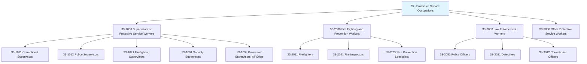
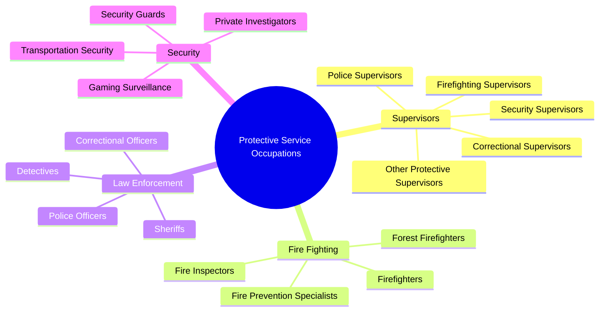
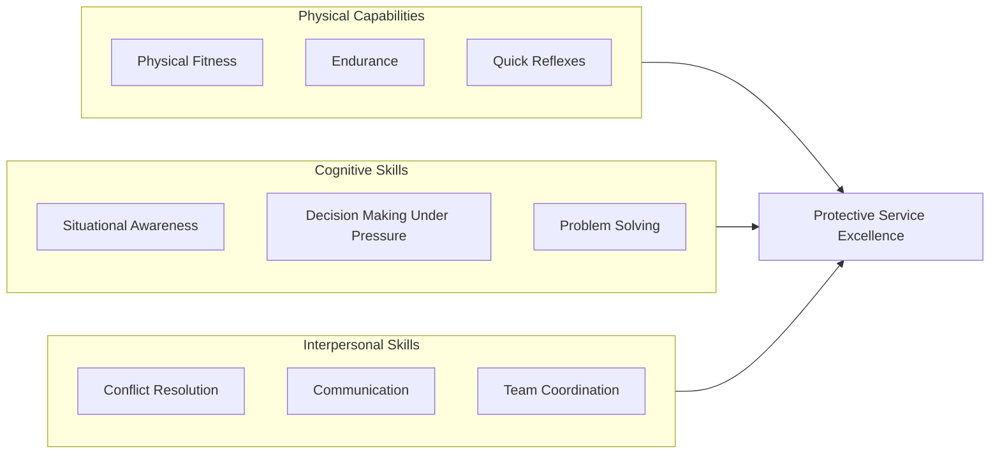
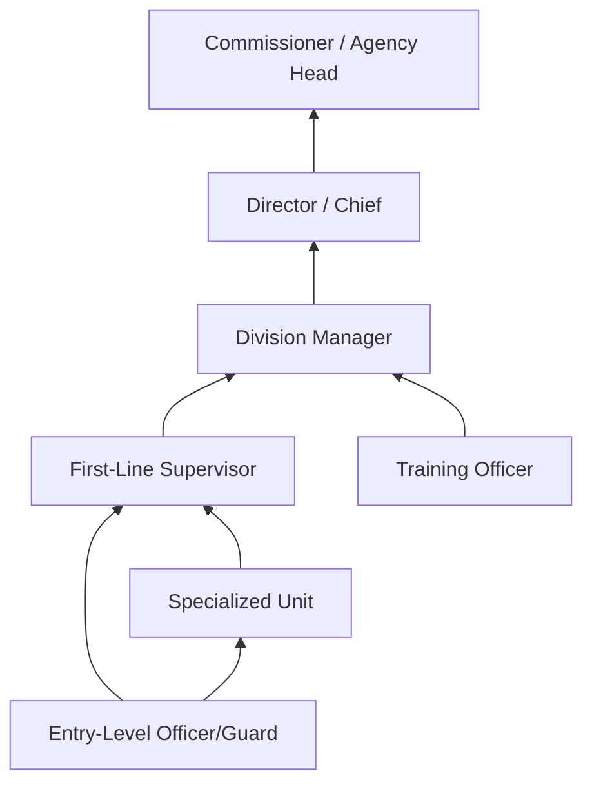

# Protective Service Occupations

> Category 33 - Protective Service occupations include roles focused on maintaining public safety, enforcing laws, fighting fires, providing security, and protecting individuals, communities, and property from harm.

## Overview

Protective Service Occupations encompass a diverse range of roles dedicated to safeguarding people, property, and public order. This category includes first-line supervisors and workers in law enforcement, fire protection, corrections, and security services. These professionals operate in high-stakes environments requiring quick decision-making, physical fitness, and strong ethical judgment. They serve in local, state, and federal government agencies as well as private sector security organizations, playing critical roles in emergency response, crime prevention, and public safety infrastructure.

## Classification Hierarchy

## Key Statistics

| Metric | Value |
|--------|-------|
| SOC Category Code | 33 |
| Major Groups | 4 |
| Detailed Occupations | 25+ |
| Source | O*NET / BLS |

## Occupations in this Category

### Supervisors of Protective Service Workers (33-1000)

| Occupation | Code | Description |
|------------|------|-------------|
| [Correctional Supervisors](./CorrectionalSupervisors.mdx) | 33-1011.00 | Supervise and coordinate activities of correctional officers and jailers |
| [Police Supervisors](./PoliceSupervisors.mdx) | 33-1012.00 | Supervise and coordinate activities of police force members |
| [Firefighting Supervisors](./FirefightingSupervisors.mdx) | 33-1021.00 | Supervise firefighting and fire prevention workers |
| [Security Supervisors](./SecuritySupervisors.mdx) | 33-1091.00 | Supervise and coordinate security workers and guards |
| [Protective Supervisors](./ProtectiveSupervisors.mdx) | 33-1099.00 | All other protective service supervisors |

### Fire Fighting and Prevention Workers (33-2000)

| Occupation | Code | Description |
|------------|------|-------------|
| Firefighters | 33-2011.00 | Control and extinguish fires, protect life and property |
| Fire Inspectors | 33-2021.00 | Inspect buildings and investigate fires |
| Fire Prevention Specialists | 33-2022.00 | Develop fire prevention programs and conduct inspections |

### Law Enforcement Workers (33-3000)

| Occupation | Code | Description |
|------------|------|-------------|
| Correctional Officers | 33-3012.00 | Guard inmates in correctional facilities |
| Detectives and Criminal Investigators | 33-3021.00 | Investigate crimes and gather evidence |
| Police and Sheriff's Patrol Officers | 33-3051.00 | Maintain order and protect life and property |

## Category Overview Diagram

## Skills Common to Protective Service Occupations

### Core Competencies

## Career Pathways

## Industries Employing Protective Service Occupations

- [Government - Local](/industries/GovernmentLocal) - Highest concentration (Police, Fire)
- [Government - State](/industries/GovernmentState) - High employment (State Police, Corrections)
- [Government - Federal](/industries/GovernmentFederal) - Federal law enforcement
- [Investigation and Security Services](/industries/Administrative/SupportServices/SecurityServices/index) - Private security sector
- [Healthcare Facilities](/industries/Healthcare/index) - Hospital security
- [Education](/industries/Education) - Campus security

## Education & Training Trends

| Level | Percentage of Workers |
|-------|----------------------|
| High School Diploma + Academy | 40-50% |
| Associate's Degree | 20-25% |
| Bachelor's Degree | 15-20% |
| Graduate Degree | 5-10% |

## Certifications & Licensing

| Certification | Description |
|---------------|-------------|
| Peace Officer Standards and Training (POST) | Required for law enforcement |
| Emergency Medical Technician (EMT) | Common for firefighters |
| Security Guard License | State-required for security workers |
| Corrections Officer Certification | Required for correctional facilities |
| Firearms Certification | Required for armed positions |

## Related Categories

- [Management Occupations](/occupations/Management/index) - Category 11
- [Healthcare Support](/occupations/HealthcareSupport/index) - Category 31
- [Legal Occupations](/occupations/Legal/index) - Category 23
- [Transportation and Material Moving](/occupations/Transportation/index) - Category 53

---

*Source: O*NET / Bureau of Labor Statistics - SOC Category 33*
