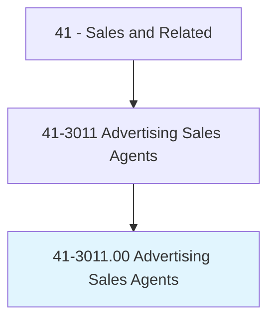
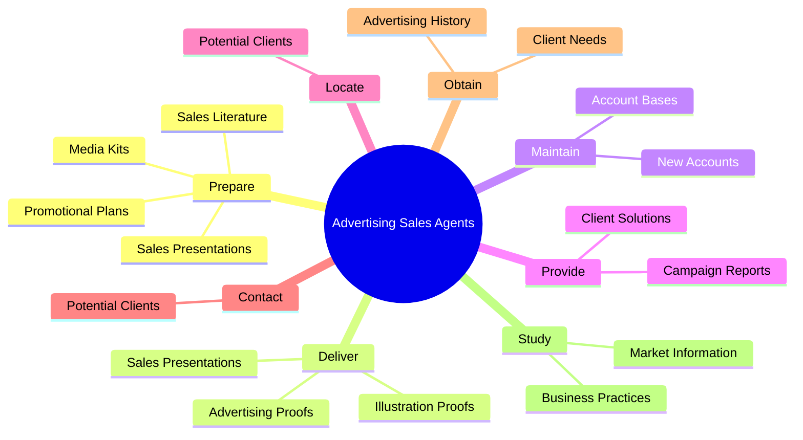
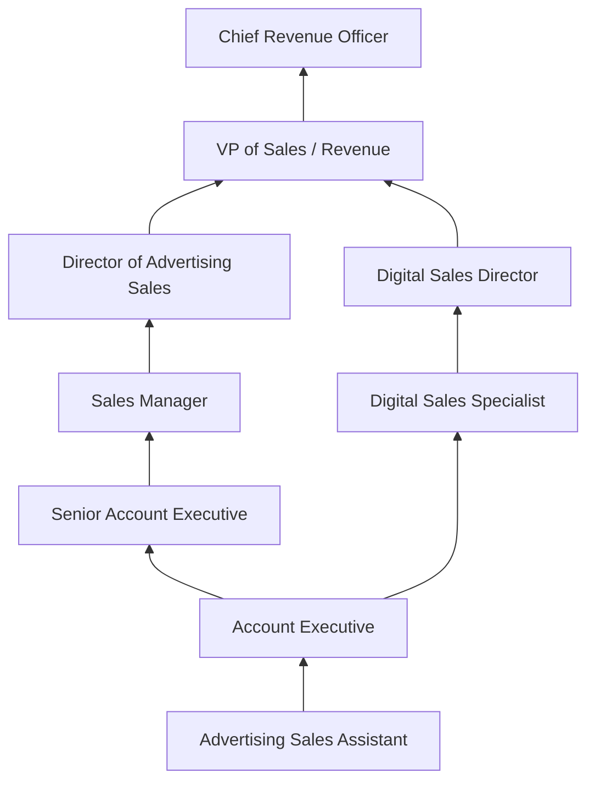
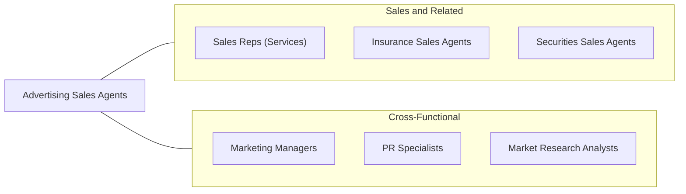

# Advertising Sales Agents

> Sell or solicit advertising space, time, or media in publications, signage, TV, radio, or Internet establishments or public spaces.

## Overview

Advertising Sales Agents are the revenue engines of media companies, connecting businesses that want to promote their products and services with publications, broadcast outlets, digital platforms, and signage opportunities that can reach target audiences. They prospect for new clients, maintain relationships with existing advertisers, develop customized advertising proposals, negotiate rates, and ensure campaigns are delivered as promised. Their work requires a blend of creative thinking, market knowledge, and persuasive selling ability.

The advertising landscape has transformed dramatically with the rise of digital media. While traditional print, radio, and television advertising remain important revenue streams, digital advertising -- including display ads, programmatic buying, social media campaigns, search engine marketing, and native content -- now represents the largest share of advertising spending. Agents must understand complex digital metrics, audience targeting capabilities, and multi-platform strategies to serve clients effectively.

Advertising Sales Agents typically work for media companies (newspapers, magazines, TV/radio stations, websites), advertising agencies, or as independent media brokers. Success is highly performance-driven, with compensation often including significant commission-based components. Top performers develop deep industry expertise, build extensive networks, and become trusted advisors on marketing strategy and media placement.

## Classification Hierarchy

## Key Statistics

| Metric | Value |
|--------|-------|
| SOC Code | 41-3011.00 |
| Job Zone | 3 (Medium Preparation) |
| Category | [Sales and Related](/occupations/Sales/index) |
| Median Annual Salary | $54,550 |
| Employment | ~108,000 |
| Projected Growth | -7% (declining) |
| Core Tasks | 71 |
| Source | O*NET |

## Core Tasks

### prepare.SalesPresentations

Advertising Sales Agents create compelling sales materials and presentations.

**Actions:**
- `prepare.SalesPresentations.to.NewCustomers` - Develop pitches for prospective advertisers
- `prepare.SalesPresentations.to.ExistingCustomers` - Create upsell and renewal proposals
- `prepare.PromotionalPlans.for.Campaigns` - Design multi-channel advertising plans
- `prepare.SalesLiterature.for.MediaKits` - Compile audience data and rate information

### deliver.SalesPresentations

Advertising Sales Agents present proposals and proofs to clients.

**Actions:**
- `deliver.SalesPresentations.to.NewCustomers` - Present advertising solutions to prospects
- `deliver.SalesPresentations.to.ExistingCustomers` - Present renewal and expansion opportunities
- `deliver.AdvertisingProofs.to.CustomersForApproval` - Submit creative proofs for review
- `deliver.IllustrationProofs.to.CustomersForApproval` - Present visual ad concepts

### maintain.AccountBases

Advertising Sales Agents manage existing accounts while developing new business.

**Actions:**
- `maintain.AssignedAccountBasesWhileDevelopingNewAccounts` - Balance retention and acquisition

## Skills & Competencies

### Technical Skills
- **Media Planning and Buying** - Advanced
- **Digital Advertising Platforms (Google Ads, Meta)** - Advanced
- **CRM and Sales Pipeline Management** - Advanced
- **Audience Analytics and Metrics** - Advanced
- **Proposal and Presentation Development** - Advanced
- **Rate Card and Pricing Strategy** - Intermediate
- **Programmatic Advertising** - Intermediate

### Soft Skills
- **Persuasion and Negotiation** - Critical
- **Relationship Building** - Critical
- **Communication (Oral and Written)** - Critical
- **Resilience and Persistence** - Essential
- **Time Management** - Essential
- **Creative Thinking** - Essential
- **Active Listening** - Essential
- **Self-Motivation** - Critical

## Education & Certifications

| Requirement | Details |
|-------------|---------|
| Typical Education | Bachelor's degree in Marketing, Communications, or Business |
| Google Ads Certification | Validates digital advertising competency |
| Meta Blueprint Certification | Facebook/Instagram advertising proficiency |
| HubSpot Inbound Sales | Inbound sales methodology certification |
| IAB Digital Media Sales | Interactive Advertising Bureau certification |
| RAB Certified | Radio Advertising Bureau sales certification |
| Continuing Education | Digital marketing courses, industry conferences |

## Career Progression

## Industry Variations

| Setting | Focus | Unique Aspects |
|---------|-------|----------------|
| Digital Media / Ad Tech | Programmatic, display, social | Data-driven; CPM/CPC metrics; self-serve platforms |
| Newspaper / Print Media | Display ads, classifieds, inserts | Declining market; bundled digital packages; local focus |
| Television / Radio | Airtime, sponsorships | Reach-based selling; upfront/scatter markets; ratings data |
| Outdoor / OOH Advertising | Billboards, transit, digital signage | Location-based; long contracts; emerging DOOH technology |

## Technology & Tools

- **CRM Systems** - Salesforce, HubSpot, Zoho CRM
- **Ad Serving** - Google Ad Manager, DFP, Broadstreet
- **Analytics** - Google Analytics, comScore, Nielsen ratings
- **Proposal Tools** - Proposify, PandaDoc, Canva
- **Media Planning** - MediaOcean, SRDS, Kantar Media
- **Prospecting** - LinkedIn Sales Navigator, ZoomInfo
- **Billing** - Ad trafficking and billing systems

## Related Occupations

## Departments

This occupation typically works in:
- [Sales Department](/departments/Sales) - Revenue generation and client management
- [Marketing Department](/departments/Marketing) - Campaign coordination
- Business Development - New market expansion
- Media Operations - Campaign delivery

---

*Source: O*NET 41-3011.00 - ONETOccupation*
