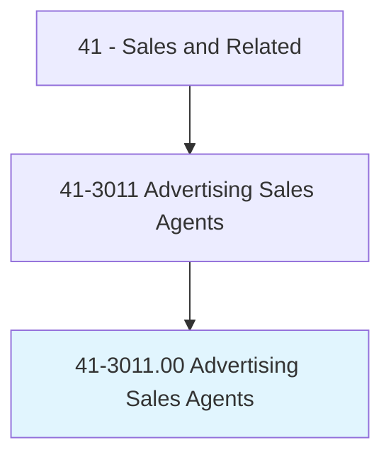
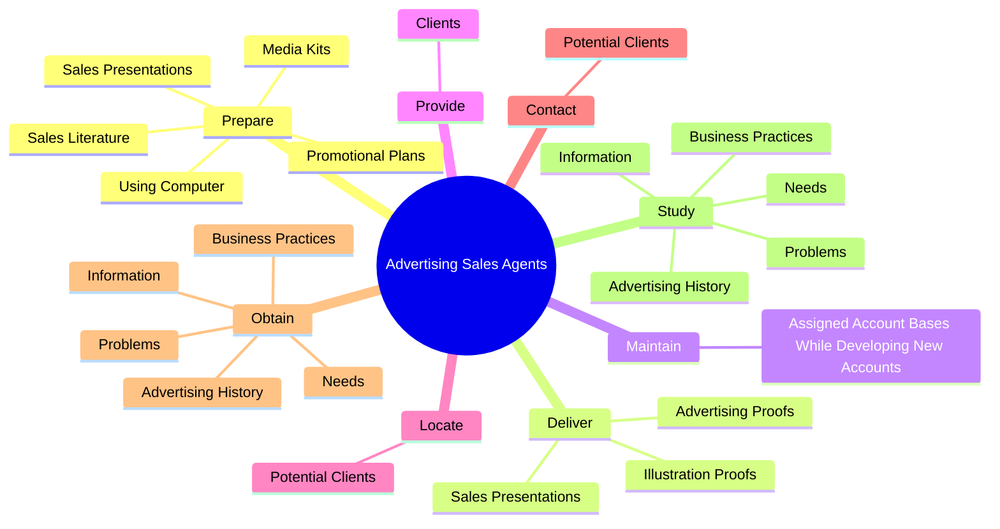

# Advertising Sales Agents

> Sell or solicit advertising space, time, or media in publications, signage, TV, radio, or Internet establishments or public spaces.

## Overview

Advertising Sales Agents is classified under Sales and Related (SOC 41). Sell or solicit advertising space, time, or media in publications, signage, TV, radio, or Internet establishments or public spaces.

## Classification Hierarchy

## Key Statistics

| Metric | Value |
|--------|-------|
| SOC Code | 41-3011.00 |
| Category | [Sales and Related](/occupations/Sales/index) |
| Task Count | 71 |
| Source | O*NET |

## Core Tasks

### prepare.SalesPresentations

Advertising Sales Agents prepare sales presentations as part of their core responsibilities.

**Actions:**
- `prepare.SalesPresentations.to.NewCustomersToSellNewAdvertisingProgramsToProtectIncreaseExistingAdvertising`
- `prepare.SalesPresentations.to.ExistingCustomersToSellNewAdvertisingProgramsToProtectIncreaseExistingAdvertising`
- `prepare.PromotionalPlans`
- `prepare.SalesLiterature`

### deliver.SalesPresentations

Advertising Sales Agents deliver sales presentations as part of their core responsibilities.

**Actions:**
- `deliver.SalesPresentations.to.NewCustomersToSellNewAdvertisingProgramsToProtectIncreaseExistingAdvertising`
- `deliver.SalesPresentations.to.ExistingCustomersToSellNewAdvertisingProgramsToProtectIncreaseExistingAdvertising`
- `deliver.AdvertisingProofs.to.CustomersForApproval`
- `deliver.IllustrationProofs.to.CustomersForApproval`

### maintain.AssignedAccountBasesWhileDevelopingNewAccounts

Advertising Sales Agents maintain assigned account bases while developing new accounts as part of their core responsibilities.

**Actions:**
- `maintain.AssignedAccountBasesWhileDevelopingNewAccounts`

## Skills & Competencies

### Technical Skills
- **Sales Techniques** - Advanced
- **Customer Relations** - Advanced
- **Product Knowledge** - Advanced

### Soft Skills
- **Communication** - Essential
- **Problem Solving** - Essential
- **Critical Thinking** - Important
- **Teamwork** - Important
- **Adaptability** - Important

## Related Occupations

## Industries

This occupation is found across multiple industries. See [Industries](/industries) for sector-specific employment data.

## Career Progression

---

*Source: O*NET 41-3011.00 - ONETOccupation*
