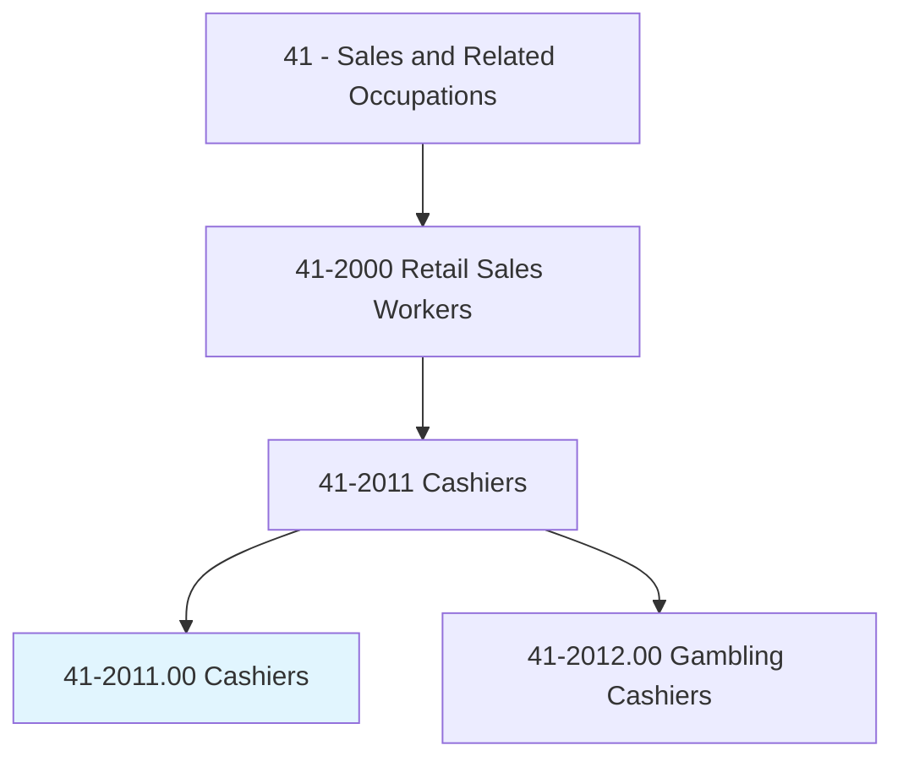
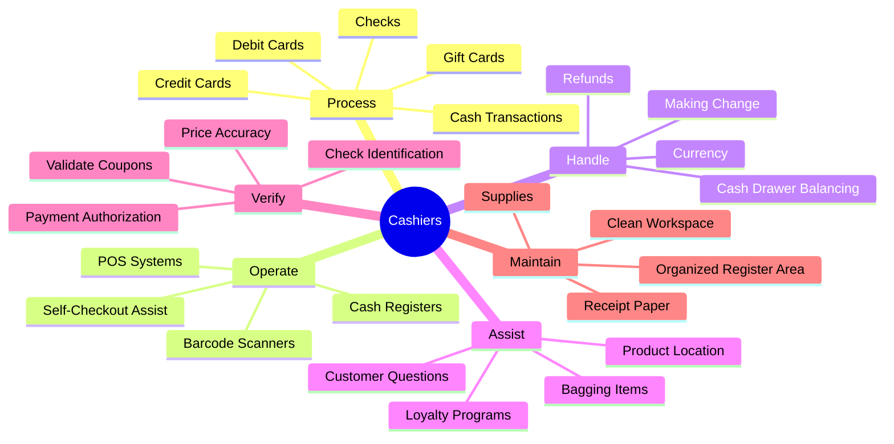
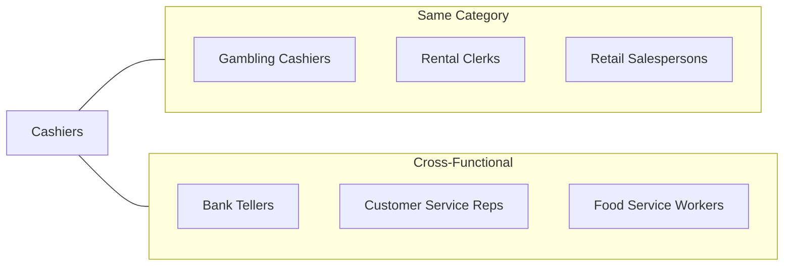
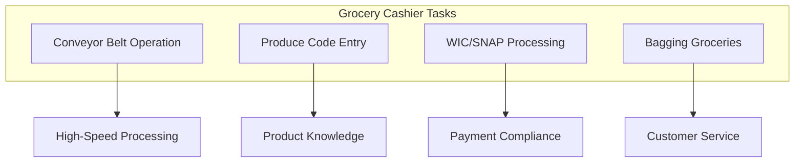
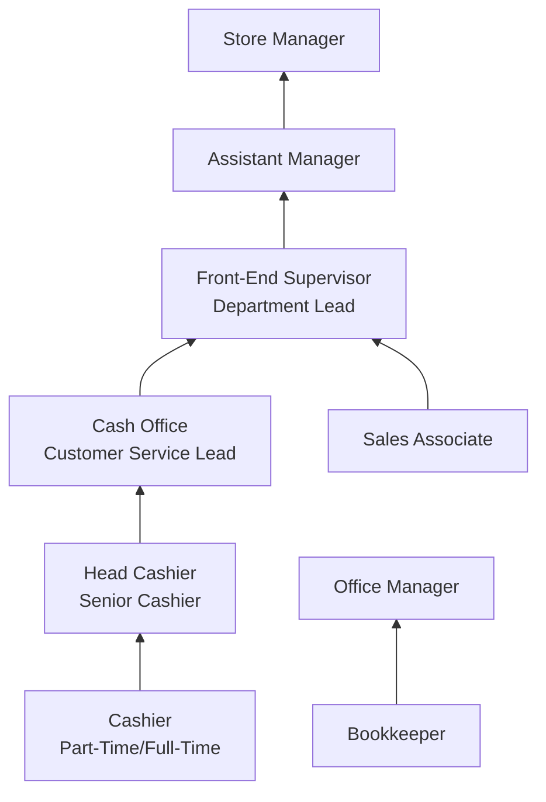
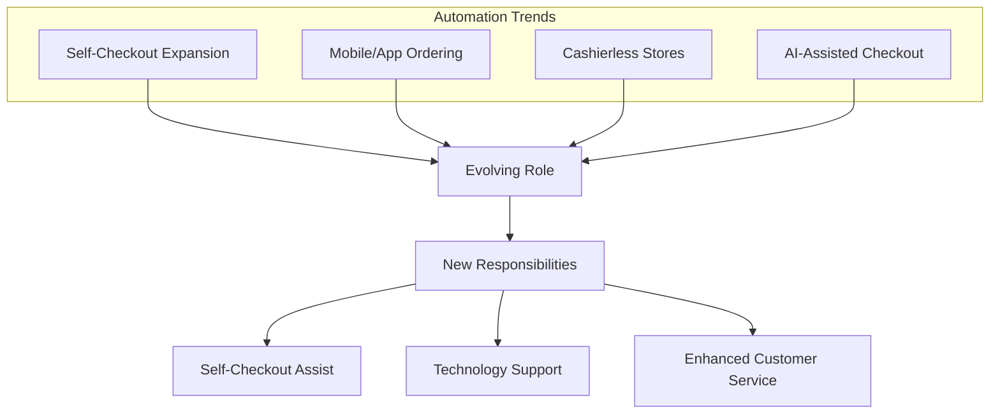

# Cashiers

> Receive and disburse money in establishments other than financial institutions. May use electronic scanners, cash registers, or related equipment. May process credit or debit card transactions and validate checks.

## Overview

Cashiers are frontline retail workers responsible for processing customer transactions and providing a positive checkout experience. They operate point-of-sale systems, handle cash and electronic payments, and often serve as the final point of contact between businesses and customers. While the role is considered entry-level, cashiers play a crucial part in customer satisfaction, loss prevention, and the overall efficiency of retail operations. This occupation is one of the largest in the United States, with millions of workers across virtually every retail sector.

## Classification Hierarchy

## Key Statistics

| Metric | Value |
|--------|-------|
| SOC Code | 41-2011.00 |
| Job Zone | 1 (Little or No Preparation) |
| Category | [Sales and Related](/occupations/Sales/index) |
| Core Tasks | 15+ |
| Employment | 3.3+ million (U.S.) |
| Source | O*NET |

## Core Tasks

### receive.Payments

Cashiers accept various forms of payment from customers to complete purchase transactions.

**Actions:**
- `receive.Payments.from.Customers` - Accept money for merchandise
- `process.CashTransactions.at.Register` - Handle currency exchanges
- `process.CreditCards.using.POSSystem` - Complete electronic payments
- `validate.Checks.for.Payment` - Verify check authenticity

### operate.PointOfSaleSystems

Using electronic equipment to scan items, calculate totals, and process transactions.

**Actions:**
- `operate.CashRegister.to.process.Sales` - Use register for transactions
- `scan.Merchandise.using.BarcodeScanner` - Record item purchases
- `enter.ProductCodes.into.POSSystem` - Manually input unscanned items
- `calculate.Totals.for.Customers` - Determine final purchase amounts

### handle.Currency

Managing cash accurately including making change and maintaining drawer balance.

**Actions:**
- `handle.Currency.for.Transactions` - Manage physical money
- `make.Change.for.Customers` - Provide accurate change
- `balance.CashDrawer.at.ShiftEnd` - Reconcile drawer contents
- `count.Currency.for.Accuracy` - Verify cash amounts

### assist.Customers

Providing customer service and answering questions during checkout.

**Actions:**
- `assist.Customers.with.Questions` - Answer product and store inquiries
- `bag.Merchandise.for.Customers` - Package purchased items
- `explain.Policies.to.Customers` - Communicate return and exchange rules
- `enroll.Customers.in.LoyaltyPrograms` - Sign up for rewards programs

### verify.Identification

Checking customer identification for age-restricted purchases and payment verification.

**Actions:**
- `verify.Identification.for.AgerestrRctedPurchases` - Check ID for alcohol, tobacco
- `validate.Coupons.for.Discounts` - Apply promotional offers
- `authorize.Payments.through.System` - Process payment approvals
- `check.PriceAccuracy.for.Items` - Verify correct pricing

## Skills & Competencies

### Technical Skills
- **Point-of-Sale Systems** - Proficient
- **Cash Handling** - Proficient
- **Basic Math** - Required
- **Barcode Scanners** - Proficient
- **Payment Processing** - Required

### Soft Skills
- **Customer Service** - Essential
- **Attention to Detail** - Essential
- **Communication** - Important
- **Patience** - Important
- **Integrity** - Critical
- **Time Management** - Important

## Related Occupations

## Industry Variations

### Grocery and Supermarkets

Key differences:
- High-volume, fast-paced environment
- Fresh produce code memorization
- Government payment program processing (WIC, SNAP)
- Heavy bagging responsibilities
- Scale operation for weighted items

### Big-Box Retail

Key differences:
- Large item processing
- Receipt checking duties
- Self-checkout assistance
- Returns desk rotation
- Extended operating hours

### Convenience Stores

Key differences:
- Multi-tasking (stocking, cleaning, cashiering)
- Age-restricted product sales (tobacco, alcohol)
- Lottery ticket processing
- Fuel payment processing
- Security awareness

### Quick-Service Restaurants

Key differences:
- Order taking combined with payment
- Drive-through window operation
- Tip handling (in some establishments)
- Food handling between transactions
- High-speed during peak periods

### Department Stores

Key differences:
- Gift wrapping services
- Store credit card applications
- Multiple department familiarity
- Higher-value transactions
- Returns processing

## Industries

- [Grocery Stores](/industries/GroceryStores) - Highest employment
- [General Merchandise Stores](/industries/GeneralMerchandise) - High employment
- [Gasoline Stations](/industries/GasStations) - Significant employment
- [Food and Beverage Stores](/industries/FoodStores) - High employment
- [Clothing Stores](/industries/ClothingRetail) - Moderate employment
- [Building Material Stores](/industries/BuildingMaterials) - Moderate employment

## Career Progression

### Typical Timeline

| Stage | Years Experience | Typical Title |
|-------|-----------------|---------------|
| Entry | 0-6 months | Cashier |
| Experienced | 6 months - 2 years | Head Cashier, Senior Cashier |
| Lead | 2-4 years | Customer Service Lead, Cash Office |
| Supervisor | 4-6 years | Front-End Supervisor |
| Management | 6+ years | Assistant Manager, Store Manager |

## Education & Training

| Requirement | Details |
|-------------|---------|
| Typical Education | No formal education required |
| Work Experience | None required |
| On-the-Job Training | 1-2 weeks initial training |
| Certifications | None required; food handler's card for some positions |

### Training Topics

- POS system operation
- Cash handling procedures
- Customer service basics
- Loss prevention awareness
- Company policies and procedures
- Age-restricted product sales compliance

## Departments

This occupation typically works in:
- [Front End](/departments/FrontEnd)
- [Customer Service](/departments/CustomerService)
- [Cash Office](/departments/CashOffice)

## Technology & Tools

### Point-of-Sale Systems
- NCR POS
- Toshiba/IBM POS
- Square
- Clover

### Payment Processing
- Verifone terminals
- Ingenico terminals
- Apple Pay/Google Pay readers
- Chip card readers

### Scanning Equipment
- Handheld barcode scanners
- Fixed-mount scanners
- Self-checkout kiosks
- Scale-integrated scanners

## Work Environment

### Physical Demands
- Standing for extended periods (4-8+ hours)
- Repetitive hand/arm motions
- Lifting items up to 25 pounds
- Bending and reaching

### Work Schedule
- Variable shifts including evenings and weekends
- Part-time and full-time positions
- Holiday work often required
- Peak season increased hours

### Work Conditions
- Indoor, climate-controlled environment
- High customer interaction
- Fast-paced during busy periods
- Potential exposure to difficult customers

## Performance Metrics

| Metric | Description |
|--------|-------------|
| Transaction Speed | Items per minute, customers per hour |
| Accuracy | Cash drawer balance, scanning errors |
| Customer Satisfaction | Survey scores, complaint frequency |
| Attendance | Punctuality and reliability |
| Upselling | Add-on sales, loyalty sign-ups |
| Shortage/Overage | Cash discrepancies |

## Challenges and Considerations

### Common Challenges
- Repetitive motion strain
- Standing fatigue
- Difficult customer interactions
- Peak period stress
- Cash shortage liability

### Automation Impact

Cashiers increasingly serve as technology assistants and customer service specialists as automation expands, shifting from pure transaction processing to customer experience management.

---

*Source: O*NET 41-2011.00 - ONETOccupation*
