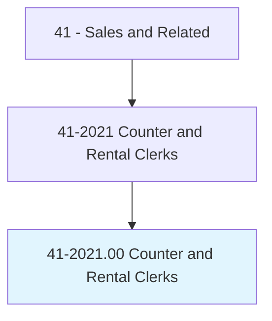
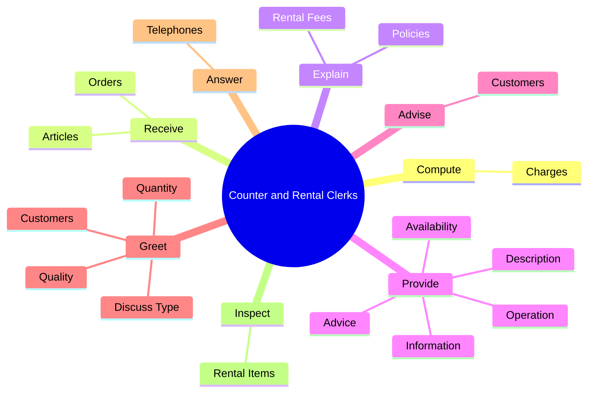
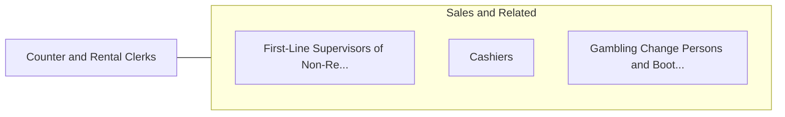

# Counter and Rental Clerks

> Receive orders, generally in person, for repairs, rentals, and services. May describe available options, compute cost, and accept payment.

## Overview

Counter and Rental Clerks is an occupation within the Sales and Related category. Receive orders, generally in person, for repairs, rentals, and services. 

## Classification Hierarchy

## Key Statistics

| Metric | Value |
|--------|-------|
| SOC Code | 41-2021.00 |
| Category | [Sales and Related](/occupations/Sales) |
| Task Count | 54 |
| Source | O*NET |

## Core Tasks

### compute.Charges

Counter and Rental Clerks compute charges as part of their core responsibilities.

**Actions:**
- `compute.Charges.for.MerchandiseReceivePayments`
- `compute.Charges.for.ServicesReceivePayments`

### receive.Orders

Counter and Rental Clerks receive orders as part of their core responsibilities.

**Actions:**
- `receive.Orders.for.Services`
- `receive.Orders.for.Rentals`
- `receive.Orders.for.Repairs`
- `receive.Orders.for.DryCleaning`

### explain.RentalFees

Counter and Rental Clerks explain rental fees as part of their core responsibilities.

**Actions:**
- `explain.RentalFees`
- `explain.Policies`

## Skills & Competencies

### Technical Skills
- **Sales Techniques** - Advanced
- **Customer Relations** - Advanced
- **Product Knowledge** - Advanced

### Soft Skills
- **Communication** - Essential
- **Problem Solving** - Essential
- **Critical Thinking** - Important
- **Teamwork** - Important
- **Adaptability** - Important

## Related Occupations

## Industries

This occupation is found across multiple industries. See [Industries](/industries) for sector-specific employment data.

## Career Progression

---

*Source: O*NET 41-2021.00 - ONETOccupation*
