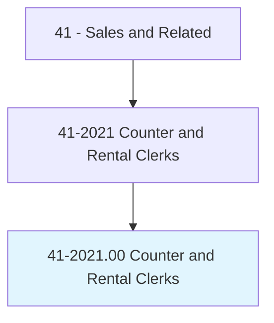
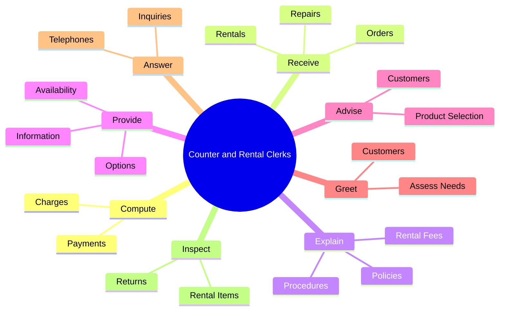
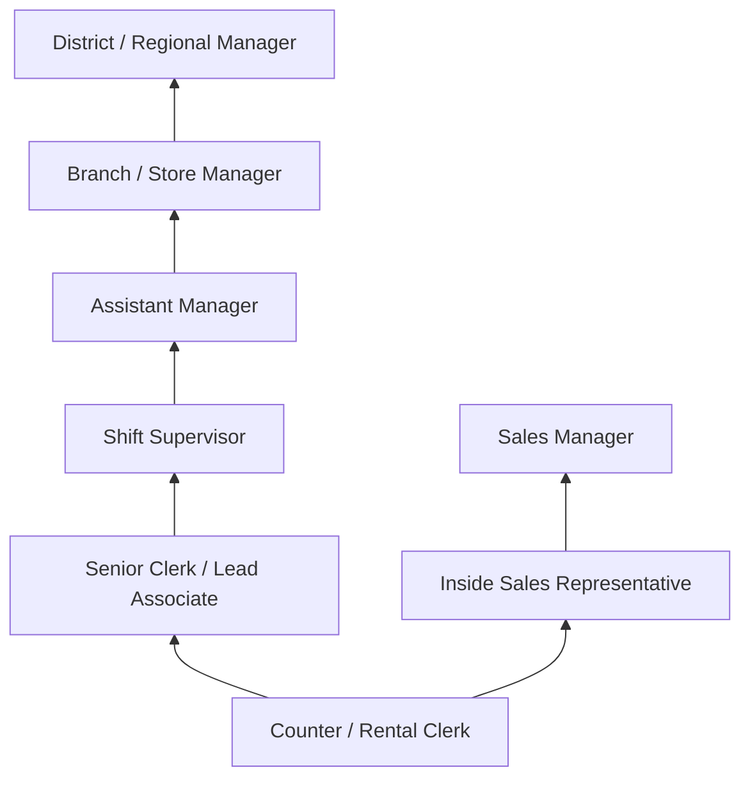
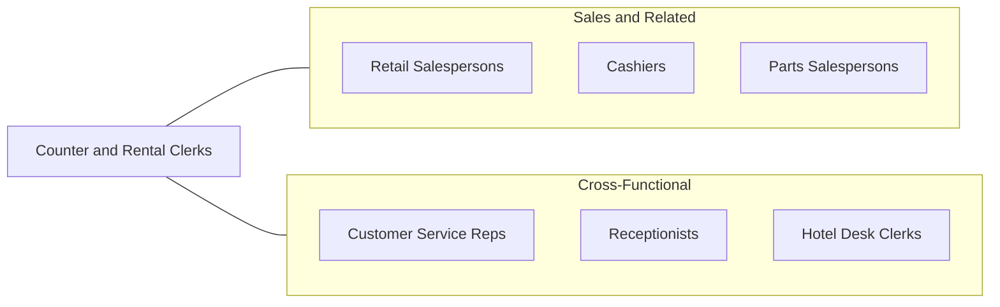

# Counter and Rental Clerks

> Receive orders, generally in person, for repairs, rentals, and services. May describe available options, compute cost, and accept payment.

## Overview

Counter and Rental Clerks serve as the primary point of contact for customers seeking to rent equipment, vehicles, clothing, or other items, or to arrange for repairs and services. Working at service counters in rental establishments, dry cleaners, repair shops, and similar businesses, they greet customers, explain available options, compute charges, prepare rental agreements, and process payments. Their role bridges customer service and sales, requiring both interpersonal skills and attention to transactional details.

These professionals work across a wide variety of industries, from car rental agencies and equipment rental companies to video stores, tool rental shops, and formal wear boutiques. The nature of the work varies significantly by industry -- a car rental agent must understand insurance options and vehicle classifications, while an equipment rental clerk needs knowledge of machinery specifications and safety requirements. Regardless of setting, the core function involves matching customer needs with available inventory and ensuring smooth rental or service transactions.

The role increasingly involves technology, with point-of-sale systems, inventory management software, and online reservation platforms becoming standard tools. Counter and Rental Clerks must balance efficiency in processing transactions with the personal attention that builds customer loyalty and generates repeat business. Many positions offer flexible scheduling, making them attractive for students and those seeking part-time employment.

## Classification Hierarchy

## Key Statistics

| Metric | Value |
|--------|-------|
| SOC Code | 41-2021.00 |
| Job Zone | 2 (Some Preparation) |
| Category | [Sales and Related](/occupations/Sales/index) |
| Median Annual Salary | $34,750 |
| Employment | ~430,000 |
| Projected Growth | 2% (slower than average) |
| Core Tasks | 54 |
| Source | O*NET |

## Core Tasks

### compute.Charges

Counter and Rental Clerks calculate costs and process payments for merchandise and services.

**Actions:**
- `compute.Charges.for.MerchandiseReceivePayments` - Calculate rental costs and collect payment
- `compute.Charges.for.ServicesReceivePayments` - Determine service fees and process transactions

### receive.Orders

Counter and Rental Clerks accept orders for services and rentals.

**Actions:**
- `receive.Orders.for.Services` - Take service requests from walk-in customers
- `receive.Orders.for.Rentals` - Process rental requests and agreements
- `receive.Orders.for.Repairs` - Accept items for repair and document issues
- `receive.Orders.for.DryCleaning` - Receive garments and note special instructions

### explain.RentalFees

Counter and Rental Clerks explain pricing and rental policies to customers.

**Actions:**
- `explain.RentalFees` - Describe pricing structures and duration-based rates
- `explain.Policies` - Communicate return policies, damage liability, and insurance options

## Skills & Competencies

### Technical Skills
- **Point-of-Sale Systems** - Advanced
- **Inventory Management** - Intermediate
- **Rental Agreement Processing** - Advanced
- **Cash Handling and Payment Processing** - Advanced
- **Product/Equipment Knowledge** - Intermediate
- **Reservation Systems** - Intermediate

### Soft Skills
- **Customer Service** - Critical
- **Communication** - Essential
- **Attention to Detail** - Essential
- **Patience** - Essential
- **Problem Solving** - Important
- **Multitasking** - Important
- **Conflict Resolution** - Important

## Education & Certifications

| Requirement | Details |
|-------------|---------|
| Typical Education | High school diploma or equivalent |
| On-the-Job Training | Short-term (1-3 months) |
| Industry-Specific Training | Vehicle classes, equipment safety, product knowledge |
| Customer Service Certification | Optional; enhances career prospects |
| POS System Training | Company-specific system training |
| Driver's License | Required for vehicle rental positions |

## Career Progression

## Industry Variations

| Setting | Focus | Unique Aspects |
|---------|-------|----------------|
| Car Rental | Vehicle selection, insurance, returns | Upselling insurance; fleet knowledge; airport operations |
| Equipment Rental | Machinery, tools, party supplies | Safety requirements; technical product knowledge; delivery coordination |
| Dry Cleaning / Laundry | Garment care, stain removal | Fabric knowledge; special handling instructions; quality assurance |
| Formal Wear / Costume | Event attire, fittings | Sizing expertise; event deadlines; alterations coordination |

## Technology & Tools

- **Point-of-Sale** - Square, Clover, industry-specific POS
- **Rental Management** - RentalPoint, Point of Rental, Alert EasyPro
- **Reservation Systems** - Online booking platforms, Amadeus (car rental)
- **Inventory Tracking** - Barcode scanners, RFID systems
- **Payment Processing** - Credit card terminals, mobile payment
- **Communication** - Phone systems, email, customer messaging

## Related Occupations

## Departments

This occupation typically works in:
- [Sales Department](/departments/Sales) - Front-counter sales operations
- [Customer Service](/departments/CustomerService) - Client-facing support
- [Operations](/departments/Operations) - Rental logistics and inventory
- [Branch Management](/departments/BranchManagement) - Location operations

---

*Source: O*NET 41-2021.00 - ONETOccupation*
