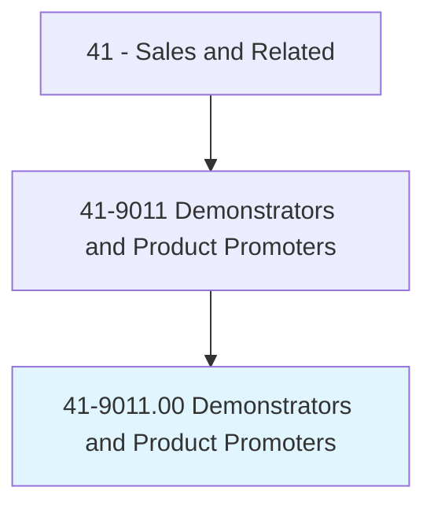
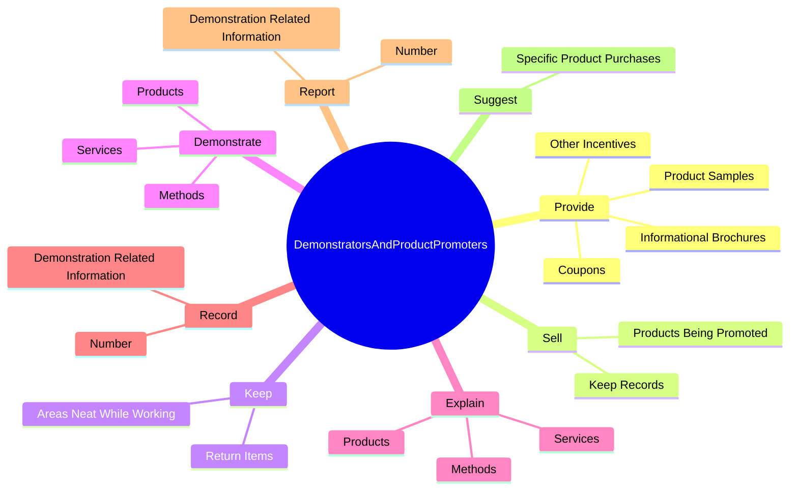
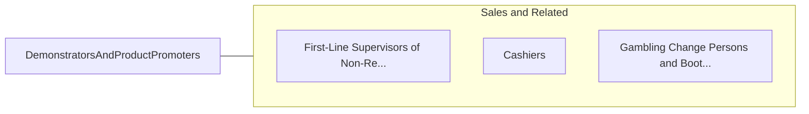

# Demonstrators and Product Promoters

> Demonstrate merchandise and answer questions for the purpose of creating public interest in buying the product. May sell demonstrated merchandise.

## Overview

Demonstrators and Product Promoters is an occupation within the Sales and Related category. Demonstrate merchandise and answer questions for the purpose of creating public interest in buying the product. 

## Classification Hierarchy

## Key Statistics

| Metric | Value |
|--------|-------|
| SOC Code | 41-9011.00 |
| Category | [Sales and Related](/occupations/Sales/index) |
| Task Count | 76 |
| Source | O*NET |

## Core Tasks

### provide.ProductSamples

Demonstrators and Product Promoters provide product samples as part of their core responsibilities.

**Actions:**
- `provide.ProductSamples.to.persuade.PeopleToBuyProducts`
- `provide.Coupons.to.persuade.PeopleToBuyProducts`
- `provide.InformationalBrochures.to.persuade.PeopleToBuyProducts`
- `provide.OtherIncentives.to.persuade.PeopleToBuyProducts`

### sell.ProductsBeingPromoted

Demonstrators and Product Promoters sell products being promoted as part of their core responsibilities.

**Actions:**
- `sell.ProductsBeingPromoted.of.Sales`
- `sell.KeepRecords.of.Sales`

### keep.AreasNeatWhileWorking

Demonstrators and Product Promoters keep areas neat while working as part of their core responsibilities.

**Actions:**
- `keep.AreasNeatWhileWorking.to.correct.LocationsFollowingDemonstrations`
- `keep.ReturnItems.to.correct.LocationsFollowingDemonstrations`

## Skills & Competencies

### Technical Skills
- **Sales Techniques** - Advanced
- **Customer Relations** - Advanced
- **Product Knowledge** - Advanced

### Soft Skills
- **Communication** - Essential
- **Problem Solving** - Essential
- **Critical Thinking** - Important
- **Teamwork** - Important
- **Adaptability** - Important

## Related Occupations

## Industries

This occupation is found across multiple industries. See [Industries](/industries) for sector-specific employment data.

## Career Progression

---

*Source: O*NET 41-9011.00 - ONETOccupation*
