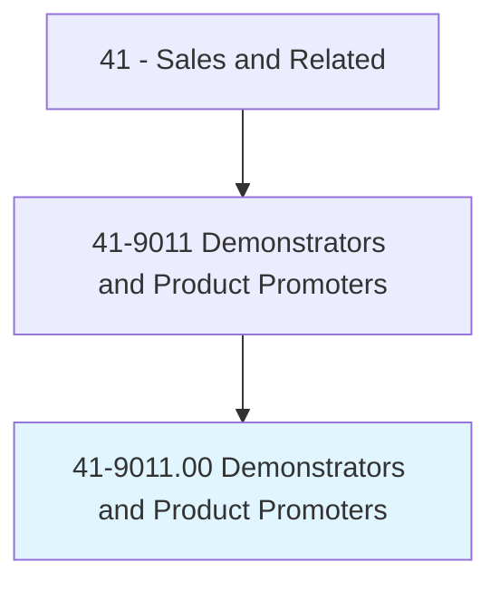
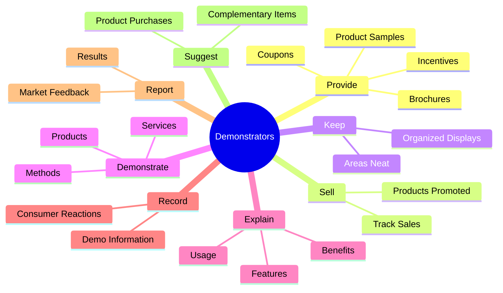
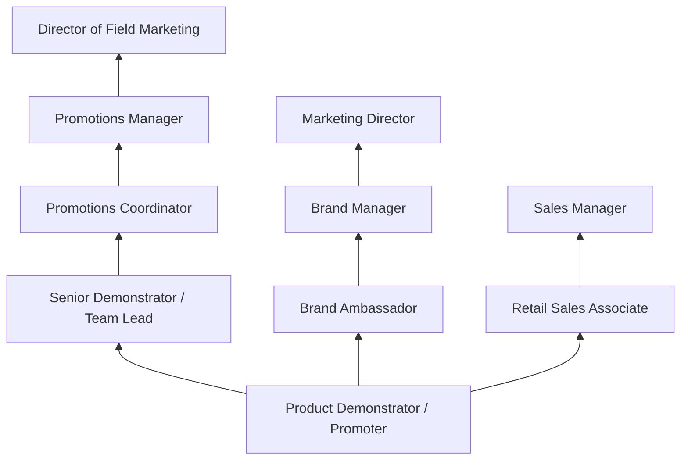
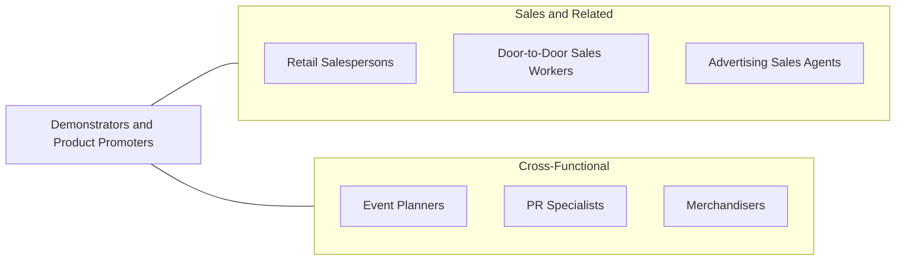

# Demonstrators and Product Promoters

> Demonstrate merchandise and answer questions for the purpose of creating public interest in buying the product. May sell demonstrated merchandise.

## Overview

Demonstrators and Product Promoters are the hands-on marketing force that brings products to life for consumers. Working in retail stores, trade shows, conventions, and public events, they showcase products through live demonstrations, distribute samples and coupons, explain features and benefits, and directly engage potential buyers. Their in-person interactions create immediate, tangible connections between consumers and products that advertising alone cannot achieve, making them a vital component of experiential marketing strategies.

These professionals represent a wide range of products, from food and beverages to electronics, cosmetics, household goods, and industrial equipment. In grocery stores, they might offer tastings of new food products. At trade shows, they demonstrate sophisticated technology solutions. In department stores, they showcase beauty products with live makeover demonstrations. The common thread is the ability to communicate product value enthusiastically and persuasively while creating a positive brand experience.

The role is often project-based and flexible, with many demonstrators working for promotional agencies that deploy them to different locations and clients. Some work full-time for specific brands or retailers. The position serves as an excellent entry point into marketing, brand management, and sales careers, providing valuable experience in consumer behavior, product positioning, and face-to-face persuasion.

## Classification Hierarchy

## Key Statistics

| Metric | Value |
|--------|-------|
| SOC Code | 41-9011.00 |
| Job Zone | 2 (Some Preparation) |
| Category | [Sales and Related](/occupations/Sales/index) |
| Median Annual Salary | $34,800 |
| Employment | ~78,000 |
| Projected Growth | 5% (average) |
| Core Tasks | 76 |
| Source | O*NET |

## Core Tasks

### provide.ProductSamples

Demonstrators distribute samples and promotional materials to generate interest.

**Actions:**
- `provide.ProductSamples.to.persuade.PeopleToBuyProducts` - Offer free samples to drive trial
- `provide.Coupons.to.persuade.PeopleToBuyProducts` - Distribute discount incentives
- `provide.InformationalBrochures.to.persuade.PeopleToBuyProducts` - Share product literature
- `provide.OtherIncentives.to.persuade.PeopleToBuyProducts` - Offer promotional items

### sell.ProductsBeingPromoted

Demonstrators sell the products they are showcasing and track results.

**Actions:**
- `sell.ProductsBeingPromoted.of.Sales` - Complete direct sales transactions
- `sell.KeepRecords.of.Sales` - Document sales volume and outcomes

### demonstrate.Products

Demonstrators perform live product demonstrations to educate consumers.

**Actions:**
- `demonstrate.Products.to.Consumers` - Show product functionality in real time
- `demonstrate.Methods.of.Use` - Teach proper product application and techniques
- `demonstrate.Services.to.ProspectiveClients` - Present service offerings

## Skills & Competencies

### Technical Skills
- **Product Knowledge** - Advanced
- **Demonstration Techniques** - Advanced
- **Merchandising and Display** - Intermediate
- **Point-of-Sale Systems** - Intermediate
- **Inventory Management** - Basic
- **Social Media and Digital Promotion** - Intermediate

### Soft Skills
- **Enthusiasm and Energy** - Critical
- **Communication (Verbal)** - Critical
- **Persuasion** - Essential
- **Customer Engagement** - Critical
- **Adaptability** - Essential
- **Patience** - Essential
- **Public Speaking** - Important
- **Reliability** - Essential

## Education & Certifications

| Requirement | Details |
|-------------|---------|
| Typical Education | High school diploma or equivalent |
| On-the-Job Training | Short-term; product-specific training provided |
| Food Handler's Certificate | Required for food demonstration roles |
| Brand Ambassador Training | Company-specific product and brand training |
| CPR/First Aid | Sometimes required for event-based roles |
| Promotional Marketing Certification | Optional; offered by PROMO Magazine/industry bodies |

## Career Progression

## Industry Variations

| Setting | Focus | Unique Aspects |
|---------|-------|----------------|
| Grocery / Retail | Food and beverage sampling | Food safety compliance; high volume; weekend-heavy schedule |
| Trade Shows / Conventions | Technology and industrial products | Technical knowledge; B2B audience; travel required |
| Cosmetics / Beauty | Skincare and makeup demonstrations | Application skills; product expertise; consultative selling |
| Electronics / Tech | Gadgets and software | Technical demos; feature education; comparison selling |

## Technology & Tools

- **Point-of-Sale** - Mobile POS, tablet-based checkout
- **Reporting** - Demo tracking apps, survey tools
- **Inventory** - Product tracking and replenishment systems
- **Communication** - Scheduling apps, team coordination platforms
- **Social Media** - Live streaming, content creation tools
- **Display Equipment** - Portable displays, demonstration kits

## Related Occupations

## Departments

This occupation typically works in:
- [Marketing Department](/departments/Marketing) - Field marketing and promotions
- [Sales Department](/departments/Sales) - Direct sales support
- [Brand Management](/departments/BrandManagement) - Brand activation
- [Events](/departments/Events) - Trade show and event coordination

---

*Source: O*NET 41-9011.00 - ONETOccupation*
