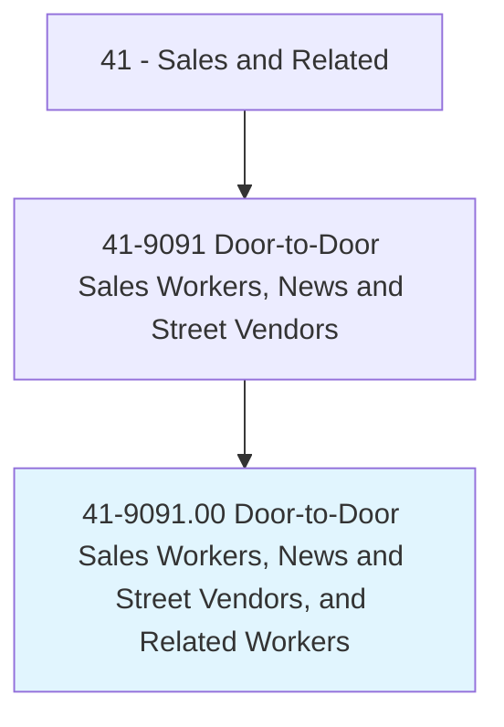
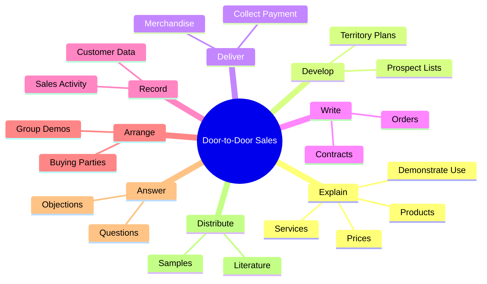
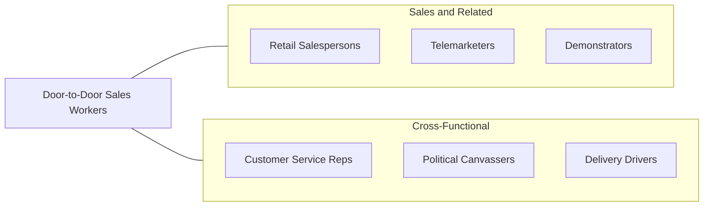

# Door-to-Door Sales Workers, News and Street Vendors, and Related Workers

> Sell goods or services door-to-door or on the street.

## Overview

Door-to-Door Sales Workers, News and Street Vendors, and Related Workers represent one of the oldest forms of direct selling, bringing products and services directly to consumers at their homes, businesses, or public locations. This diverse category encompasses canvassers who sell home improvement services, solar installations, pest control, or telecommunications door-to-door; newspaper and magazine subscription sellers; street vendors selling food, merchandise, or periodicals; and direct sales representatives for companies like home security, cable, and energy providers.

Despite the growth of e-commerce and digital marketing, door-to-door and street selling remains a viable channel for certain products and services, particularly those that benefit from personal demonstration or explanation. Home improvement companies, solar energy installers, and telecommunications providers continue to rely heavily on door-to-door sales teams. The direct sales model (MLM/network marketing) for cosmetics, supplements, and household products also falls partly within this category. Street vending has experienced a renaissance in urban areas, with food trucks, artisanal products, and farmer's market vendors contributing to local economies.

The work demands exceptional resilience, self-motivation, and interpersonal skills. Sales workers in this category face frequent rejection, weather exposure, and irregular hours, but successful practitioners can earn substantial commissions. The role develops foundational sales skills that transfer well to inside sales, account management, and sales leadership positions.

## Classification Hierarchy

## Key Statistics

| Metric | Value |
|--------|-------|
| SOC Code | 41-9091.00 |
| Job Zone | 1 (Little or No Preparation) |
| Category | [Sales and Related](/occupations/Sales/index) |
| Median Annual Salary | $30,600 |
| Employment | ~120,000 |
| Projected Growth | -6% (declining) |
| Core Tasks | 29 |
| Source | O*NET |

## Core Tasks

### explain.Products

Door-to-Door Sales Workers present and explain products and services to potential customers.

**Actions:**
- `explain.Products.to.ProspectiveCustomers` - Describe product features and benefits
- `explain.ServicesDemonstrateUse.of.Products` - Show product usage and applications
- `explain.PricesDemonstrateUse.of.Products` - Present pricing and payment options

### develop.ProspectLists

Door-to-Door Sales Workers build lists of potential customers for targeted outreach.

**Actions:**
- `develop.ProspectLists` - Research and compile target customer lists by territory

### deliver.Merchandise

Door-to-Door Sales Workers deliver products and collect payments.

**Actions:**
- `deliver.MerchandisePayment` - Deliver purchased goods to customers
- `deliver.CollectPayment` - Collect cash, check, or electronic payment

## Skills & Competencies

### Technical Skills
- **Direct Sales Techniques** - Advanced
- **Product Demonstration** - Advanced
- **Territory Management** - Intermediate
- **Order Processing** - Intermediate
- **Mobile Sales Tools** - Intermediate
- **Payment Collection** - Intermediate

### Soft Skills
- **Resilience and Persistence** - Critical
- **Persuasion** - Critical
- **Communication** - Critical
- **Self-Motivation** - Critical
- **Adaptability** - Essential
- **Confidence** - Essential
- **Time Management** - Essential
- **Empathy** - Important

## Education & Certifications

| Requirement | Details |
|-------------|---------|
| Typical Education | High school diploma or less |
| On-the-Job Training | Short-term; company-provided sales scripts and training |
| Solicitation Permit | Required in many municipalities |
| Direct Selling Association Membership | Industry credential for MLM/direct sales |
| Sales Methodology Training | SPIN Selling, Challenger Sale (provided by employers) |
| Background Check | Required by many home service companies |

## Career Progression

## Industry Variations

| Setting | Focus | Unique Aspects |
|---------|-------|----------------|
| Home Services (Solar, HVAC, Security) | Installation contracts | High commission; technical product knowledge; permit requirements |
| Telecommunications | Cable, internet, phone plans | Subscription sales; competitive territory; promotional offers |
| Direct Sales / MLM | Cosmetics, supplements, household | Recruitment component; party plan selling; independent contractor |
| Street Vending | Food, merchandise, periodicals | Permits required; location strategy; cash-intensive; weather-dependent |

## Technology & Tools

- **Mobile CRM** - Salesforce Mobile, HubSpot, door-to-door sales apps
- **Territory Mapping** - SalesRabbit, Spotio, SPOTIO
- **Payment Processing** - Square, PayPal Here, Stripe Terminal
- **Lead Management** - Door-to-door canvassing software
- **Communication** - Team messaging apps, GPS tracking
- **Presentation Tools** - Tablet-based demos, digital catalogs

## Related Occupations

## Departments

This occupation typically works in:
- [Sales Department](/departments/Sales) - Direct field sales
- Business Development - New customer acquisition
- [Marketing Department](/departments/Marketing) - Field marketing campaigns
- [Operations](/departments/Operations) - Territory and logistics management

---

*Source: O*NET 41-9091.00 - ONETOccupation*
