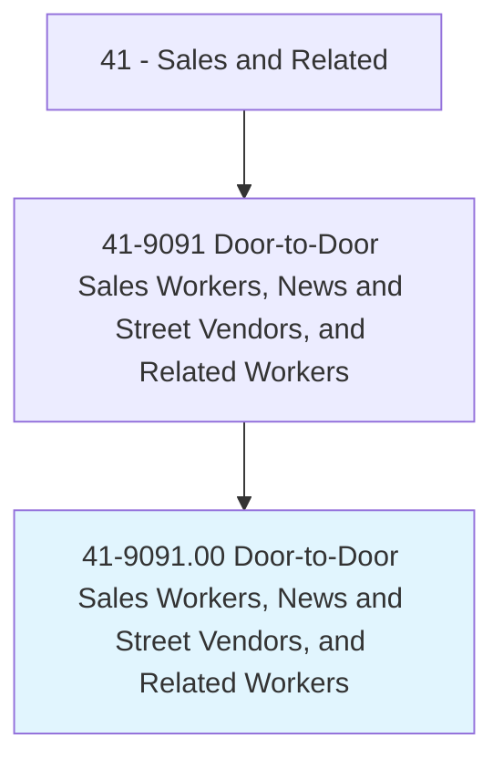
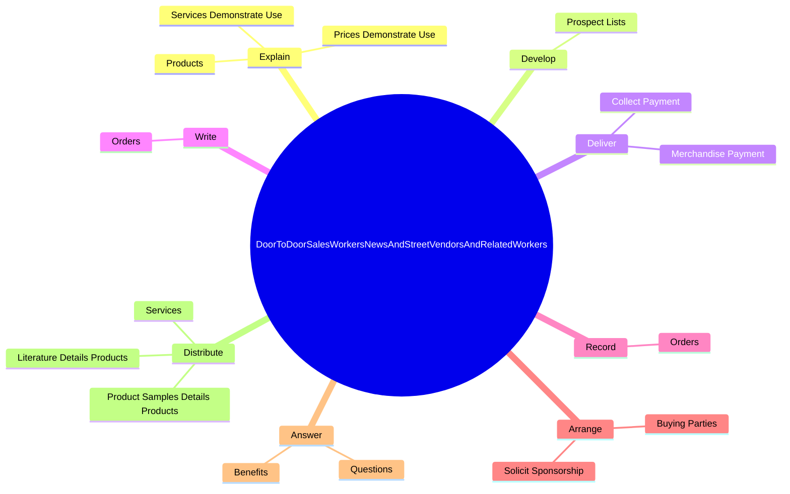

# Door-to-Door Sales Workers, News and Street Vendors, and Related Workers

> Sell goods or services door-to-door or on the street.

## Overview

Door-to-Door Sales Workers, News and Street Vendors, and Related Workers is classified under Sales and Related (SOC 41). Sell goods or services door-to-door or on the street.

## Classification Hierarchy

## Key Statistics

| Metric | Value |
|--------|-------|
| SOC Code | 41-9091.00 |
| Category | [Sales and Related](/occupations/Sales/index) |
| Task Count | 29 |
| Source | O*NET |

## Core Tasks

### explain.Products

Door-to-Door Sales Workers, News and Street Vendors, and Related Workers explain products as part of their core responsibilities.

**Actions:**
- `explain.Products.of.Products`
- `explain.ServicesDemonstrateUse.of.Products`
- `explain.PricesDemonstrateUse.of.Products`

### develop.ProspectLists

Door-to-Door Sales Workers, News and Street Vendors, and Related Workers develop prospect lists as part of their core responsibilities.

**Actions:**
- `develop.ProspectLists`

### deliver.MerchandisePayment

Door-to-Door Sales Workers, News and Street Vendors, and Related Workers deliver merchandise payment as part of their core responsibilities.

**Actions:**
- `deliver.MerchandisePayment`
- `deliver.CollectPayment`

## Skills & Competencies

### Technical Skills
- **Sales Techniques** - Advanced
- **Customer Relations** - Advanced
- **Product Knowledge** - Advanced

### Soft Skills
- **Communication** - Essential
- **Problem Solving** - Essential
- **Critical Thinking** - Important
- **Teamwork** - Important
- **Adaptability** - Important

## Related Occupations

## Industries

This occupation is found across multiple industries. See [Industries](/industries) for sector-specific employment data.

## Career Progression

---

*Source: O*NET 41-9091.00 - ONETOccupation*
