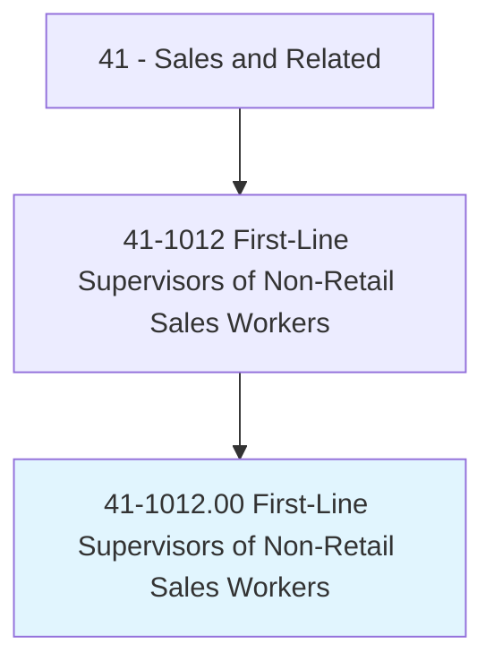
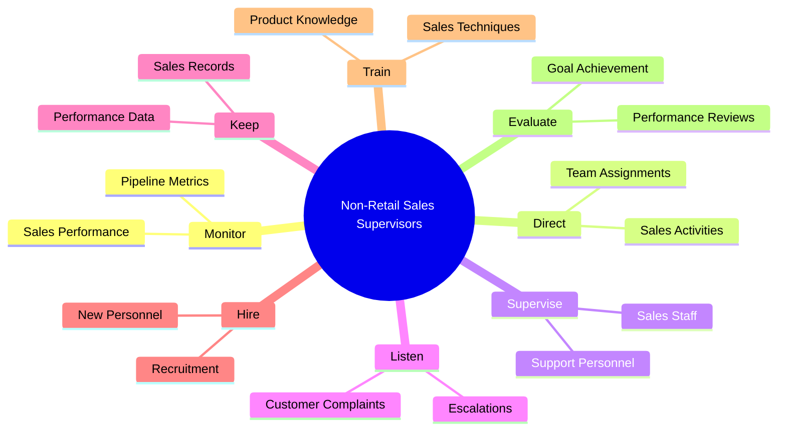
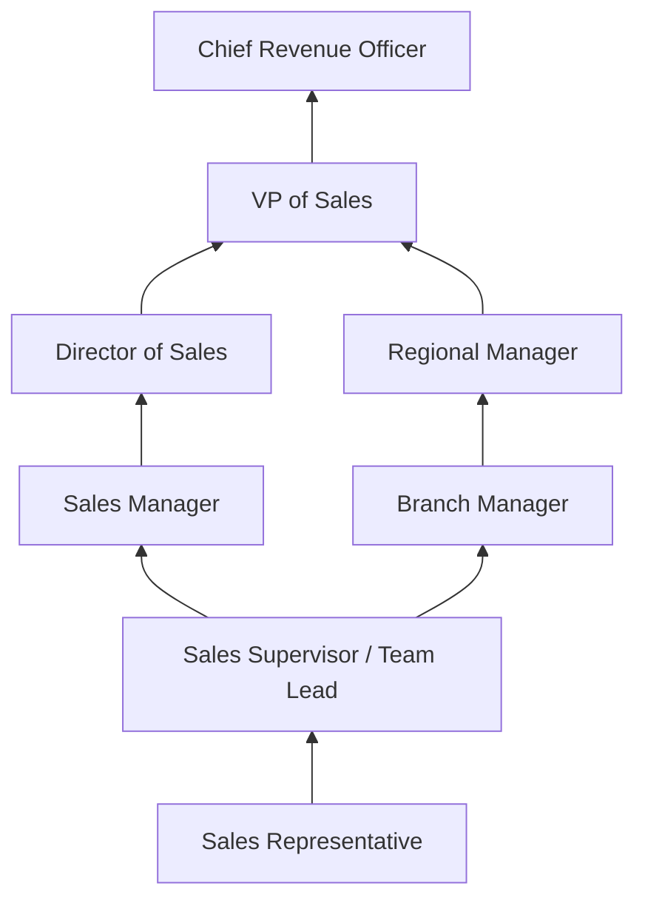
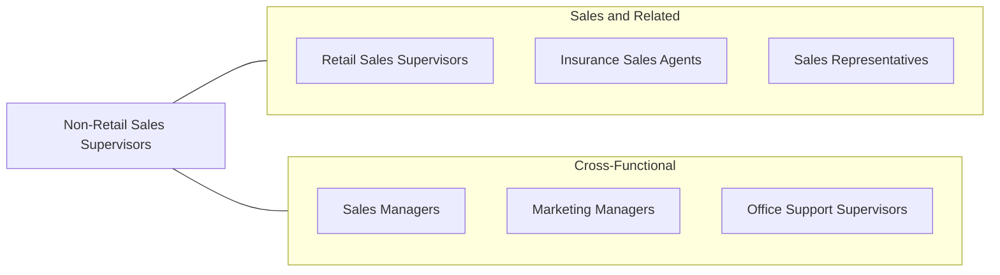

# First-Line Supervisors of Non-Retail Sales Workers

> Directly supervise and coordinate activities of sales workers other than retail sales workers. May perform duties such as budgeting, accounting, and personnel work, in addition to supervisory duties.

## Overview

First-Line Supervisors of Non-Retail Sales Workers manage and coordinate the activities of sales professionals who sell products and services outside of traditional retail environments. This includes overseeing insurance agents, real estate agents, advertising sales representatives, wholesale sales teams, financial services salespeople, and other non-retail sales staff. They set sales targets, monitor performance, provide coaching and training, resolve customer complaints, and handle administrative functions such as budgeting, reporting, and personnel management.

Unlike retail supervisors who manage store operations, non-retail sales supervisors focus on driving revenue through B2B relationships, complex consultative selling, and long-cycle sales processes. They typically manage teams of independent or semi-independent sales professionals who work in the field, from home offices, or in corporate settings. The role requires balancing individual accountability with team collaboration, often in commission-heavy compensation environments where motivation and performance management are paramount.

These supervisors play a critical role in translating organizational sales strategy into executable plans, territory assignments, and quota allocations. They analyze market conditions, identify growth opportunities, and ensure their teams have the tools, training, and support needed to succeed. Many hold substantial sales experience themselves and continue to maintain key client relationships alongside their management duties.

## Classification Hierarchy

## Key Statistics

| Metric | Value |
|--------|-------|
| SOC Code | 41-1012.00 |
| Job Zone | 3 (Medium Preparation) |
| Category | [Sales and Related](/occupations/Sales/index) |
| Median Annual Salary | $90,000 |
| Employment | ~335,000 |
| Projected Growth | 2% (slower than average) |
| Core Tasks | 48 |
| Source | O*NET |

## Core Tasks

### monitor.SalesPerformance

Supervisors track sales metrics and ensure team goals are met.

**Actions:**
- `monitor.SalesStaffperformance.to.ensure.GoalsAreMet` - Review KPIs, quotas, and pipeline health

### direct.EmployeesEngaged

Supervisors assign and direct sales activities across their teams.

**Actions:**
- `direct.EmployeesEngaged.in.PerformingSpecificServices` - Assign territories, accounts, and priorities

### supervise.EmployeesEngaged

Supervisors oversee daily operations of their sales teams.

**Actions:**
- `supervise.EmployeesEngaged.in.PerformingSpecificServices` - Manage ongoing sales activities and client relationships

## Skills & Competencies

### Technical Skills
- **Sales Management and Strategy** - Expert
- **CRM and Pipeline Management** - Advanced
- **Revenue Forecasting** - Advanced
- **Territory and Account Planning** - Advanced
- **Compensation Plan Design** - Intermediate
- **Data Analysis and Reporting** - Advanced
- **Industry-Specific Knowledge** - Advanced
- **Contract Negotiation** - Advanced

### Soft Skills
- **Leadership and Coaching** - Critical
- **Motivational Skills** - Critical
- **Communication** - Critical
- **Strategic Thinking** - Essential
- **Conflict Resolution** - Essential
- **Decision Making** - Essential
- **Accountability** - Critical
- **Relationship Building** - Essential

## Education & Certifications

| Requirement | Details |
|-------------|---------|
| Typical Education | Bachelor's degree in Business, Marketing, or related field |
| Sales Management Certifications | Certified Sales Leadership Professional (CSLP) |
| Industry Licenses | Insurance license, real estate broker license, Series 7/66 (financial) |
| CRM Certification | Salesforce Administrator, HubSpot Sales certification |
| Leadership Training | Dale Carnegie, FranklinCovey, company-specific programs |
| Continuing Education | Industry conferences, sales methodology certifications |

## Career Progression

## Industry Variations

| Setting | Focus | Unique Aspects |
|---------|-------|----------------|
| Insurance | Agency management, producer oversight | Licensing requirements; compliance focus; book of business management |
| Real Estate | Brokerage operations, agent oversight | Broker license required; independent contractor management; market cycles |
| Wholesale / Manufacturing | Territory management, account teams | B2B focus; trade show coordination; distribution channel management |
| Financial Services | Advisor supervision, compliance | Regulatory oversight (FINRA); fiduciary standards; complex products |

## Technology & Tools

- **CRM Systems** - Salesforce, HubSpot, Microsoft Dynamics
- **Sales Analytics** - Tableau, Clari, Gong, Chorus
- **Pipeline Management** - Outreach, SalesLoft, Pipedrive
- **Communication** - Zoom, Teams, Slack
- **Performance Management** - Lattice, 15Five, sales leaderboards
- **Compensation Tools** - Xactly, CaptivateIQ, Spiff
- **Forecasting** - Revenue intelligence platforms

## Related Occupations

## Departments

This occupation typically works in:
- [Sales Department](/departments/Sales) - Team leadership and revenue management
- [Business Development](/departments/BusinessDevelopment) - Growth strategy execution
- [Operations](/departments/Operations) - Sales operations and process
- [Human Resources](/departments/HumanResources) - Hiring and team development

---

*Source: O*NET 41-1012.00 - ONETOccupation*
