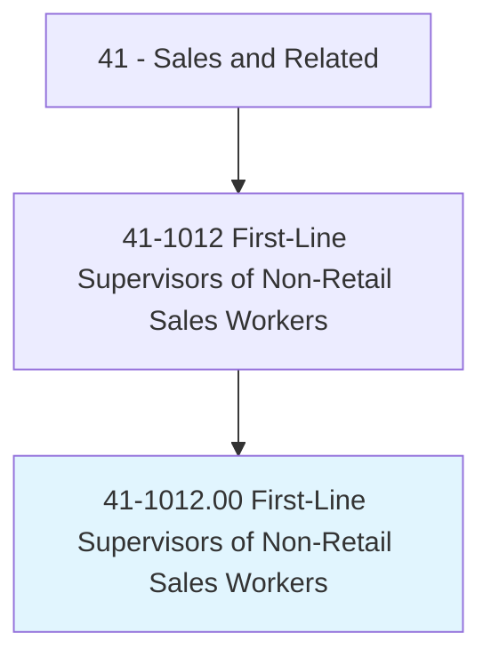
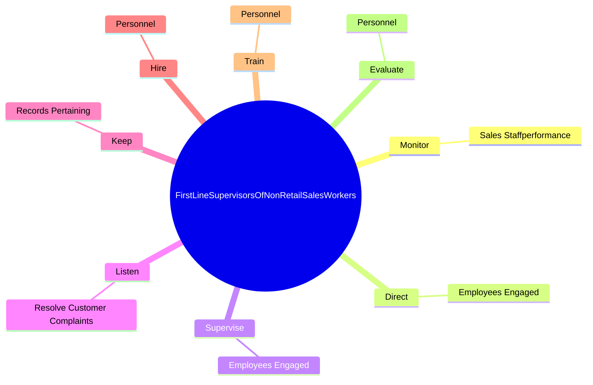

# First-Line Supervisors of Non-Retail Sales Workers

> Directly supervise and coordinate activities of sales workers other than retail sales workers. May perform duties such as budgeting, accounting, and personnel work, in addition to supervisory duties.

## Overview

First-Line Supervisors of Non-Retail Sales Workers is an occupation within the Sales and Related category. Directly supervise and coordinate activities of sales workers other than retail sales workers. 

## Classification Hierarchy

## Key Statistics

| Metric | Value |
|--------|-------|
| SOC Code | 41-1012.00 |
| Category | [Sales and Related](/occupations/Sales/index) |
| Task Count | 48 |
| Source | O*NET |

## Core Tasks

### monitor.SalesStaffperformance

First-Line Supervisors of Non-Retail Sales Workers monitor sales staffperformance as part of their core responsibilities.

**Actions:**
- `monitor.SalesStaffperformance.to.ensure.GoalsAreMet`

### direct.EmployeesEngaged

First-Line Supervisors of Non-Retail Sales Workers direct employees engaged as part of their core responsibilities.

**Actions:**
- `direct.EmployeesEngaged.in.PerformingSpecificServices`

### supervise.EmployeesEngaged

First-Line Supervisors of Non-Retail Sales Workers supervise employees engaged as part of their core responsibilities.

**Actions:**
- `supervise.EmployeesEngaged.in.PerformingSpecificServices`

## Skills & Competencies

### Technical Skills
- **Sales Techniques** - Advanced
- **Customer Relations** - Advanced
- **Product Knowledge** - Advanced

### Soft Skills
- **Communication** - Essential
- **Problem Solving** - Essential
- **Critical Thinking** - Important
- **Teamwork** - Important
- **Adaptability** - Important

## Related Occupations

## Industries

This occupation is found across multiple industries. See [Industries](/industries) for sector-specific employment data.

## Career Progression

---

*Source: O*NET 41-1012.00 - ONETOccupation*
