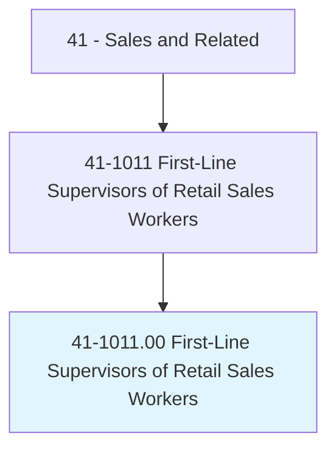
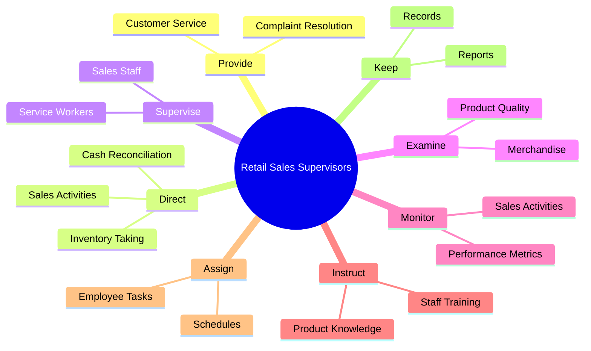
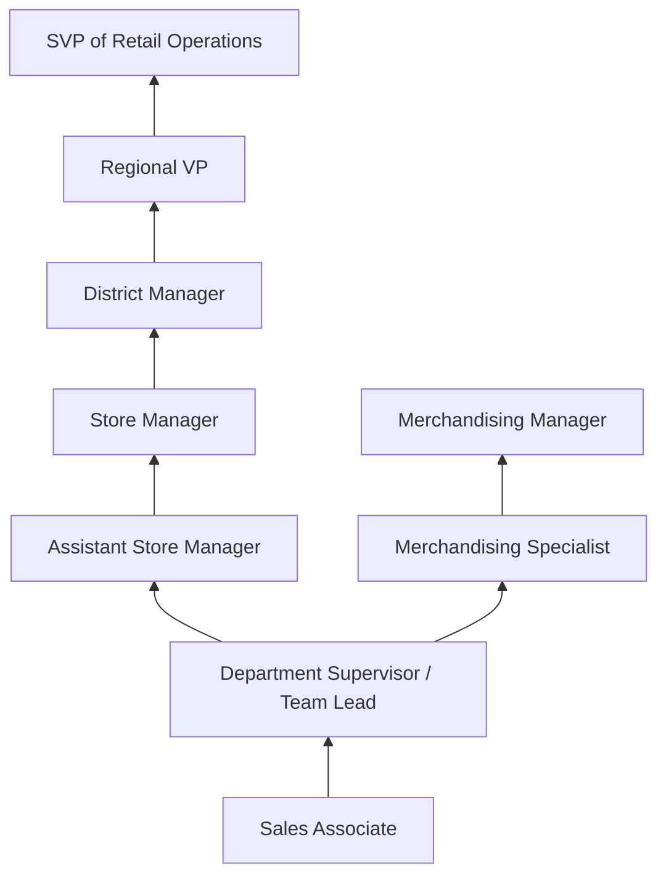
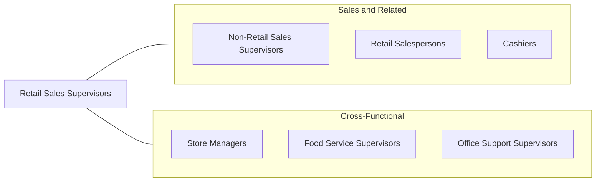

# First-Line Supervisors of Retail Sales Workers

> Directly supervise and coordinate activities of retail sales workers in an establishment or department. Duties may include management functions, such as purchasing, budgeting, accounting, and personnel work, in addition to supervisory duties.

## Overview

First-Line Supervisors of Retail Sales Workers manage the day-to-day operations of retail stores, departments, or sections, directly overseeing sales associates and ensuring that customer service standards, sales targets, and operational procedures are met. They serve as the critical link between store management and front-line retail staff, handling everything from scheduling and training to inventory management, merchandising, and customer complaint resolution. Their leadership directly impacts store performance, employee morale, and customer satisfaction.

These supervisors work across the entire retail spectrum -- from department stores and specialty boutiques to big-box retailers, grocery stores, and automotive dealerships. Their responsibilities extend well beyond simple oversight: they analyze sales data, adjust staffing levels to match traffic patterns, execute promotional campaigns, manage shrinkage and loss prevention, and ensure compliance with company policies and labor regulations. In smaller retail operations, they may also handle purchasing, bookkeeping, and opening/closing procedures.

The role demands a versatile skill set combining people management, business acumen, and hands-on retail knowledge. Successful supervisors motivate their teams through coaching and recognition, handle difficult customer situations with diplomacy, and drive sales performance through strategic merchandising and staff deployment. This position is one of the most common entry points into retail management, with many district managers and store directors having started as floor supervisors.

## Classification Hierarchy

## Key Statistics

| Metric | Value |
|--------|-------|
| SOC Code | 41-1011.00 |
| Job Zone | 3 (Medium Preparation) |
| Category | [Sales and Related](/occupations/Sales/index) |
| Median Annual Salary | $47,300 |
| Employment | ~1,100,000 |
| Projected Growth | -1% (little or no change) |
| Core Tasks | 83 |
| Source | O*NET |

## Core Tasks

### provide.CustomerService

First-Line Supervisors ensure excellent customer service through personal involvement.

**Actions:**
- `provide.Customerservice.by.GreetingCustomers` - Model customer engagement behaviors
- `provide.Customerservice.by.RespondingToInquiriesComplaints` - Resolve escalated customer issues

### direct.EmployeesEngaged

Supervisors direct staff in sales, inventory, and operational activities.

**Actions:**
- `direct.EmployeesEngaged.in.Sales` - Guide sales floor activities and priorities
- `direct.EmployeesEngaged.in.InventoryTaking` - Oversee physical inventory counts
- `direct.EmployeesEngaged.in.ReconcilingCashReceipts` - Manage cash handling procedures
- `direct.EmployeesEngaged.in.InPerformingServicesForCustomers` - Coordinate service delivery

### supervise.EmployeesEngaged

Supervisors oversee and evaluate staff performance.

**Actions:**
- `supervise.EmployeesEngaged.in.Sales` - Monitor sales associate performance
- `supervise.EmployeesEngaged.in.InventoryTaking` - Ensure accurate inventory processes
- `supervise.EmployeesEngaged.in.ReconcilingCashReceipts` - Verify cash handling accuracy

## Skills & Competencies

### Technical Skills
- **Retail Operations Management** - Advanced
- **Inventory Management and Merchandising** - Advanced
- **Point-of-Sale Systems** - Advanced
- **Sales Performance Analysis** - Advanced
- **Scheduling and Labor Management** - Advanced
- **Loss Prevention** - Intermediate
- **Visual Merchandising** - Intermediate
- **Budgeting and P&L Basics** - Intermediate

### Soft Skills
- **Leadership and Team Building** - Critical
- **Customer Service Excellence** - Critical
- **Communication** - Critical
- **Conflict Resolution** - Essential
- **Decision Making** - Essential
- **Coaching and Development** - Essential
- **Adaptability** - Essential
- **Multitasking** - Essential

## Education & Certifications

| Requirement | Details |
|-------------|---------|
| Typical Education | High school diploma; some college preferred |
| On-the-Job Training | Moderate; company-specific management training |
| Retail Management Certificate | NRF Foundation RISE Up credential |
| CPR/First Aid | Often required for supervisory roles |
| OSHA Safety Training | Required in some retail environments |
| Loss Prevention Training | Company-specific LP certification |
| Leadership Development | Employer-provided management programs |

## Career Progression

## Industry Variations

| Setting | Focus | Unique Aspects |
|---------|-------|----------------|
| Department Stores | Multi-department oversight | Complex scheduling; cross-selling; seasonal staffing surges |
| Specialty Retail | Single-category expertise | Deep product knowledge; consultative selling; loyalty programs |
| Grocery / Supermarket | Perishable inventory, checkout | Food safety compliance; high turnover; union environments |
| Auto Dealership | Vehicle sales supervision | High-value transactions; F&I knowledge; commission management |

## Technology & Tools

- **POS Systems** - Oracle Retail, Shopify POS, Square, NCR
- **Workforce Management** - Kronos, Deputy, When I Work
- **Inventory Management** - Oracle, SAP Retail, Lightspeed
- **Analytics** - Power BI, Tableau, retailer-specific dashboards
- **Communication** - Walkie-talkies, team messaging apps
- **Loss Prevention** - CCTV monitoring, EAS systems
- **E-commerce** - Ship-from-store, BOPIS platforms

## Related Occupations

## Departments

This occupation typically works in:
- [Sales Department](/departments/Sales) - Sales floor management
- [Operations](/departments/Operations) - Store operations and logistics
- [Human Resources](/departments/HumanResources) - Staff hiring and training
- [Loss Prevention](/departments/LossPrevention) - Shrinkage management

---

*Source: O*NET 41-1011.00 - ONETOccupation*
