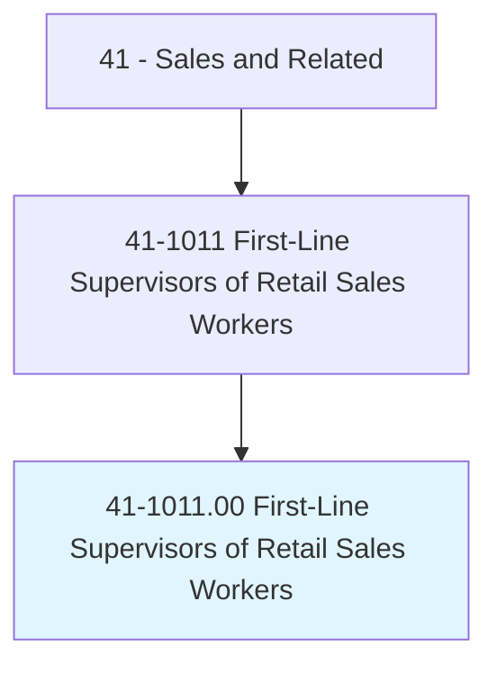
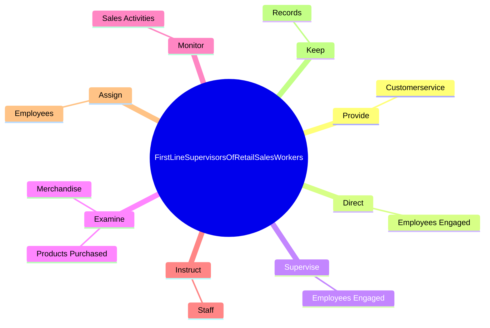

# First-Line Supervisors of Retail Sales Workers

> Directly supervise and coordinate activities of retail sales workers in an establishment or department. Duties may include management functions, such as purchasing, budgeting, accounting, and personnel work, in addition to supervisory duties.

## Overview

First-Line Supervisors of Retail Sales Workers is an occupation within the Sales and Related category. Directly supervise and coordinate activities of retail sales workers in an establishment or department. 

## Classification Hierarchy

## Key Statistics

| Metric | Value |
|--------|-------|
| SOC Code | 41-1011.00 |
| Category | [Sales and Related](/occupations/Sales) |
| Task Count | 83 |
| Source | O*NET |

## Core Tasks

### provide.Customerservice

First-Line Supervisors of Retail Sales Workers provide customerservice as part of their core responsibilities.

**Actions:**
- `provide.Customerservice.by.GreetingCustomersRespondingToCustomerInquiriesComplaints`
- `provide.Customerservice.by.AssistingCustomersRespondingToCustomerInquiriesComplaints`

### direct.EmployeesEngaged

First-Line Supervisors of Retail Sales Workers direct employees engaged as part of their core responsibilities.

**Actions:**
- `direct.EmployeesEngaged.in.Sales`
- `direct.EmployeesEngaged.in.InventoryTaking`
- `direct.EmployeesEngaged.in.ReconcilingCashReceipts`
- `direct.EmployeesEngaged.in.InPerformingServicesForCustomers`

### supervise.EmployeesEngaged

First-Line Supervisors of Retail Sales Workers supervise employees engaged as part of their core responsibilities.

**Actions:**
- `supervise.EmployeesEngaged.in.Sales`
- `supervise.EmployeesEngaged.in.InventoryTaking`
- `supervise.EmployeesEngaged.in.ReconcilingCashReceipts`
- `supervise.EmployeesEngaged.in.InPerformingServicesForCustomers`

## Skills & Competencies

### Technical Skills
- **Sales Techniques** - Advanced
- **Customer Relations** - Advanced
- **Product Knowledge** - Advanced

### Soft Skills
- **Communication** - Essential
- **Problem Solving** - Essential
- **Critical Thinking** - Important
- **Teamwork** - Important
- **Adaptability** - Important

## Related Occupations

## Industries

This occupation is found across multiple industries. See [Industries](/industries) for sector-specific employment data.

## Career Progression

---

*Source: O*NET 41-1011.00 - ONETOccupation*
