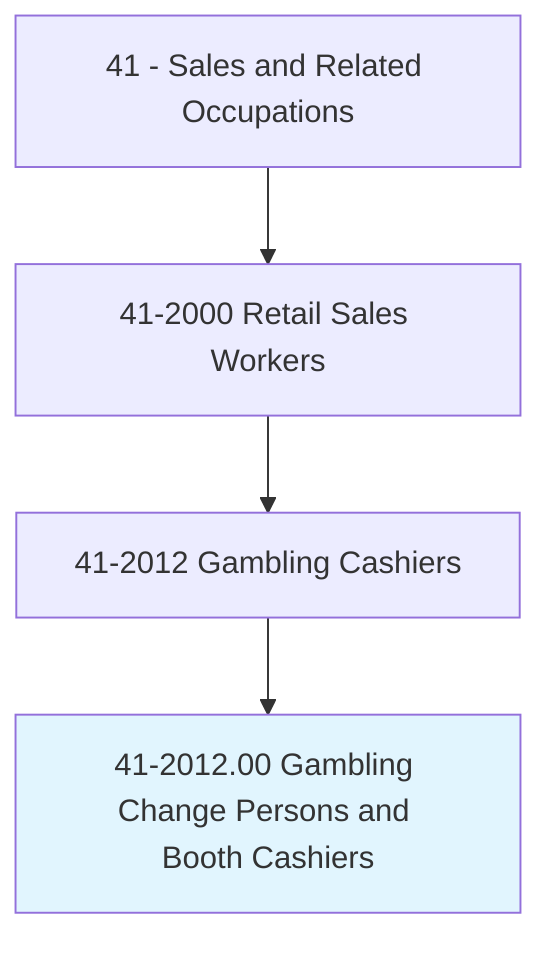
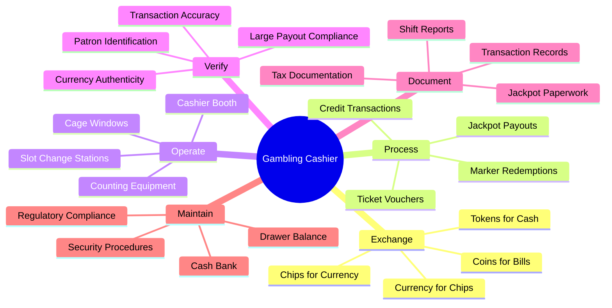
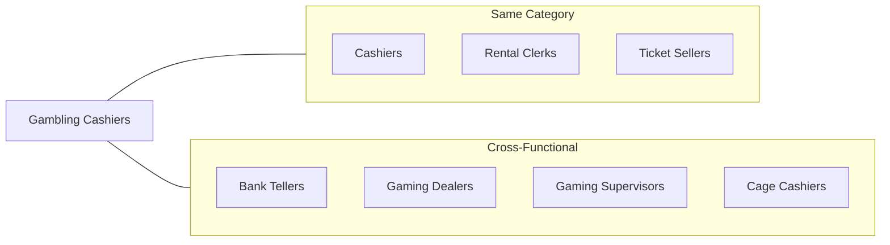
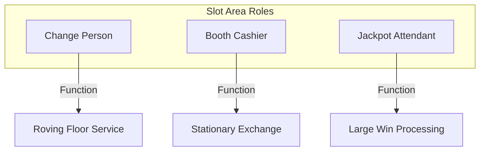
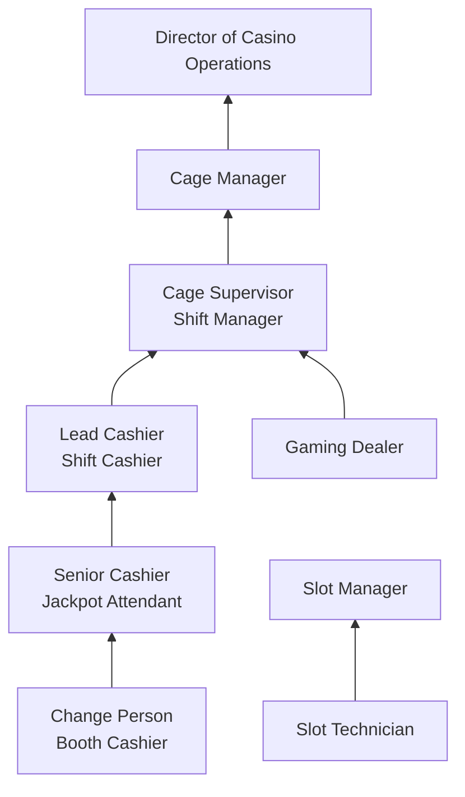
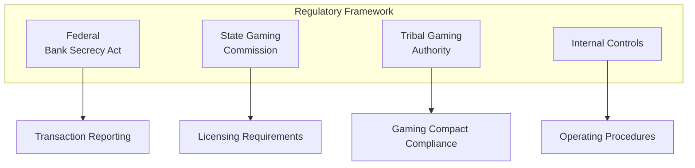
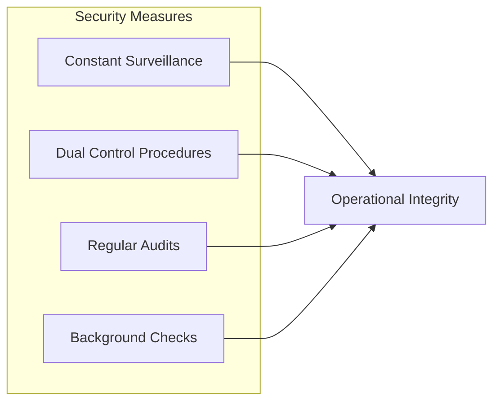

# Gambling Change Persons and Booth Cashiers

> Exchange coins, tokens, and chips for patrons' money. May issue payoffs and obtain customer's signature on receipt. May operate a booth in the slot machine area and furnish change persons with money bank at the start of the shift, or count and audit money in drawers.

## Overview

Gambling Change Persons and Booth Cashiers are specialized cashiers working in casinos, racetracks, and other gambling establishments. They facilitate gaming transactions by exchanging currency for chips, tokens, or coins, and process payouts for winning patrons. This role requires strict adherence to gaming regulations, exceptional cash handling accuracy, and the ability to work in a fast-paced, high-security environment. These professionals serve as essential points of contact for casino patrons and play a critical role in maintaining the integrity of gaming operations.

## Classification Hierarchy

## Key Statistics

| Metric | Value |
|--------|-------|
| SOC Code | 41-2012.00 |
| Job Zone | 2 (Some Preparation) |
| Category | [Sales and Related](/occupations/Sales/index) |
| Core Tasks | 15+ |
| Source | O*NET |

## Core Tasks

### exchange.CurrencyForChips

Gambling Cashiers convert patrons' money into gaming currency and vice versa.

**Actions:**
- `exchange.Currency.for.Chips` - Convert cash to gaming chips
- `exchange.Tokens.for.Money` - Redeem gaming tokens for cash
- `exchange.Chips.for.Currency` - Cash out patron winnings
- `exchange.Coins.for.Bills` - Convert coin denominations

### process.Payouts

Handling jackpot winnings and large payouts according to gaming regulations.

**Actions:**
- `process.JackpotPayouts.for.Patrons` - Issue major winnings
- `obtain.Signatures.on.Receipts` - Document payout transactions
- `verify.WinningTickets.for.Redemption` - Validate jackpot claims
- `issue.W2GForms.for.TaxableWinnings` - Complete required tax documentation

### operate.CashierBooth

Managing cashier stations in the casino's slot machine areas and gaming floors.

**Actions:**
- `operate.Booth.in.SlotArea` - Staff change booths
- `furnish.ChangePersons.with.MoneyBank` - Supply floor staff with cash banks
- `count.Currency.in.Drawers` - Balance cash drawers
- `audit.Money.at.ShiftEnd` - Verify drawer accuracy

### verify.PatronIdentification

Ensuring compliance with identification requirements for gaming transactions.

**Actions:**
- `verify.Identification.for.Transactions` - Check patron ID
- `confirm.Age.for.GamingEligibility` - Verify legal gambling age
- `check.ExclusionLists.for.Compliance` - Screen for self-excluded patrons
- `validate.Credentials.for.LargePayouts` - Verify identity for significant transactions

### document.Transactions

Maintaining accurate records of all financial transactions for regulatory compliance.

**Actions:**
- `document.Transactions.for.Records` - Log all exchanges
- `complete.CTRs.for.LargeTransactions` - File Currency Transaction Reports
- `record.SARs.when.Required` - Report suspicious activities
- `prepare.ShiftReports.for.Management` - Summarize daily transactions

## Skills & Competencies

### Technical Skills
- **Cash Handling** - Expert
- **Gaming System Software** - Proficient
- **Currency Counting Equipment** - Proficient
- **Anti-Counterfeiting Detection** - Required
- **Regulatory Documentation** - Required

### Soft Skills
- **Attention to Detail** - Critical
- **Integrity** - Critical
- **Customer Service** - Essential
- **Mathematical Aptitude** - Essential
- **Stress Management** - Important
- **Memory/Recall** - Important

## Related Occupations

## Industry Variations

### Casino Floor (Slot Area)

Key differences:
- Mobile change service (change persons)
- High-volume small transactions
- TITO (Ticket-In/Ticket-Out) processing
- Hand-pay jackpot coordination

### Main Cage Operations

Key differences:
- Higher security environment
- Credit/marker processing
- Large currency exchanges
- Safe deposit services
- Foreign currency exchange

### Table Games Area

Key differences:
- Chip color/denomination expertise
- Fill and credit verification
- Table bank management
- Coordination with pit supervisors

### Racetracks and OTB

Key differences:
- Betting window operations
- Pari-mutuel payout calculations
- Multiple race handling
- Ticket validation

### Tribal Gaming

Key differences:
- Tribal gaming commission regulations
- Compact-specific requirements
- Cultural considerations
- Sovereign nation compliance

## Industries

- [Casinos (except Casino Hotels)](/industries/Entertainment/RecreationIndustries/GamblingIndustries/Casinos) - Primary sector
- [Casino Hotels](/industries/CasinoHotels) - Major employer
- [Racetracks](/industries/Racetracks) - Horse and dog racing
- Riverboat Gambling - Water-based casinos
- Tribal Gaming - Native American operations
- Card Rooms - Poker and card establishments

## Career Progression

### Typical Timeline

| Stage | Years Experience | Typical Title |
|-------|-----------------|---------------|
| Entry | 0-1 | Change Person, Booth Cashier |
| Experienced | 1-3 | Senior Cashier, Jackpot Attendant |
| Lead | 3-5 | Lead Cashier, Main Cage Cashier |
| Supervisor | 5-8 | Cage Supervisor, Shift Manager |
| Management | 8+ | Cage Manager, Director |

## Education & Training

| Requirement | Details |
|-------------|---------|
| Typical Education | High school diploma or equivalent |
| Work Experience | Cash handling experience preferred |
| On-the-Job Training | 2-4 weeks casino-specific training |
| Certifications | Gaming license required (state/tribal issued) |

### Licensing Requirements

Gaming employees must obtain licenses issued by state gaming commissions or tribal gaming authorities. Requirements typically include:

- Background investigation
- Fingerprinting
- Drug testing
- Credit check
- Criminal history review
- Periodic renewal (annual or biennial)

### Training Topics

- Currency counting and verification
- Chip and token denominations
- Gaming regulations and compliance
- Title 31/Bank Secrecy Act requirements
- Customer service in gaming
- Security and surveillance awareness
- Responsible gaming practices

## Departments

This occupation typically works in:
- Casino Cage
- Slot Operations
- Gaming Floor
- Count Room

## Regulatory Environment

### Key Regulations

### Reporting Thresholds

| Report Type | Threshold | Requirement |
|-------------|-----------|-------------|
| CTR (Currency Transaction Report) | $10,000+ | Mandatory filing |
| W-2G | Varies by game | Tax reporting for winnings |
| SAR (Suspicious Activity Report) | $5,000+ | Suspicious transactions |
| Multiple Transaction Log | $3,000+ | Internal tracking |

## Technology & Tools

### Gaming Systems
- Slot Management Systems (IGT, Aristocrat)
- Table Game Management Systems
- Player Tracking Systems
- TITO (Ticket-In/Ticket-Out) machines

### Cash Handling
- Currency counting machines
- Chip sorters
- Counterfeit detection equipment
- Coin counters and wrappers

### Security
- Surveillance integration
- Electronic signature pads
- ID verification systems
- Transaction monitoring software

## Work Environment

### Physical Demands
- Standing for extended periods
- Handling heavy coin/chip trays
- Repetitive counting motions
- Visual attention to detail

### Work Schedule
- 24/7 casino operations
- Shift work (day, swing, graveyard)
- Weekend and holiday work required
- Overtime during peak periods

### Work Conditions
- Smoke-filled environments (in some jurisdictions)
- Loud gaming floor noise
- Constant surveillance monitoring
- High-security areas

## Performance Metrics

| Metric | Description |
|--------|-------------|
| Transaction Accuracy | Cash drawer variances |
| Speed of Service | Transactions per hour |
| Compliance Rate | Regulatory report completion |
| Customer Service Scores | Patron satisfaction ratings |
| Attendance/Reliability | Schedule adherence |
| Security Incidents | Suspicious activity identification |

## Challenges and Considerations

### Common Challenges
- High accountability for large sums
- Constant surveillance pressure
- Regulatory compliance complexity
- Exposure to second-hand smoke
- Late-night and holiday schedules

### Security Considerations

Gambling cashiers work under constant video surveillance and are subject to strict internal controls, random audits, and ongoing background monitoring to ensure the integrity of gaming operations.

---

*Source: O*NET 41-2012.00 - ONETOccupation*
