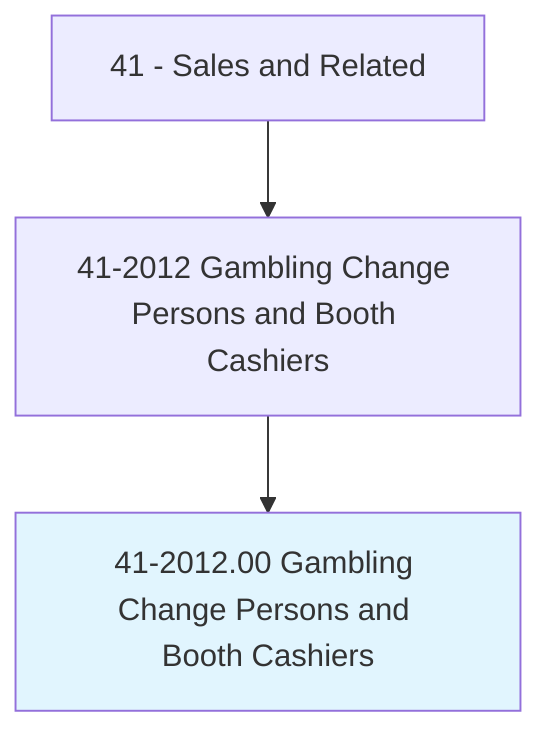
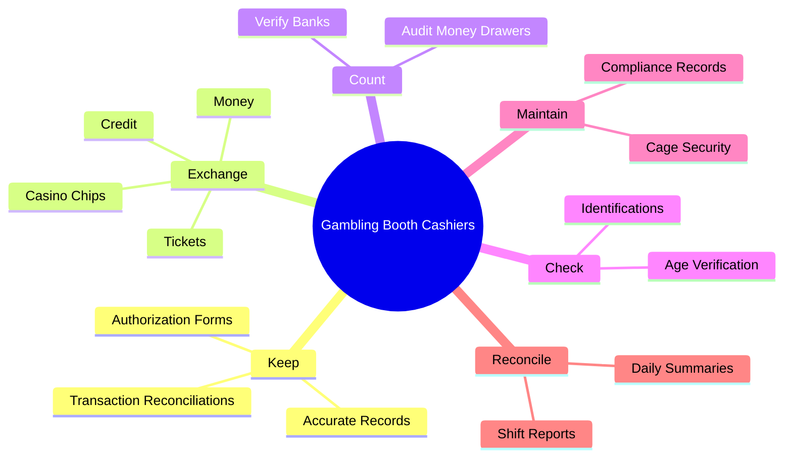
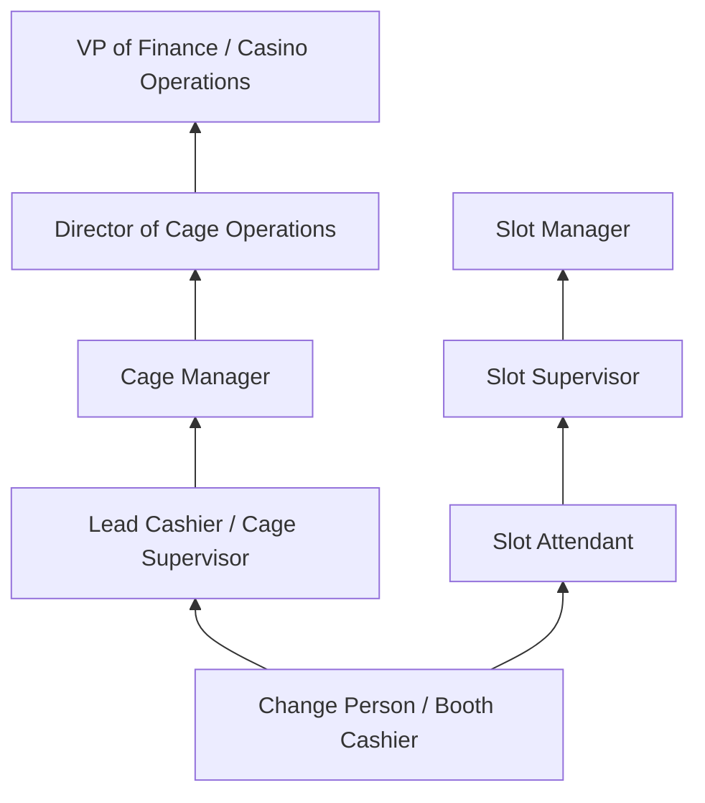
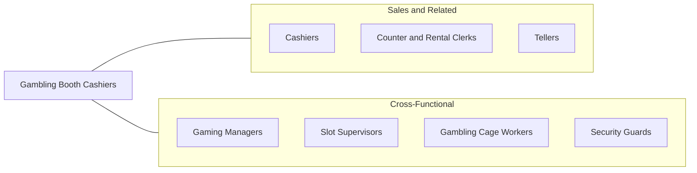

# Gambling Change Persons and Booth Cashiers

> Exchange coins, tokens, and chips for patrons' money. May issue payoffs and obtain customer's signature on receipt. May operate a booth in the slot machine area and furnish change persons with money bank at the start of the shift, or count and audit money in drawers.

## Overview

Gambling Change Persons and Booth Cashiers are frontline financial service workers in the casino and gaming industry, responsible for exchanging currency, tokens, chips, and tickets for patrons on the gaming floor. They operate cashier booths in slot machine areas, process jackpot payouts, verify patron identification, and maintain accurate records of all monetary transactions. Their role combines cash handling precision with customer service, as they interact directly with gaming patrons throughout their shifts.

These workers serve as the financial backbone of casino floor operations. They furnish change persons with starting banks at the beginning of shifts, count and audit money drawers at shift end, process credit and marker transactions, and ensure compliance with gaming regulations and anti-money laundering requirements. The position requires meticulous attention to detail, as errors in cash handling can result in significant financial discrepancies and regulatory consequences.

The gaming industry is heavily regulated, and booth cashiers must comply with state and tribal gaming commission requirements, including reporting large currency transactions, verifying patron identity for tax purposes, and maintaining chain-of-custody documentation for all funds. While technology has reduced the need for physical change (with ticket-in/ticket-out systems replacing coin-operated machines in many casinos), the booth cashier role remains essential for patron services, jackpot processing, and cage operations.

## Classification Hierarchy

## Key Statistics

| Metric | Value |
|--------|-------|
| SOC Code | 41-2012.00 |
| Job Zone | 2 (Some Preparation) |
| Category | [Sales and Related](/occupations/Sales/index) |
| Median Annual Salary | $30,200 |
| Employment | ~14,000 |
| Projected Growth | -10% (declining) |
| Core Tasks | 31 |
| Source | O*NET |

## Core Tasks

### keep.AccurateRecords

Gambling Booth Cashiers maintain detailed transaction records for regulatory compliance.

**Actions:**
- `keep.AccurateRecords.of.MonetaryExchanges` - Document all currency transactions
- `keep.AccurateRecords.of.AuthorizationForms` - Maintain jackpot and payout authorizations
- `keep.AccurateRecords.of.TransactionReconciliations` - Reconcile shift financial records

### exchange.Money

Gambling Booth Cashiers process currency and chip exchanges for patrons.

**Actions:**
- `exchange.Money.for.Customers` - Convert currency denominations
- `exchange.Credit.for.Customers` - Process credit and marker transactions
- `exchange.Tickets.for.Customers` - Redeem TITO (ticket-in/ticket-out) vouchers
- `exchange.CasinoChips.for.Customers` - Exchange chips for cash at cage

### count.AuditMoneyDrawers

Gambling Booth Cashiers count and verify cash drawers.

**Actions:**
- `count.AuditMoneyDrawers` - Count drawer contents and verify against records

## Skills & Competencies

### Technical Skills
- **Cash Handling and Counting** - Expert
- **Gaming Regulatory Compliance** - Advanced
- **Transaction Processing** - Advanced
- **Anti-Money Laundering (AML) Procedures** - Intermediate
- **Currency Transaction Reporting (CTR)** - Advanced
- **Point-of-Sale and Cage Systems** - Advanced

### Soft Skills
- **Attention to Detail** - Critical
- **Integrity and Honesty** - Critical
- **Customer Service** - Essential
- **Accuracy Under Pressure** - Critical
- **Communication** - Essential
- **Reliability** - Critical
- **Composure** - Essential

## Education & Certifications

| Requirement | Details |
|-------------|---------|
| Typical Education | High school diploma or equivalent |
| Gaming License | Required by state/tribal gaming commission |
| Background Check | Extensive background investigation required |
| AML Training | Anti-money laundering compliance training |
| Title 31 Training | Federal currency transaction reporting requirements |
| Company Training | Casino-specific cage operations and systems |
| CPR/First Aid | Sometimes required |

## Career Progression

## Industry Variations

| Setting | Focus | Unique Aspects |
|---------|-------|----------------|
| Large Casino Resorts | High-volume cage operations | Multiple cage locations; high-value transactions; VIP services |
| Tribal Casinos | Compact compliance | Tribal gaming commission oversight; IGRA compliance |
| Card Rooms | Table game cash handling | Smaller scale; card-room-specific regulations |
| Racetracks with Gaming | Pari-mutuel and slot operations | Dual gaming types; seasonal fluctuations |

## Technology & Tools

- **Casino Management Systems** - Bally CMS, IGT Advantage, Konami SYNKROS
- **TITO Systems** - Ticket-in/ticket-out processing terminals
- **Currency Counters** - High-speed bill and coin counting machines
- **Patron Tracking** - Player loyalty card systems
- **Surveillance Interface** - Camera and recording systems
- **Compliance Software** - CTR/SAR filing systems, Title 31 reporting
- **Safe and Vault Systems** - Time-lock safes, vault management

## Related Occupations

## Departments

This occupation typically works in:
- Cage Operations - Casino cash management
- Slot Operations - Gaming floor services
- [Finance Department](/departments/Finance) - Financial controls and compliance
- Compliance - Gaming regulatory compliance

---

*Source: O*NET 41-2012.00 - ONETOccupation*
